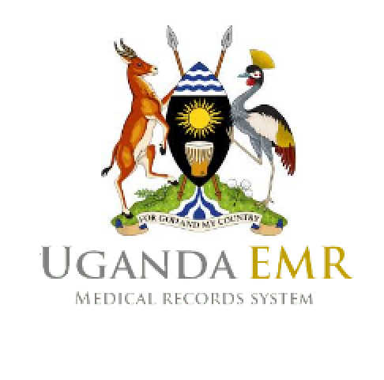

# Introduction

## UgandaEMR User Manual

This document describes how to use the UgandaEMR to capture and report on patient information.

UgandaEMR is a customization of OpenMRS for Uganda, initially starting with HIV related forms but later expanding to other areas such as Maternal and Child Health services, Tuberculosis treatment following guidelines issued by the Ministry of Health \(MoH\) under the Health Management Information System \(HMIS\) manuals.

The user manual is available in the following formats

1. [Online](SUMMARY.md)
2. PDF Download 

