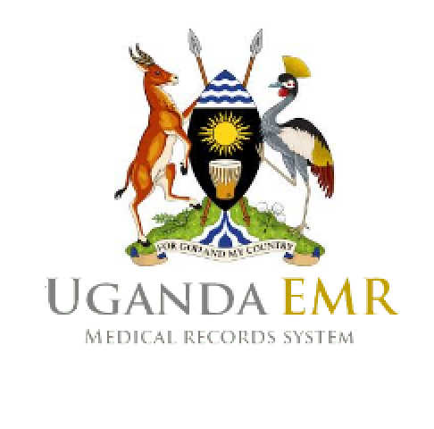

# Introduction

## UgandaEMR User Manual

This document describes how to use the UgandaEMR to capture and report on patient information.

UgandaEMR is a customization of OpenMRS for Uganda, initially starting with HIV related forms but later expanding to other areas such as Maternal and Child Health services, Tuberculosis treatment following guidelines issued by the Ministry of Health \(MoH\) under the Health Management Information System \(HMIS\) manuals.

## Building PDF Version
The PDF version of the user manual can be generated by running the following command 

`npm run docs:prepare && npm run docs:generate-pdf`

The ugandaemr-user-manual.pdf file will be generated in the _book directory