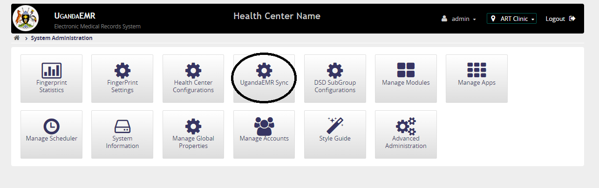
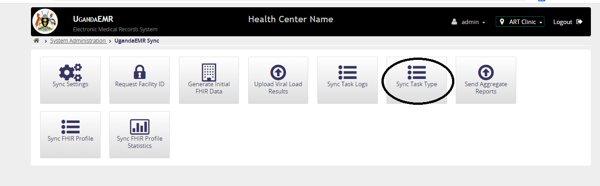
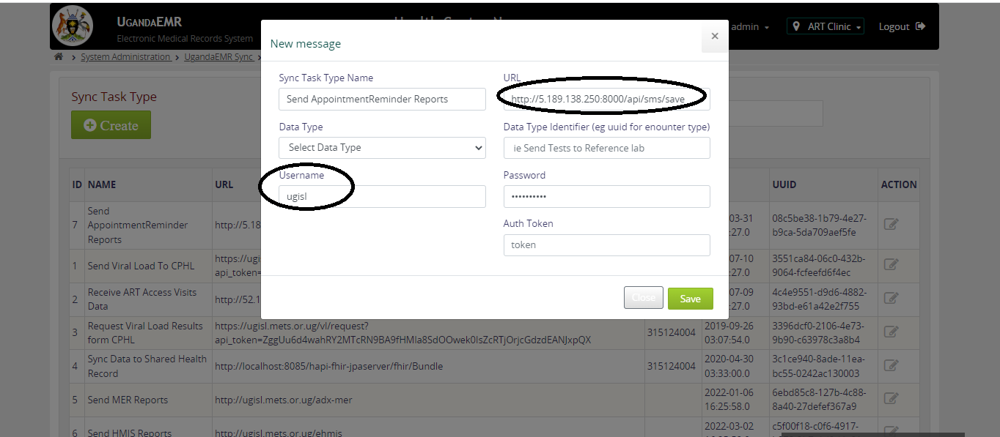

# Configure UgandaEMR to send SMS reminders

1. Login as user with administrator privileges and Go to the home page

2. Click System Administration link as shown below

3. Click UgandaEMRSync link as shown below

4. Click Sync Task Type link as shown below

5. Click the edit corresponding to Send AppointmentReminder Reports under Action, a window similar to that in the image below pops up.
Enter the Username and URL as circled in the image below 

6. Click Save
