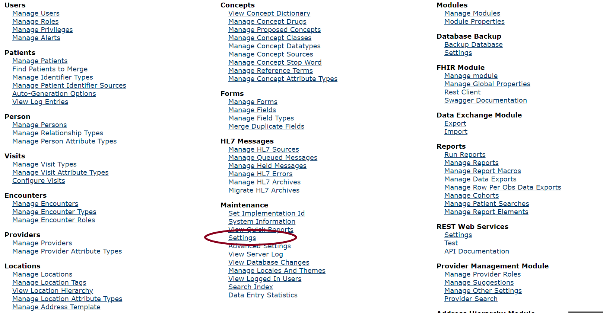
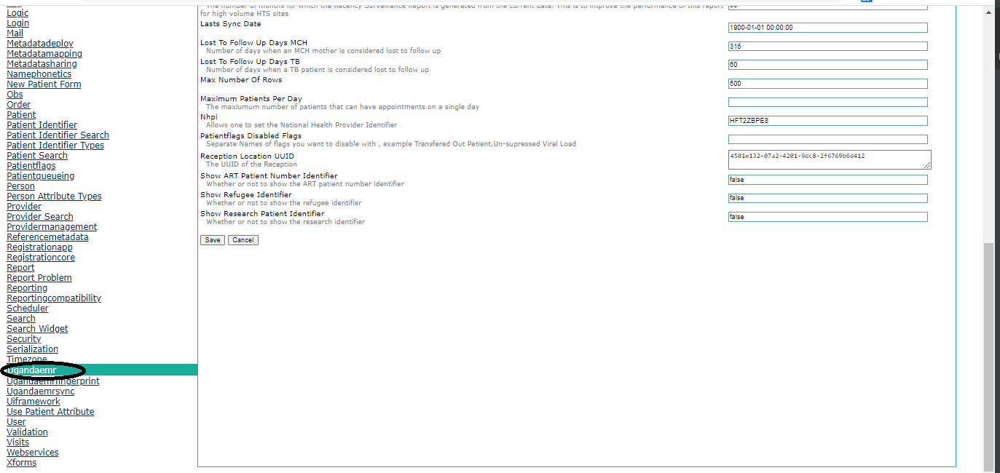
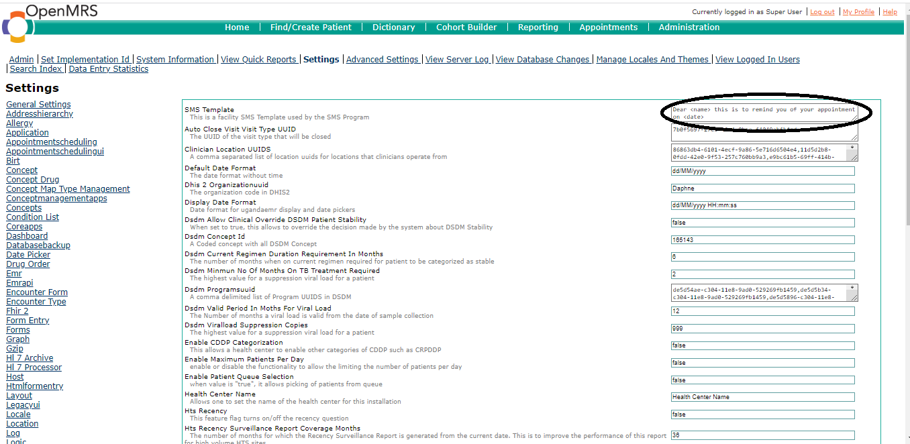

# Customize SMS Template

1. Login as user with administrator privileges and Go to the home page

2. Click Legacy System Administration 

3. Under Maintenance, click Settings link as shown below

4. Click the Ugandaemr link as shown below

5. Edit SMS Template in the text input circled in the image below

7. Click Save
