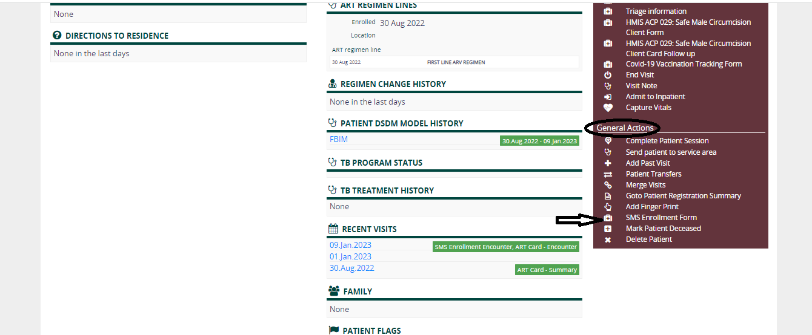
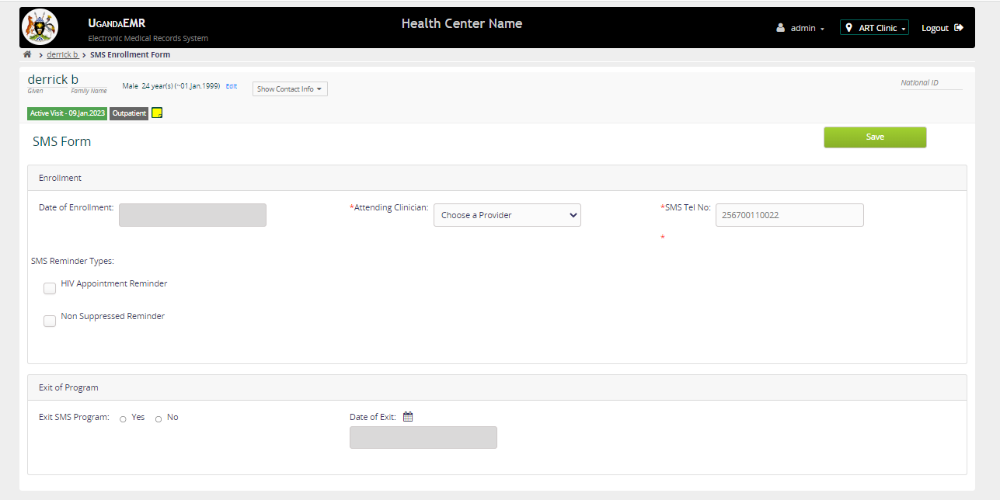

# SMS Notifications
This section provides steps on how to configure UgandaEMR to send SMS reminders, to enroll clients for the SMS program, and customize the SMS template.

## Enroll client on SMS Program

1. Login as user with privileges to enroll a patient and Go to the home page

2. Click Find Patient Record to find patient

3. Select the patient by either Patient ID or Patient Name

4. Go to the patient dashboard

5. Under General Action, click the SMS enrollment form link as circled in the image below

6. Enter the date of enrollment(If not generated automatically), Attending Clinician, Client's SMS telephone Number, and SMS Reminder Type

7. Click Save
