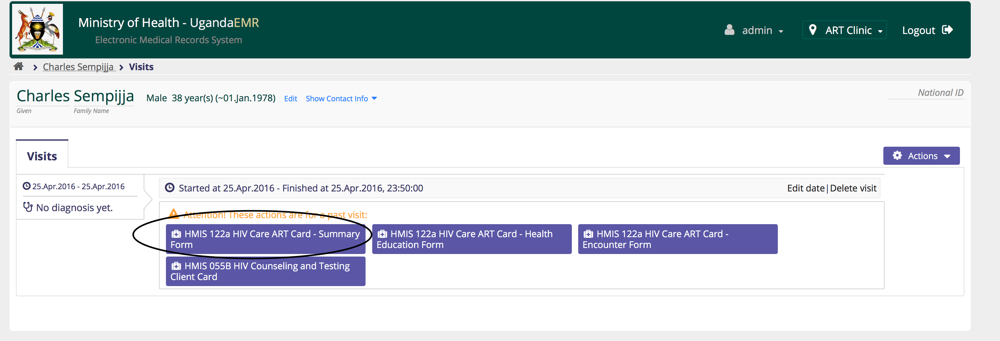
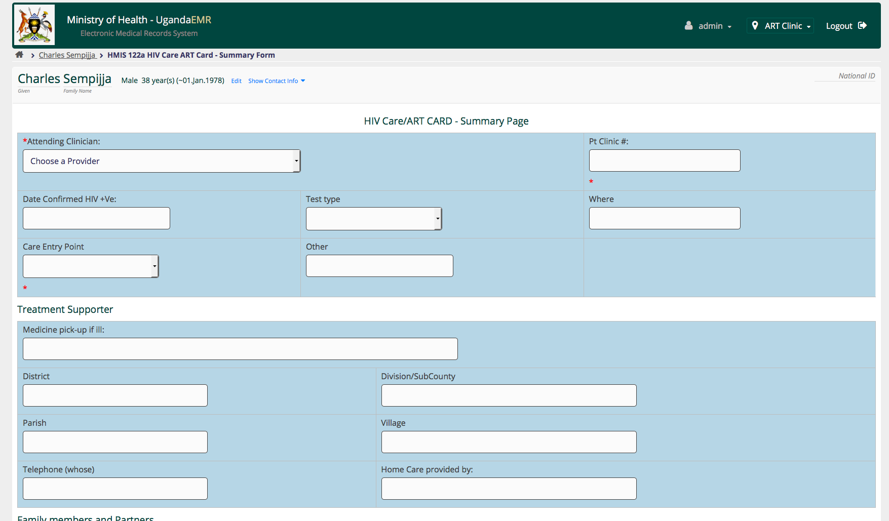
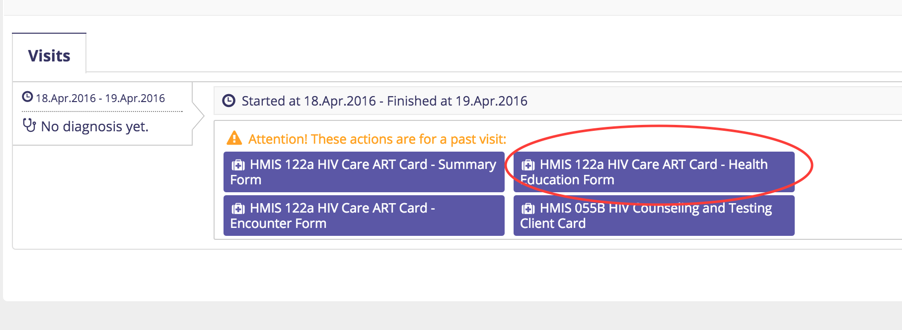
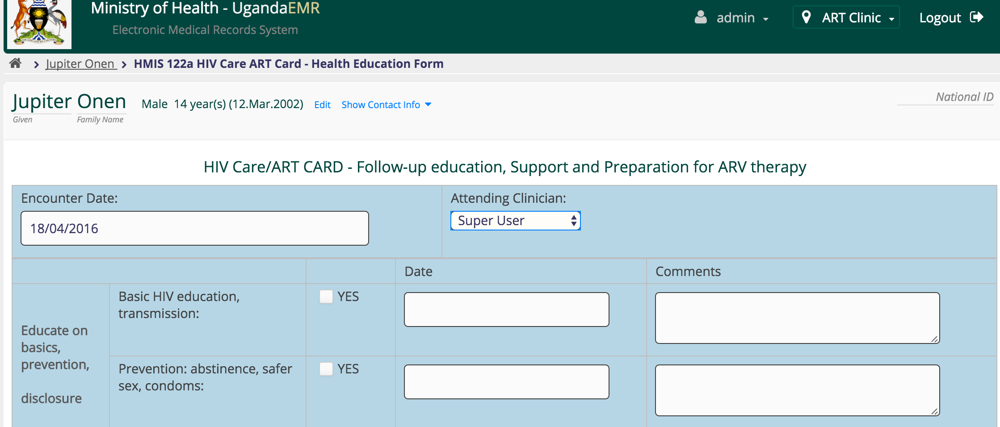
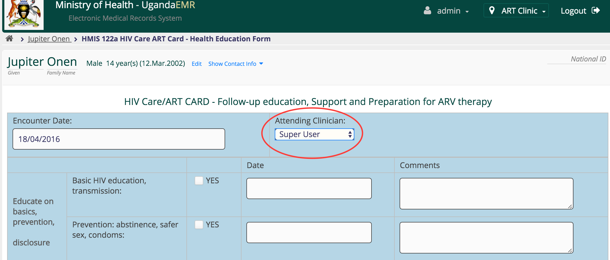

## HIV Care ART Card 
This section describes how to enter data from the ART card.
### Summary Page
#### Enter a New Summary Page
1. Go to the patient dashboard 
2. Create a past visit with the same date as the HIV enrolled date on the blue card

3. The visits page is displayed, with the current visit displayed along with a link to the summary page

4.  Click the link to the HMIS 122a HIV Care ART Card - Summary Form to enter the summary page 

#### Edit an Existing Summary Page
Only one summary page can be entered for each patient, so creating a new summary page will load the existing page for the patient.  

### Health Education Page
To capture the health education info, follow the steps below;
1. Click the ***HMIS 122a HIV Care ART Card-Health Education Form***
2. You should see the health education form like this

3. Select the ***Attending Clinician*** 
4. Enter the comments made by the attending clinician(health worker) as below; 
5. To save the data entered, scroll to the bottom and click ***Enter Form*** button as below 
6. Data is successfully saved. You should see a page showing the previously entered record
#### Common Errors
Should the system fail to save, there could be a session-timeout.

  **Solution**
  1. Scroll upwards, and enter your username and password.
  2. Click the ***Submit*** button to access the page again
  Scroll down to the bottom and hit the ***Enter Form*** button

### Encounter Page 
This captures data every time a client/patient visits the hospital. Follow the steps below to enter the data.
1. 

