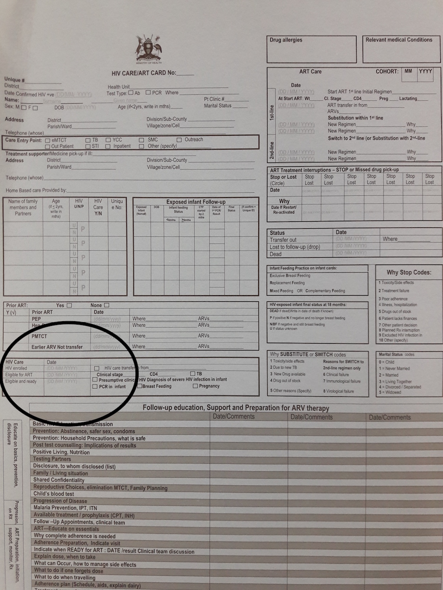
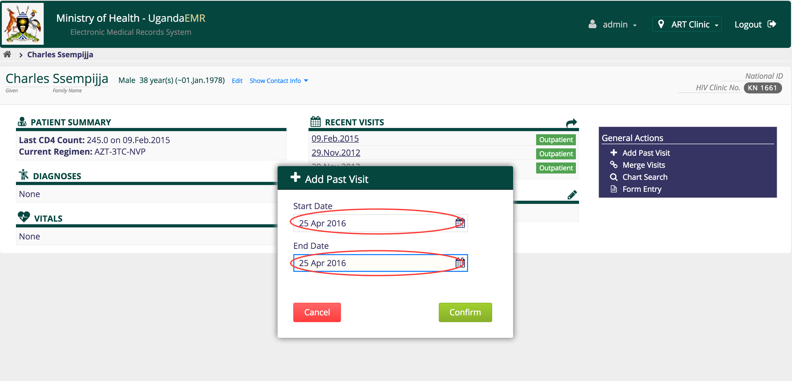

## HIV Care ART Card 
This section describes how to enter data from the ART card.
### Summary Page
1. Go to the patient dashboard 
2. Create a past visit with the same date as the HIV enrolled date on the blue card

3. The visits page is displayed, with the current visit displayed along with a link to the summary page

4.  
4. 

### Health Education Page
### Encounter Page 
