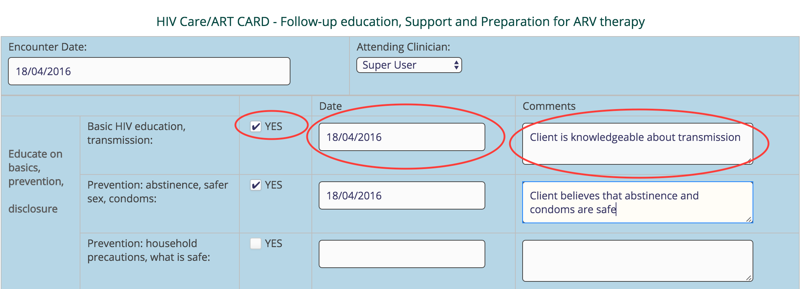
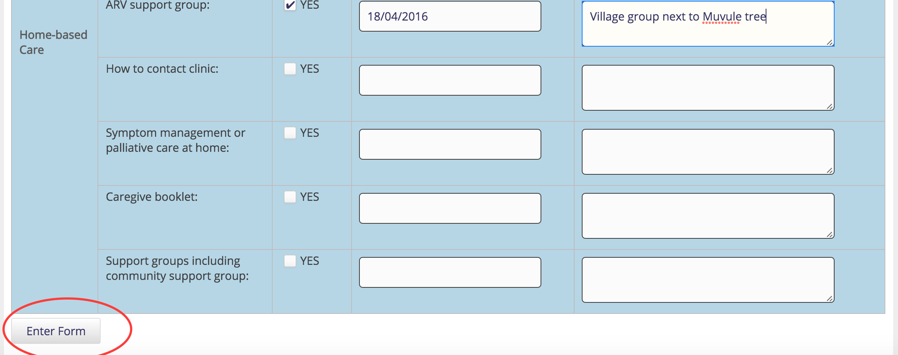
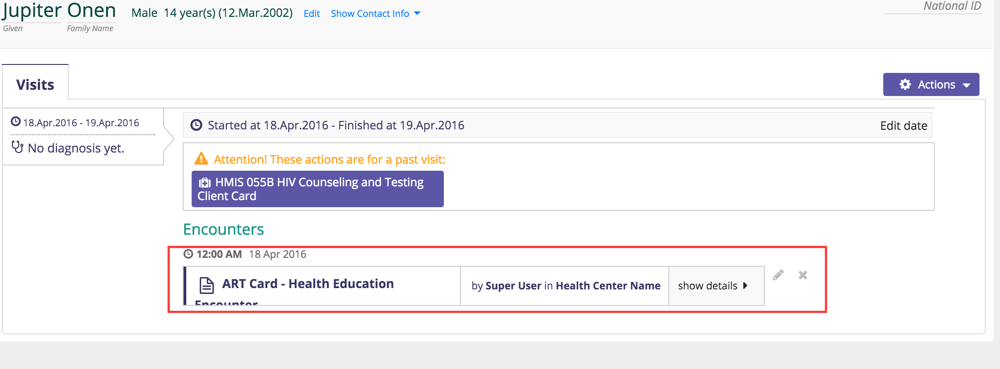

## HIV Care ART Card 
This section describes how to enter data from the ART card.
### Summary Page
#### Enter a New Summary Page
1. Go to the patient dashboard 
2. Create a past visit with the same date as the HIV enrolled date on the blue card

3. The visits page is displayed, with the current visit displayed along with a link to the summary page

4.  Click the link to the HMIS 122a HIV Care ART Card - Summary Form to enter the summary page 

#### Edit an Existing Summary Page
Only one summary page can be entered for each patient, so creating a new summary page will load the existing page for the patient.  

### Health Education Page
To capture the health education info, follow the steps below;
1. Go to the patient dashboard and click Add Past Visit link as described in the chapter entitled  Entering Client Information > Visits > Add Past Visit. [Click here](data_entry.md) to access the steps.
2. Click the ***HMIS 122a HIV Care ART Card-Health Education Form***
2. You should see the health education form like this

3. Select the ***Attending Clinician*** 
4. Enter the details as shown. Be sure to select the Yes checkbox so as enter date and comment 
5. Scroll to the bottom and hit the Enter Form button
6. Once added successfully, you should see a page showing the most recent health education form added 

#### Encounter Page 
To capture the ART Card Encounters, follow the steps below;
1. Go to the patient dashboard and click Add Past Visit link as described in the chapter entitled  Entering Client Information > Visits > Add Past Visit. [Click here](data_entry.md) to access the steps.
2. Click the ***HMIS 122a HIV Care ART Card-Encounter Form** 
2. You should see the ***Encounter*** form looking like this 
3. Because the encounter chart has a very long table,it was split into four sections(or tables). 
4. Capture the first section as below 
5. Capture the second section as below 
6. Capture the third section as below 
7. Capture the fourth section as below 
8. Click the ***Enter Form*** button to save the encounter record
9. You should see a new page 
10. Click on the visit circled on the left to see the saved encounter record 

#### Common Errors
#### Timeout when entering data 
Should the page fail to save, due to a timeout session/when you have spent more than a 20 minutes without saving, do the following: 
1. Scroll to the upper most part of the page,
Enter your username and password 
2. Scroll to the bottom and hit the Enter Form button
3. Once added successfully, you should see a page showing the most recent Encounter form added 