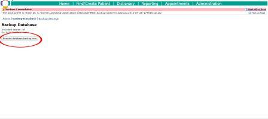
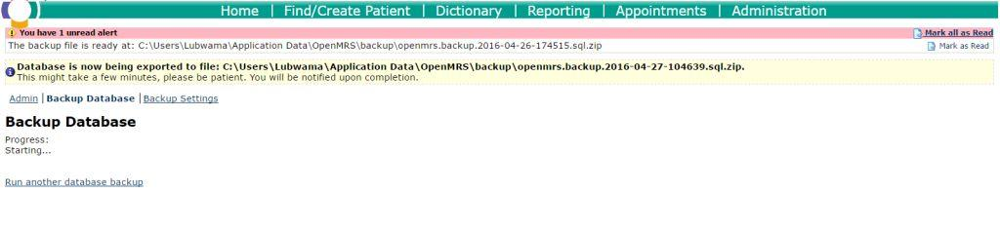

## Backup and Restoration

### Database Backup

#### Database Backup Module

The database backup module is available to run from the administration interface.

The Backups are stored in the OpenMRS configuration directory  
The two common paths to find the backups are  
1. C:\Users{UserAccount}\Application Data\OpenMRS\backup  
2. C:\Application Data\OpenMRS\backup

The steps in the backup are.  
1. On the Dash Board Click on the Backup Database icon.  
  
2. Click on the Execute database backup now  
  
3. The backup begins and the progress is shown until completion.  
  
4. Once the backup is complete, a message is displayed with the status.  

#### Using HeidiSQL

TBD

#### Backup using mysqldump client

The native mysqldump tool can also be used to dump a database into a file  
`mysqldump -u [useraccount] -p --opt --routines openmrs > backupDDMMYY-HHMM.sql`

* \[useraccount\] - the username for accessing the database
* backupDDMMYY-HHMM.sql - the name of the file, recommended naming for example is backup04April16-1425.sql which has a date and time when the backup was done

**NOTE** The password will be prompted for on the command line

An example command will be  
`mysqldump -u username -p --opt --routines openmrs > backup04April16-1425.sql`

### Database Restore

#### Restore using HeidiSQL

The UgandaEMR installer includes HeidiSQL a tool that allows the restoration of backup files into the backend database.

#### Restore using mysql client

The native mysql client tool can also be used to load a database from a file

`mysql -u [useraccount] -p openmrs < [backup_file]`

* \[useraccount\] - the username for accessing the database
* \[backup\_file\] - the path to the backup file. If the path contains spaces then enclose the path in double quotes for example "C:\Application Data\OpenMRS\backup\backupfile.sql"

**NOTE** The password will be prompted for on the command line

#### **Restore using Backup and restore option in UgandaEMR \(2.0 on wards\)**

UgandaEMR 2.0 provides a database restore option. found in the start menu programs/apps section to use it,

1. Launch start menu 
2. Go to "All programs/All apps"
3. Under UgandaEMR select "Restore UgandaEMR Database". This will launch a popup window.
4. In the Popup window Click install. This gives  you a place to browse for a database you wish to restore.
5. Select the Database file then click open. A dialogue will appear showing the database you have selected
6. Click okay.  At this point cmd promopt widnow will show and close after the database has been restored.

#### Improving Restore Speed

The default configuration does not provide adequate speed for restoration of backups. If you have more than 5000 patients follow the steps below to improve restore speed

1. Open Notepad as an administrator - this is because the configuration file being edited in located in the C:\Program Files folder which has restrictions on who can edit the files. 
2. Open the file my.cnf \(or my in case Windows Explorer is configured to hide the extensions for files\)
3. Search for the variable innodb\_buffer\_pool\_size and change is value to 512M
4. If the variable does not exists add it following the steps below
   * Search for the section \[mysqld\]
   * Add innodb\_buffer\_pool\_size=512M as the first line in that section 
   * Add max\_allowed\_packet=16M \(this caters for the larger size of backup batches now being sent\) 
5. Save the file
6. Restart your computer 
7. Run the following on the command prompt `mysql -u openmrs -p -e "SHOW GLOBAL VARIABLES LIKE 'innodb_buffer_pool_size'"` which will show 536870912 which means the variable has been changed 
8. Start the import again 

** NOTE **Depending on your Windows version the file may be called my.ini and displayed as my in case file extensions for known types are hidden.

### Common Troubleshooting Tips

#### Error incorrect integer value: 'false' for column 'retiredby'

This error usually happens for older versions of the backup module, so the fix is to open the backup file and make the following changes

* Replace 'false' with '0'
* Replace 'true' with '1'

Save the changes to the script then run it again

