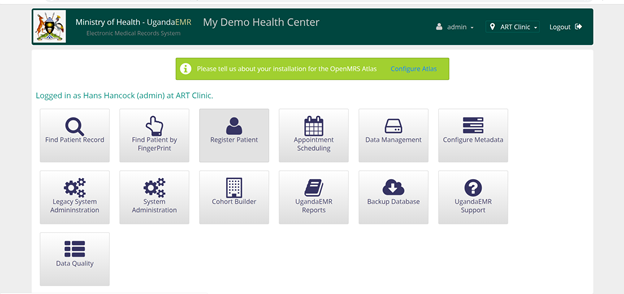
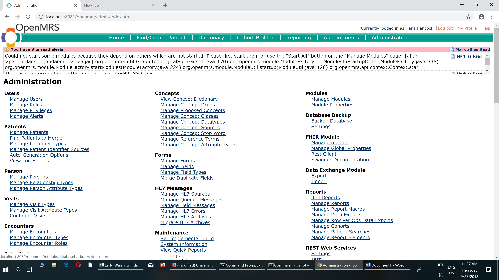
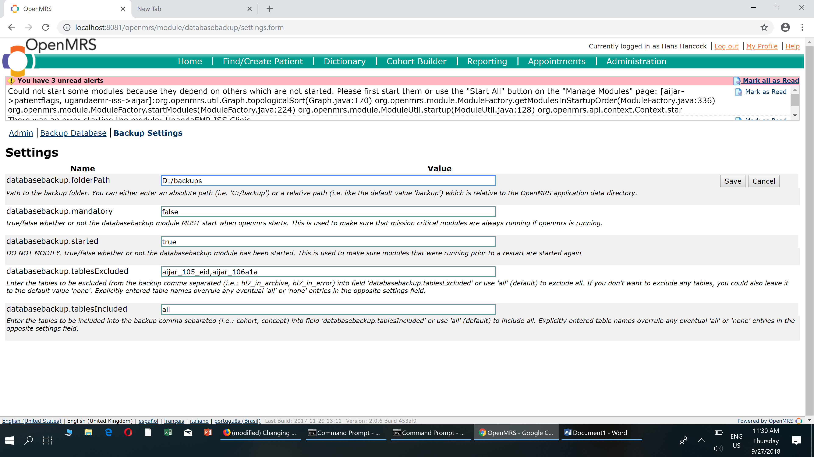

# Changing Database Backup File Path

## Guidelines For changing Database Backup Path

By default the backup files for UgandaEMR are stored on local Disk C in **Users/{UserAccount}/Application Data/OpenMRS/backup** folder Or C:/Application Data/OpenMRS/backup.

In cases where a user needs to change the folder where these backups are stored, the following steps should be followed:

1. Login in UgandaEMR
2. On the Dashboard, click on "**Legacy System Adminstration**".
3. [ ] Under Subsection of **Database Backup,** click on **Settings**
4. Change the **databasebackup.folderPath**  value to a new path to the folder  that you would like to save your backups to.       You can either enter an absolute path \(i.e. 'C:/backup'\) or a relative path \(i.e. like the default value 'backup'\) which is relative to the OpenMRS application data directory.
5. Click Save after  writing your new path.

   Now your next  database backups  will always be saved in the folder you have specified above.

