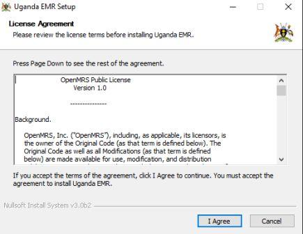
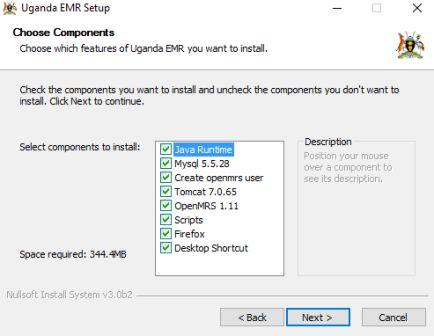
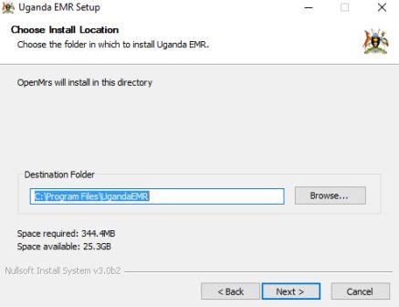
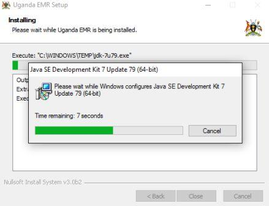
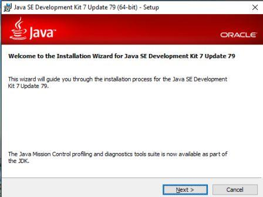
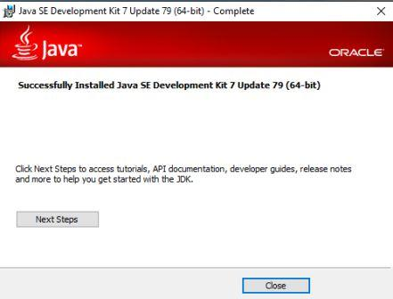
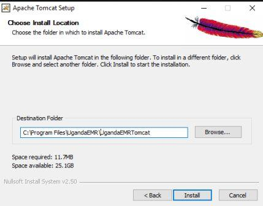
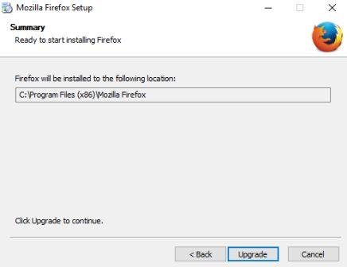

#Installing UgandaEMR
## New Installation - Using the installer 
The Installation Process of Uganda EMR is a step by step process but in one installation. Bellow are the series of stages of installation

# Chapter 1: Installation of the System: Before you begin. (Adapted from WHO OpenMRS Express Guide) 

## **Requirements: **

1. Windows 7 and above
2. 4GB of RAM and above
3. 1.5GHz duo core processor and above 

## Installation context
32 Bit Installer
64 Bit Installer.

## Obtaining OpenMRS 

URL:

## **Directory structure**

**Main Directory** - C:\Program Files\UgandaEMR
**Tomcat Directory** - C:\Program Files\UgandaEMR\UgandaEMRTomcat
**War file location** - C:\Program Files\UgandaEMR\UgandaEMRTomcat\webapps\openmrs
**Mysql Directory** - C:\Program Files\MySQL\MySQL Server 5.5

Windows Start Menu

# Chapter 2: Installation of the System (Adapted from WHO OpenMRS Express Guide)

 

## Installer

The installer is made of two files the 32 bit and the 64 bit installer. These apply according to the computer bit system.

### Installation diagram.

### Installation process.

Detailed installation in picture
1. Launch of the splash screen

2. Agreement of installation

3. Selecting components to install.

4. Determining Installation directory.

5. Determine Shortcut directory

**Required Software**

6. Install Java

7. Install Mysql

8. Install Tomcat.

9. Install Firefox

**Completion **

10. Complete Installation

**Installation of The application**

11. Start Application.

This installation guide is pictorial.

Step 1 Check the Computer Operating System Bit

Step 2 Launch the installer either 32 bit or 64 bit, depending on the computer bit.

Step 3 Agree to the terms and conditions in the installer

Step 4 Select components to install

Step 5 Select default directory in which openmrs will install. NB. Leave the current/default preselected option.

