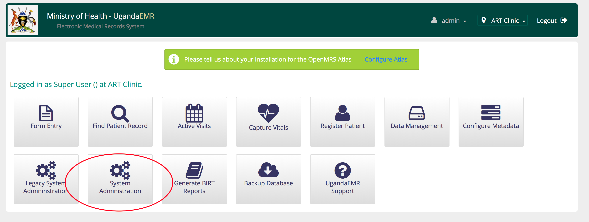
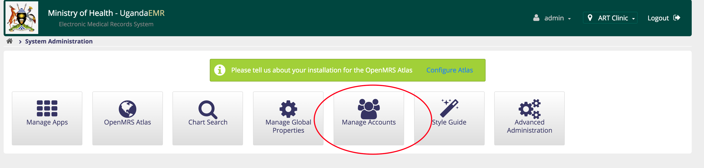
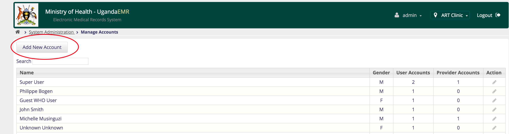
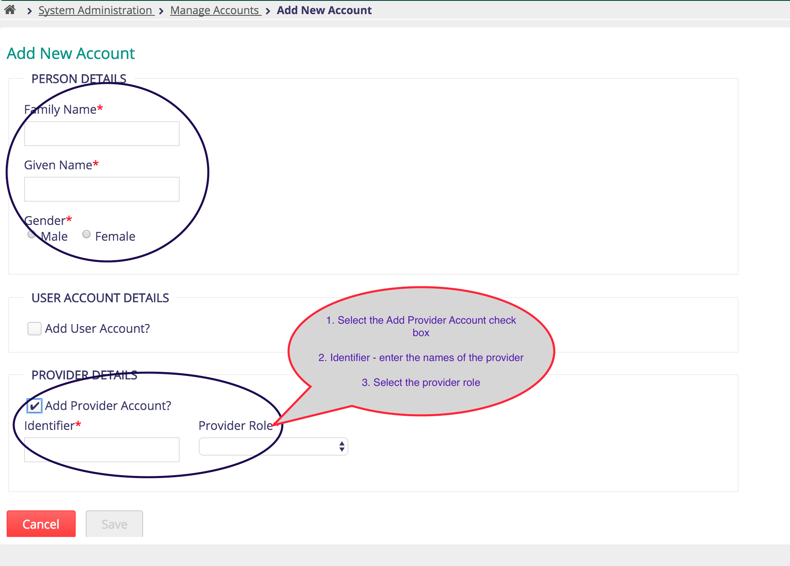
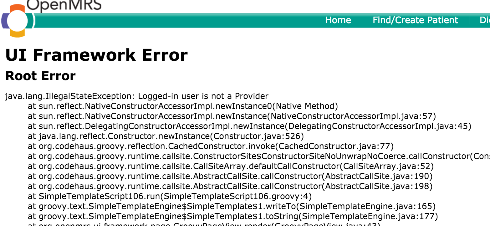
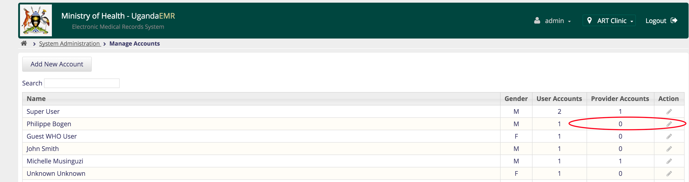
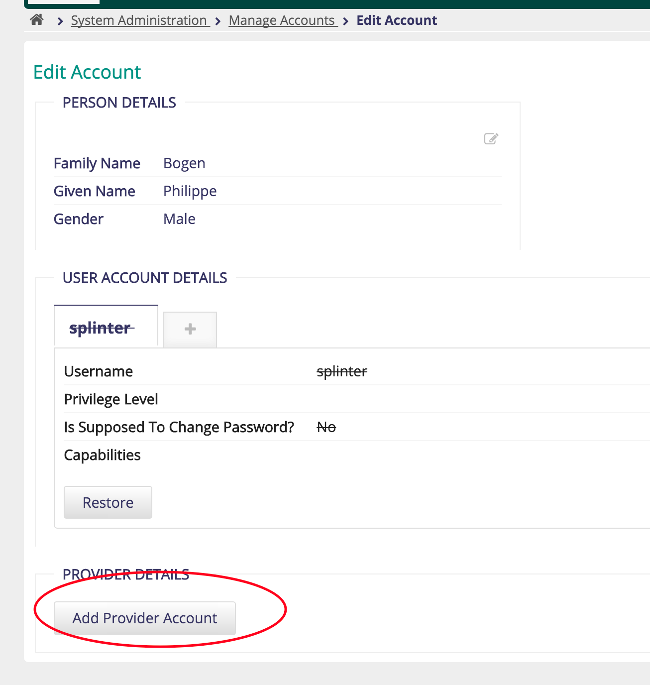

# Managing Providers 
A provider is a person who gives services to clients within a facility, may be a doctor, nurse or midwife. 

In addition anybody registering patients also needs to have a provider account. 
## Creating a New Provider
1. Click the System Administration link on the home page

2. Click the Manage Accounts link on the system administration page
 
1. Click the New Account button

1. On the new account page, enter the full names, select gender and select the Add Provider checkbox 

4. The identifier for the provider use their full names, then select the role that the provider plays such as Clinical Doctor, Nurse
5. When all the required information has been entered then the Save button becomes green as below

## Making an existing user a provider
There are situations where a user was created and not made a provider, which causes the error as below

The steps to make an existing user account a provider are as follows:
1. Click the System Administration link on the home page

2. Click the Manage Accounts link on the system administration page
 
3. Click the Edit button next to the user account you want to edit. Any user with 0 (zero) in the provider Accounts has not been created as a provider

4. On the Edit Account click the Add Provider Account button

5. When all the required information has been entered then the Save button will appear

3. 
 
