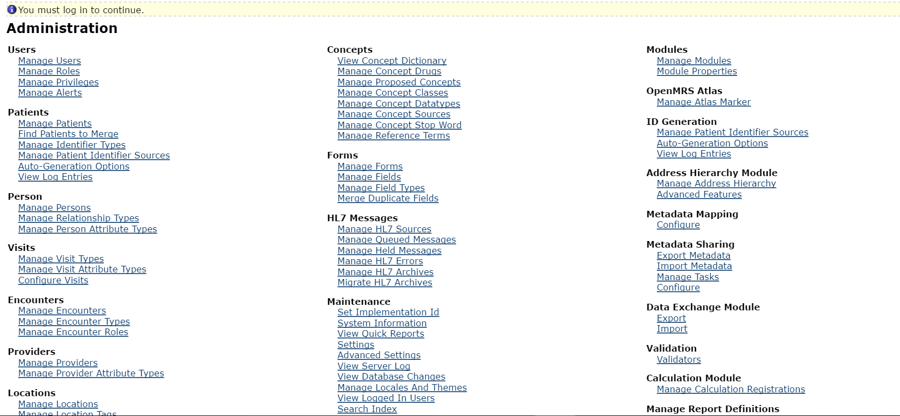
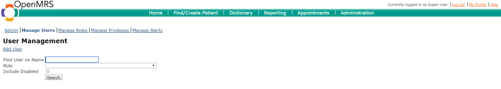
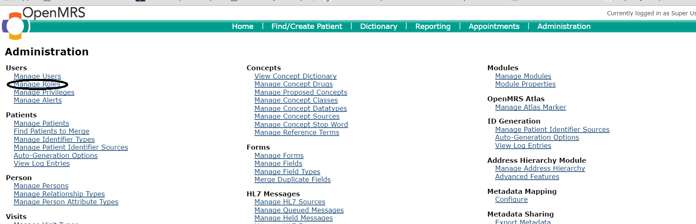

# Manage User Accounts
## Create a new user account
1. Login as a user with administrator privileges

2. click legacy administration link as circled in the image below

3. Click on manage users link as shown below

4.If it is a new user, click on the Add User link as shown below

## Reset a user password

## Add a new role to a user account 
Click on Manage Roles as circled below

To add a  user role, click on Add Role as  circled below:

