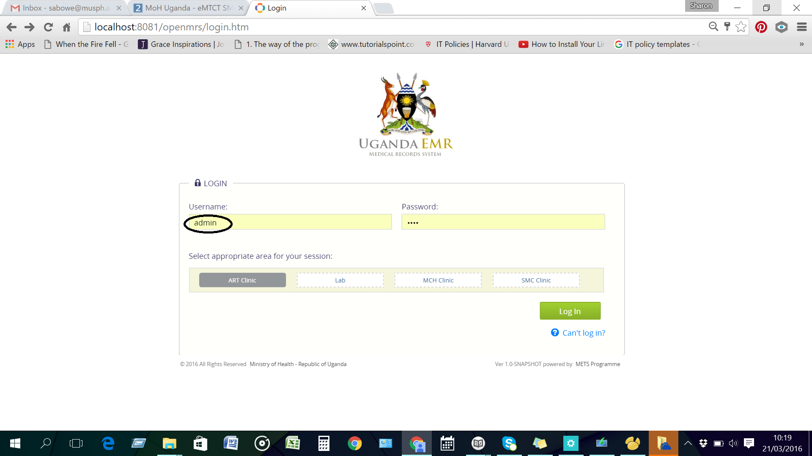

# Manage User Accounts
## Create a new user account
1. Login as a user with administrator privileges
 

2. click legacy administration link as circled in the image below

3. Click on manage users link as shown below

4.If it is a new user, click on the Add User link as shown below

## Reset a user password

## Add a new role to a user account 

## Making an existing user a provider
There are situations where a user was created and not made a provider, which causes the error as at 

The steps to make an existing user account a provider are as follows:
1. 
