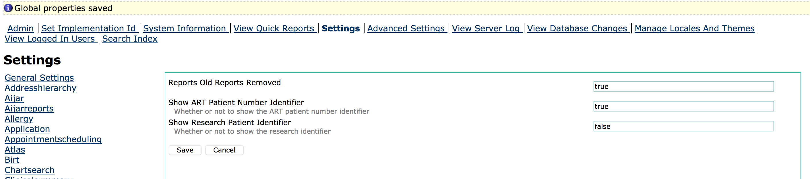

# Configuring your installation

## Enabling ART Number Patient Identifier

Ministry of Health policy dictates that the patient's preART number has to be carried on into ART treatement, as the ART number. However there are circumstances where this is not the case, so a separate ART number identifier is needed.

To enable this identifier:

1. Login as a user with administrator privileges

   

2. Click legacy administration link as circled in the image below

   

3. Under Maintenance in the middle column, select Settings 
4. On the Settings page, select UgandaEMR from the left hand side
5. Change the value of the RT Patient Identifier to true, then click the Save button 
6. Restart your computer and the new identifier will be enabled.

## Tomcat Configurations

1. Go to Windows Startup Menu
2. Search for Configure Tomcat and click on it
3. On the Configuration Select Java Tab
4. Delete values in the Initial memory pool and Maximum memory pool
5. Click okay
6. Restart Tomcat

## MySQL

1. Open the file my.cnf in C:\Program Files\MySQL Server\MySQL Server 5.5
2. In the section that starts with \[mysqld\] add the line `innodb_buffer_pool_size=2G`
3. Restart the computer 

