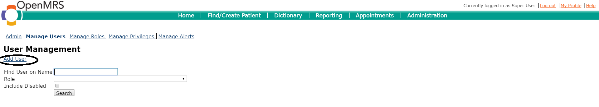

# Create a new user account

1. Login as a user with administrator privileges

2. Click legacy administration link as circled in the image below

3. Click on manage users link as shown below

4. Click on the Add User link as shown below

5. Click the button under the Create new person text

6. Enter the details for the user account, making sure to select the following:
  * The create provider account must option
  * Select the System Developer and Provider roles

