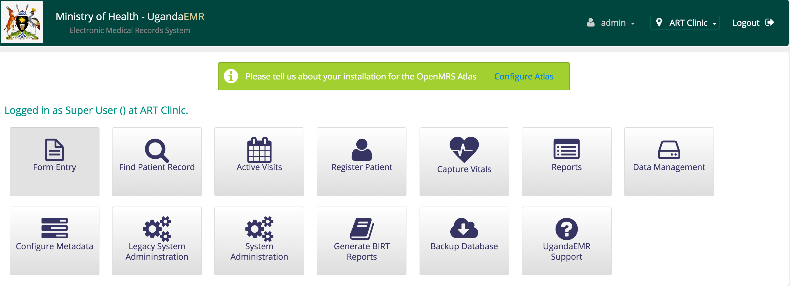
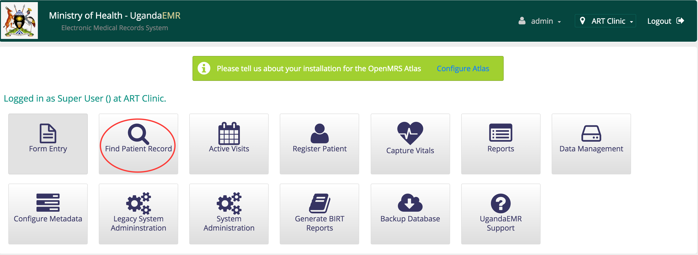
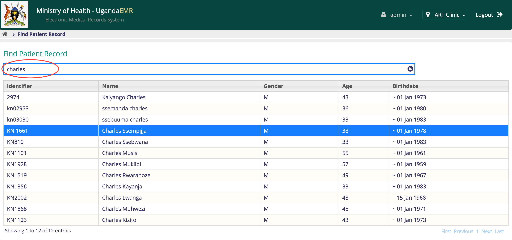
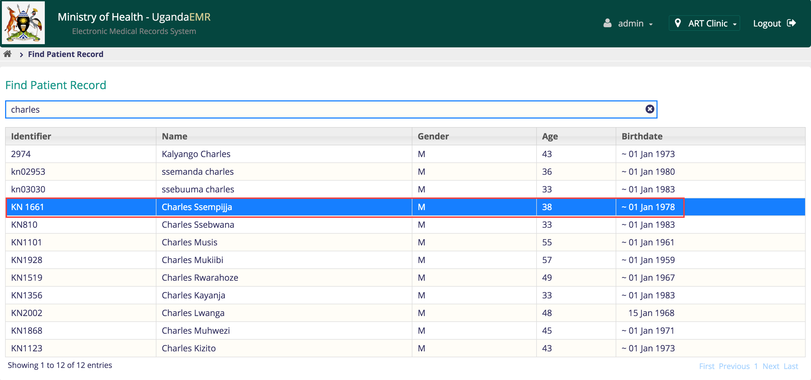
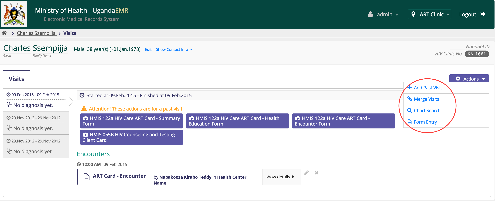
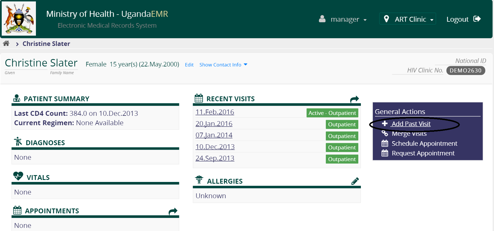
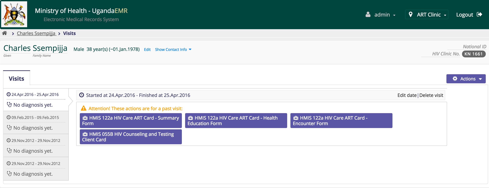

# Entering Client Information
To enter patient information
1. Go to home

2. Click search patients

3. Enter the search term in the text box, this can be the patient name or any unique identifier by which the patient can be identified with (eg. ANC#,PNC#, ART#,EID#, etc. ), make sure that your search term is more than three (3) characters long otherwise nothing will be displayed

4. After identifying the correct patient, click on it; this will take you the patient dashboard.

## Visits
To add a visit, make sure you are on the patient dashboard for whom you want to enter a visit (refer to entering patient information) or if a visit is active you can click on actions drop down and then select add visit

### Add Past Visit
To add past visit, make sure that the patient has no duplicate visit with the same date you are entering and then;
1. Click on the add past visit link on the right

2. Enter the visit start date and the visit stop date if the visit is more than one day, otherwise leave the default

3. Click confirm
4. This will take you visit page

### Edit Vist Start and End Dates
To edit a visit,
1. Select the
click on the edit link  
If the dates you want to select do not appear, it means that there are encounters whose date can not be in that range.  
Either delete all the encounters which belong to the visit or you can just create new visit
2. Otherwise click confirm

### Delete a Visit
The delete link appears only if the visit has no encounters; so to delete a visit make sure that the encounters are deleted
