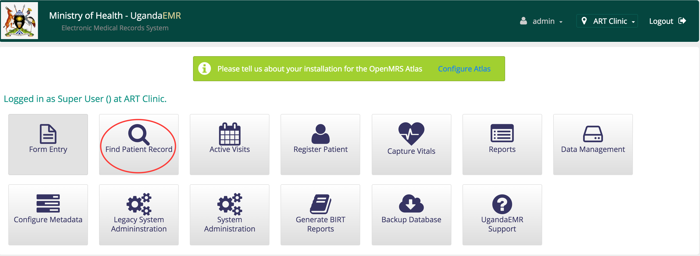
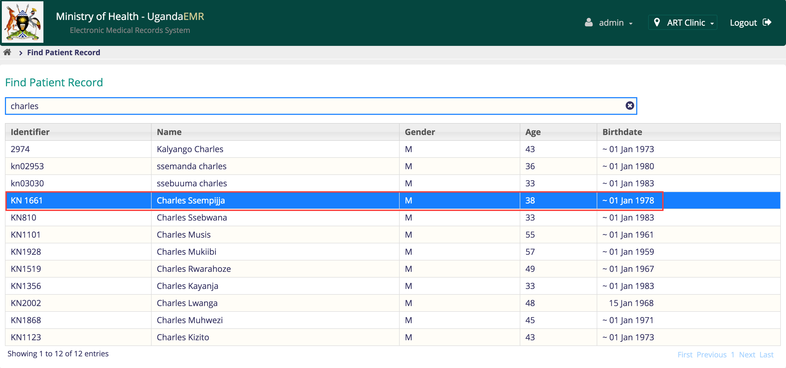
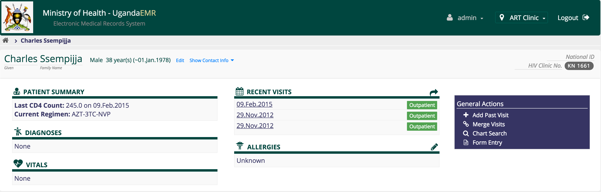
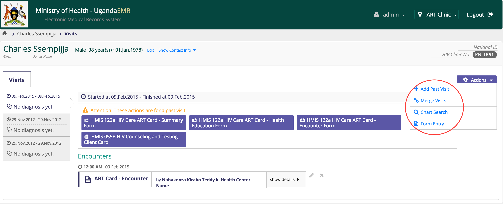
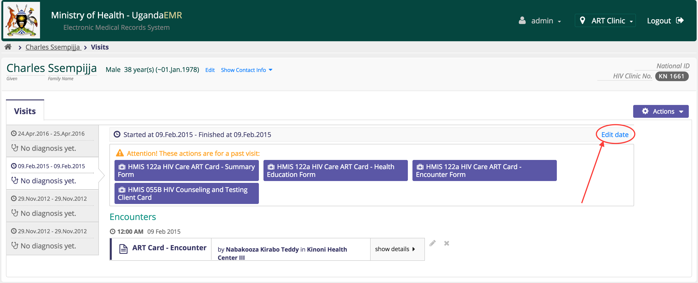
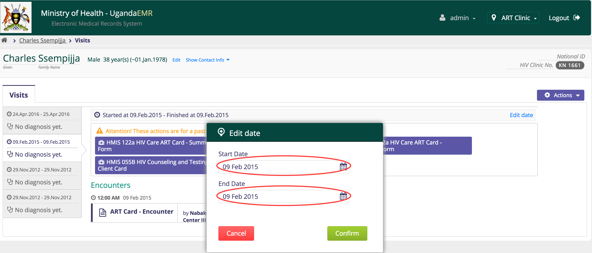

# Entering Client Information

The following data capture tools are available within UgandaEMR based on the MoH October 2014 HMIS Manual:

1. HMIS 031 Outpatient Form
2. HMIS 035a Safe Male Circumcision Client Form 
3. HMIS 053 Appointment Book 
4. HMIS 055b HIV Counseling and Testing Client Card
5. HMIS 071 Integrated Antenatal Form
6. HMIS 072 Integrated Maternity Form
7. HMIS 078 Integrated Postnatal Form
8. HMIS 082a Exposed Infant Clinical Chart 
9. HMIS 089a Daily Activity Laboratory Register for Clinical Chemistry
10. HMIS 094 Daily Activity Register for Haematological Indices
11. HMIS 095 Daily Activity Register Viral Load and CD4 Count
12. HMIS 096A Health Unit TB Register 
13. HMIS 117 Viral Load Non Suppressed Reister
14. HMIS 122a HIV Care/ART Card 
15. Comprehensive HIV Care/RT Patient Referral/Transfer Form

Each of the data collection tools above also has the corresponding register developed as an inbuilt data report

## Entering Client Information

To enter patient information follow the steps below

1. Go to the home page 

   

2. Click search patients

   

3. Enter the search term in the text box, this can be the patient name or any identifier assigned to the patient, such as but not limited to National ID, ANC number, PNC number, Patient clinic number, Exposed Infant or birth cohort number. The search only begins after three \(3\) characters have been entered.

   

4. In the search results, click on the row with the patient which will display that patient's dashboard.

   

   

## Visits

All patient data capture is based on visits.  
To add a visit, make sure you are on the patient dashboard for whom you want to enter a visit \(refer to entering patient information\) or if you are already on a specific visit then you can click on actions drop down and then select add visit  
  

### Add Past Visit

To add past visit, make sure that the patient has no duplicate visit with the same date you are entering and also make sure that all other patient visits are closed \(no open visits\) then;  
1. Click on the _**add past visit**_ link on the right  

1. Enter the  _**visit start date**_ and the _**visit stop date**_ if the visit is more than one day, otherwise leave the default

   

2. Click confirm
3. This will take you to the visit page

   

### Edit Visit Start and End Dates

To edit the dates for a visit,  
1. Click on the edit link.  
If the dates you want to select do not appear, it means that there are encounters whose date can not be in that range.  
Either delete all the encounters which belong to the visit or you can just create new visit

## 

  
2. Otherwise click confirm

### Delete a Visit

The delete link appears only if the visit has no encounters, so make sure that the encounters are deleted from the visit.

