# ART Card

This section describes how to enter data from the ART card.

## Summary Page

### Enter a New Summary Page

1. Go to the patient dashboard 
2. Create a past visit with the same date as the HIV enrolled date on the blue card

   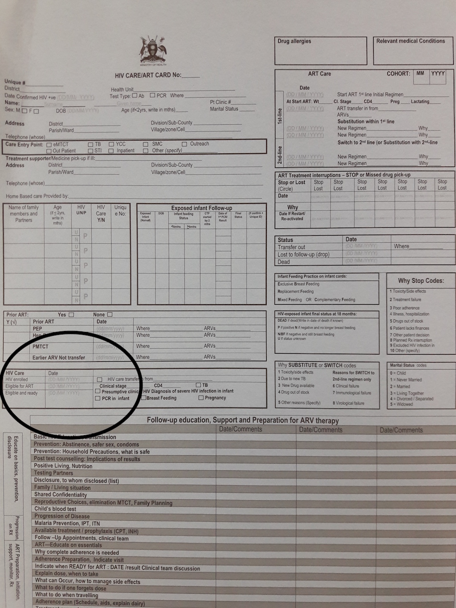

   

3. The visits page is displayed, with the current visit displayed along with a link to the summary page

   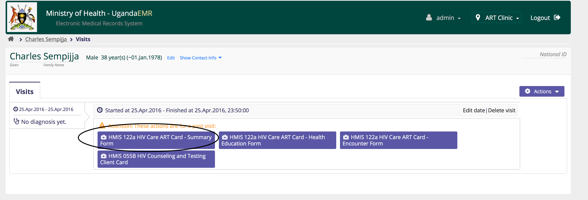

4. Click the link to the HMIS 122a HIV Care ART Card - Summary Form to enter the summary page  

   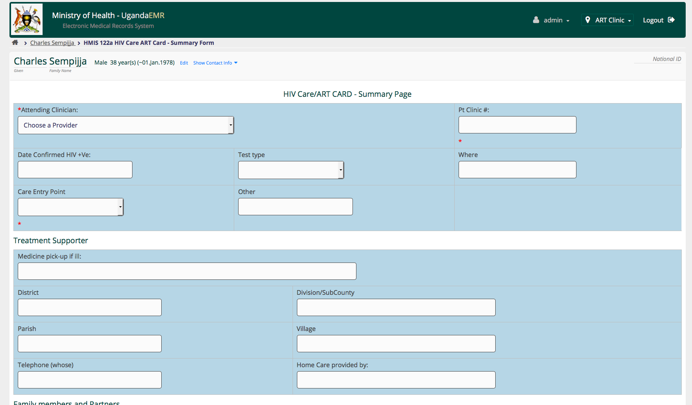

### Transfer In

A transfer occurs when a patient who is currently in care in one facility, moves to start receiving care from your facility.

1. The `HIV Enrolled Date` for the client is the date when they first come to your facility to receive care and is the date they are entered in the Pre-ART Register and assigned a number.
2. In this case the `ART Start Date` can be earlier than the `HIV Enrolled` date 
3. Set the `Eligible for ART` and the `Eligible and Ready` dates to be the same date as the `HIV Enrolled Date` to overcome a validation check in UgandaEMR 2.0.0 

For a patient enrolled into care on April 7, 2018, started ART on September 12, 2018, then transferred into a facility on July 1, 2019. The dates are as follows:

* HIV Enrolled Date - `July 1, 2019`
* Eligible for ART - `July 1, 2019`
* Eligible and Ready - `July 1, 2019`
* ART Start Date - `September 12, 2018`

### Edit an Existing Summary Page

Only one summary page can be entered for each patient, so creating a new summary page will load the existing page for the patient.

## Health Education Page

To capture the health education info, follow the steps below;  
1. Go to the patient dashboard and click Add Past Visit link as described in the chapter entitled Entering Client Information &gt; Visits &gt; Add Past Visit. [Click here](./) to access the steps.  
2. Click the _**HMIS 122a HIV Care ART Card-Health Education Form**_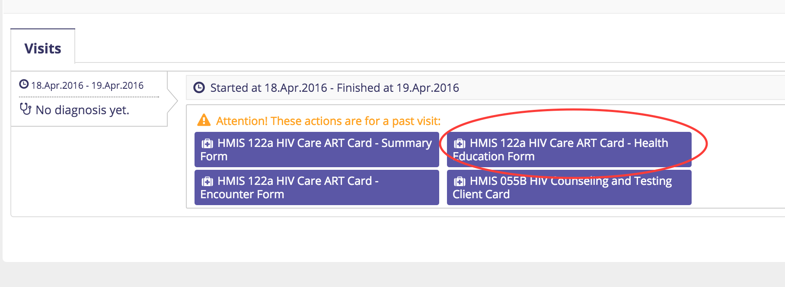  
2. You should see the health education form like this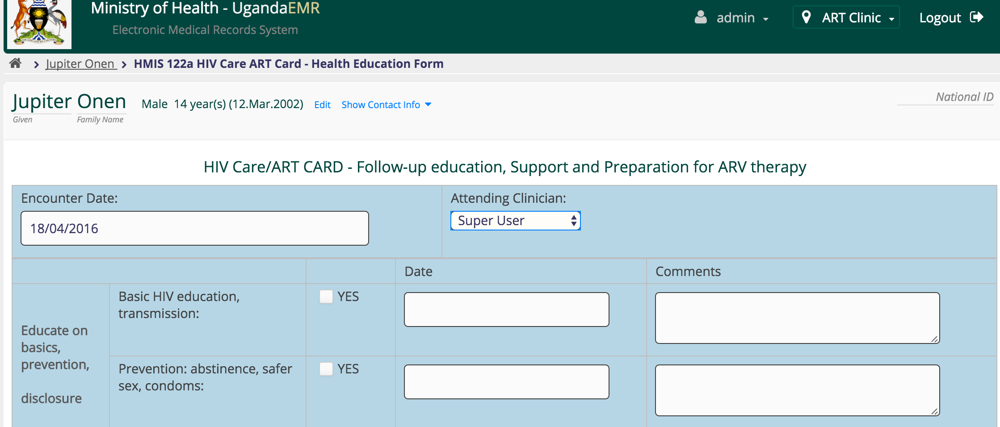

1. Select the _**Attending Clinician**_ 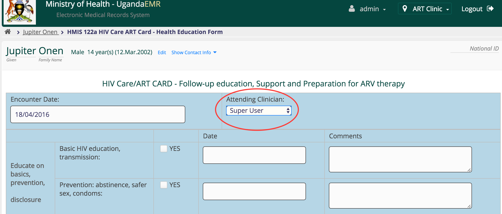
2. Enter the details as shown. Be sure to select the Yes checkbox so as enter date and comment 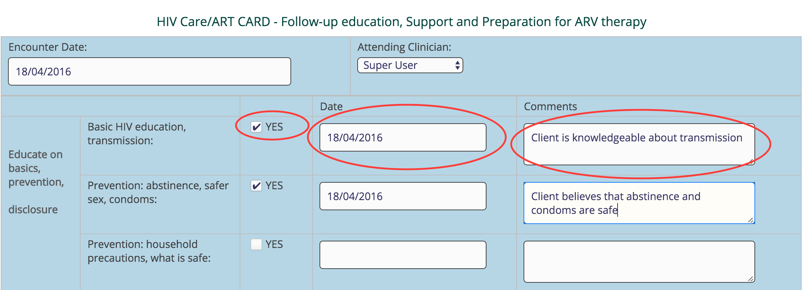
3. Scroll to the bottom and hit the Enter Form button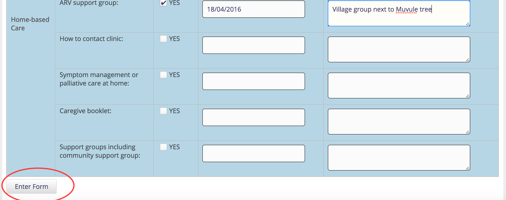
4. Once added successfully, you should see a page showing the most recent health education form added 

## ART Encounter Page

To capture the ART Card Encounters, follow the steps below;  
1. Go to the patient dashboard and click Add Past Visit link as described in the chapter entitled Entering Client Information &gt; Visits &gt; Add Past Visit. [Click here](./) to access the steps.  
2. Click the **\*HMIS 122a HIV Care ART Card-Encounter Form** 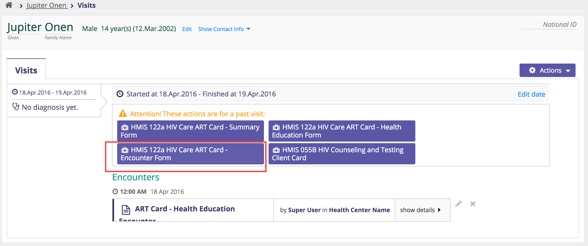  
2. You should see the _**Encounter**_ form looking like this 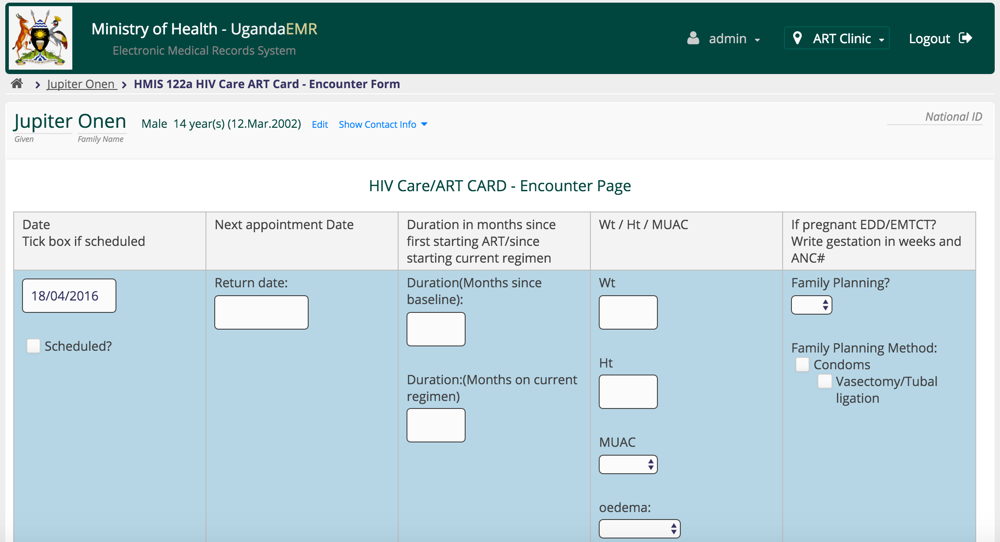  
3. Because the encounter chart has a very long table,it was split into four sections\(or tables\).  
4. Capture the first section as below 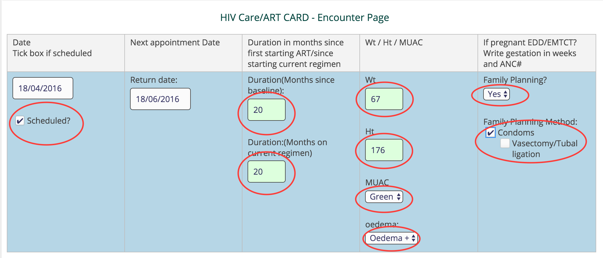  
5. Capture the second section as below 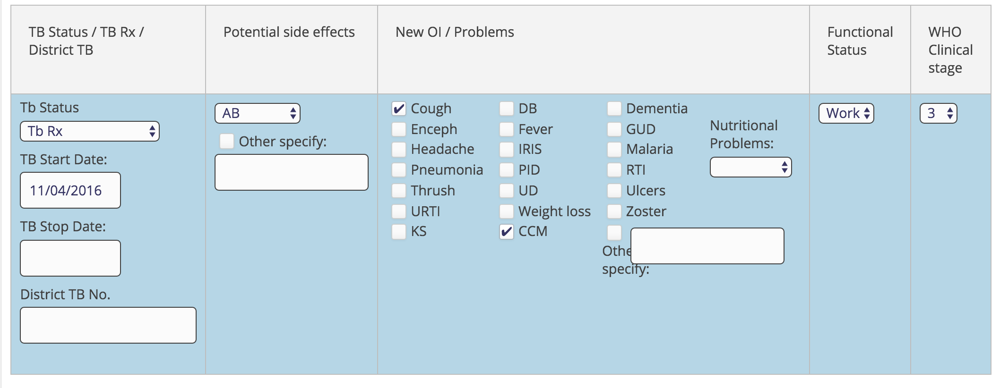  
6. Capture the third section as below 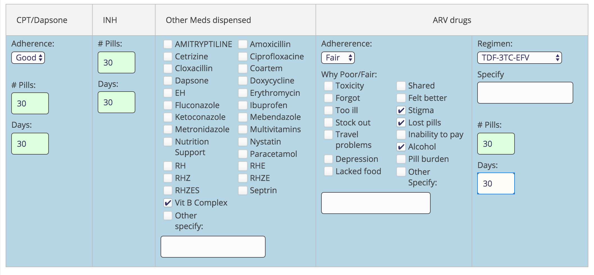  
7. Capture the fourth section as below - TBD add entry of detectable and undetectable viral loads results 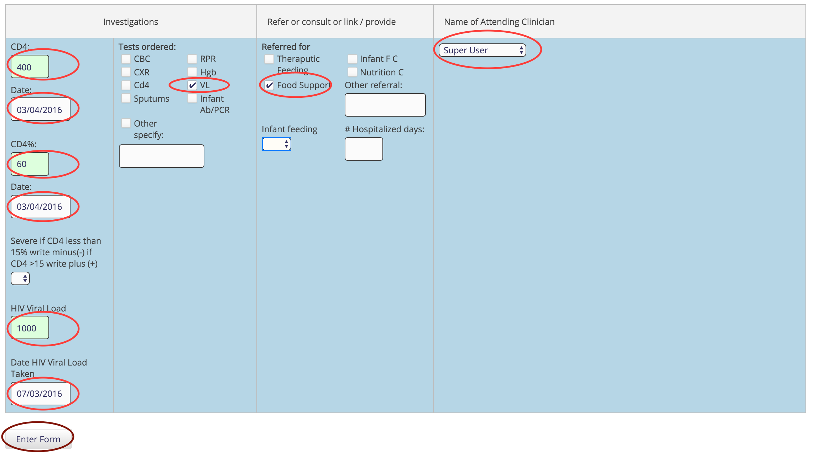  
8. Click the _**Enter Form**_ button to save the encounter record  
9. You should see a new page 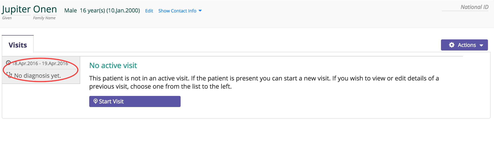  
10. Click on the visit circled on the left to see the saved encounter record 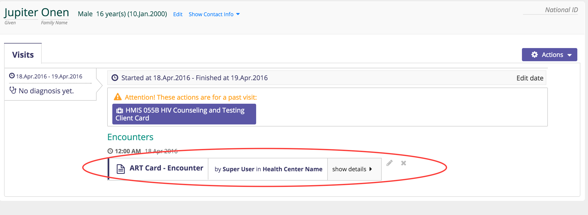

### Limiting Visits on a Specific Day and Public Holidays 

The default configuration restricts the maxiumum number of patients who can be seen on a day to 100 and disables the ability to set a predefined public holiday.

#### Changing the default number of patients who can be seen per day

1. Login as a user with administrator privileges

   

2. Click legacy administration link as circled in the image below

   

3. Under Maintenance in the middle column, select Settings 
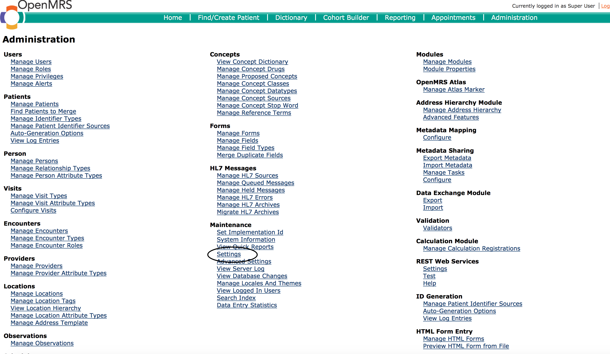

4. Click Ugandaemr in the left hand column, and select the "Maximum Patients Per Day " variable 

5. Click the "Save" button in the bottom right hand corner 

### Viral Load Data

The recommendation for entering viral loads is as follows:  
1. Enter the viral load in the first encounter after the results have been received at the facility  
2. The viral load information is entered on the ART Encounter page from the results slip in the bottom left hand corner as follows:

* Date Viral Load Taken - the date when the patient was bled for viral load 
* Viral Load Results:
  * Detected - a viral load result was detected which enables the Viral Load field to enter the copies found 
  * Not Detected - no viral load detected 
  * Sample Rejected - there are issues with the sample so the patient has to be bled again 
* Viral Load - the copies per ml

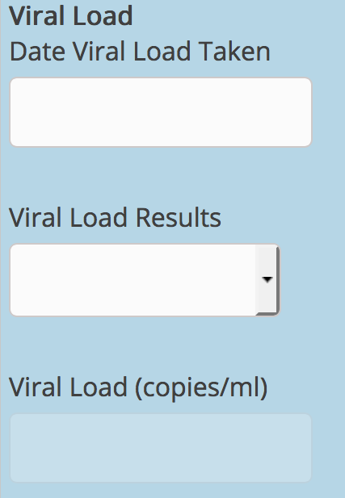

### Common Errors

### Timeout when entering data

Should the page fail to save, due to a timeout session/when you have spent more than a 20 minutes without saving, do the following:  
1. Scroll to the upper most part of the page,  
Enter your username and password 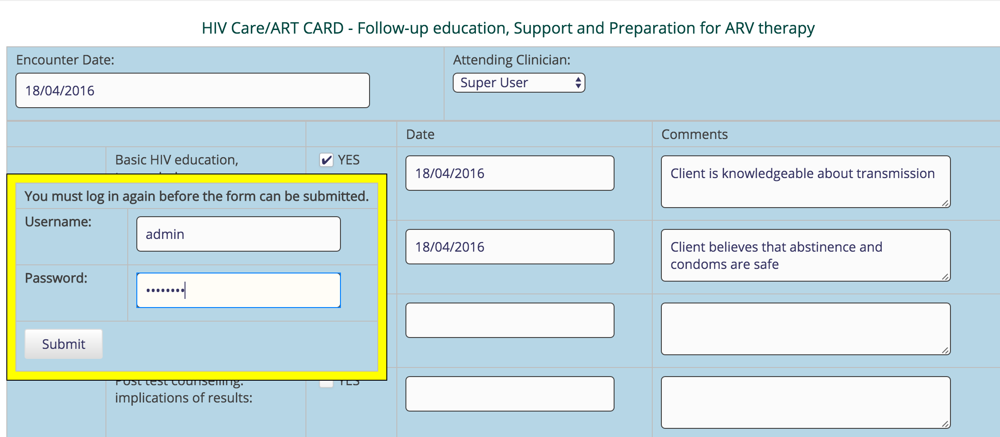  
2. Scroll to the bottom and hit the Enter Form button  
3. Once added successfully, you should see a page showing the most recent Encounter form added 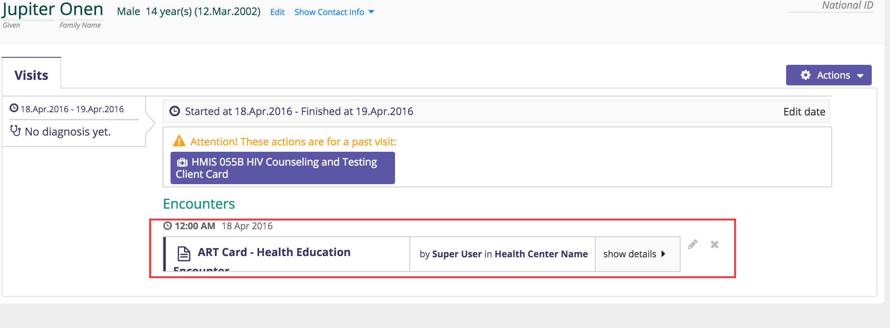

### Contact System Administrator on Saving Encounter

Should the Encounter fail to Save indicating the above message in the top right Corner of the screen, do the following

1. Uninstall the existing version of Firefox
2. Download and Install the latest version of firefox.
3. Restart the computer and launch UgandaEMR 
4. Enter the Encounter Data and Save 

