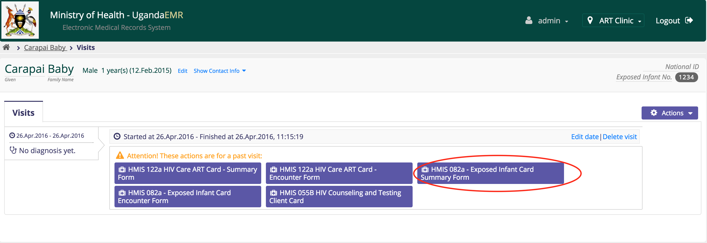
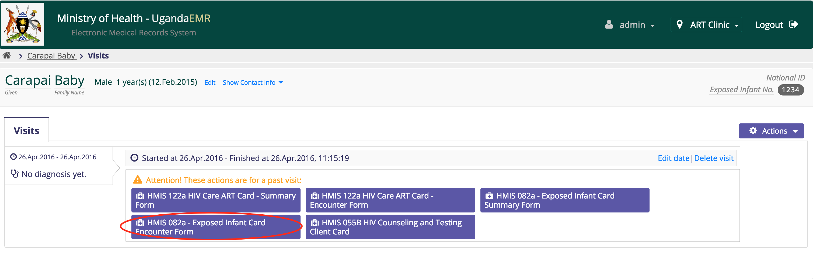

# HIV Exposed Infant Card

## Summary Page

### New Summary Page

**What you need** 1. Exposed Infant Clinical Chart  2. Registered infant in the system \(search for the infant, refer to entering client information section\). If the Infant is not registered in the system refer to the patient registration process \(Use the basic information on the card to register patient\) 3. For the registered infant, he/she should have a visit that matches the date the chart was opened. If there is no visit, refer to creating visits section

 

Once you have a visit that matches the date chart was opened, then click on it, this will take to the visit page  
While on the visit page click the Exposed Infant Card Summary Form link which will take you to Exposed Infant Clinical Chart Summary Page, where data entry can be done  

**Things to note** 1. The fields marked \* are required fields and hence form can not save without those fields 2. Take note of numeric fields and make sure that no strings included, this include fields like wight, height. All fields should be plain numbers without adding measurements like cm,kg \(use 5.2 instead of 5.2kg and 100 instead of 100cm\) 3. The age of infant must be in months and not weeks or days. Instead of writing 2 months, write 2. The age must be converted to months. If the age is in weeks or days convert to months. 4. The summary page is entered once and edited if need be. No one infant can have more than one summary page. 5. Date Chart Opened will be auto filled

### Editing Summary page

Since a patient can not have more than one summary page, clicking on the summary page link on any visit page will take you to edit the already entered summary page.  
You can also click the icon to edit, to edit the EID summary page

## Encounter Page

### New Encounter Page

**What you need** 1. Exposed Infant Clinical Chart  2. Registered infant in the system \(search for the infant, refer to entering client information section\). If the Infant is not registered in the system refer to the patient registration process \(Use the basic information on the card to register patient\)

 **Things to note**  
1. Each visit on the Exposed Infant Clinical Chart is an encounter 2. Date of the visit on the Exposed Infant Clinical Chart will the same as visit date on the openMRS system

To enter new encounter page,  
1. Create a visit with date that matches the date of visit on the Exposed Infant Clinical Chart, refer to creating visits section. If the visit exists, make sure that it does not have a counter page, otherwise refer to the edit EID encounter page section 2. For the selected or created visit, click on HMIS 082a - Exposed Infant Card Encounter Form link on the visit page  
 

**Things to note** 1. The fields marked \* are required fields and hence form can not save without those fields 2. Take note of numeric fields and make sure that no strings included, these include fields like weight, height. All fields should be plain numbers without adding measurements like cm,kg \(use 5.2 instead of 5.2kg and 100 instead of 100cm\) 3. The age of infant must be in months and not weeks or days. Instead of writing 2 months, write 2. The age must be converted to months. If the age is in weeks or days convert to months. 4. Date of Visit will be auto filled  
5. Type of visit corresponds to visit number on the chart

Repeat the process for each visit on Exposed Infant Clinical Chart is an encounter

### Editing Encounter page

To edit the encounter page, 1. Click the visit on the left that matches the date of the visit on the Exposed Infant Clinical Chart 2. Click the edit icon, to edit the EID encounter

