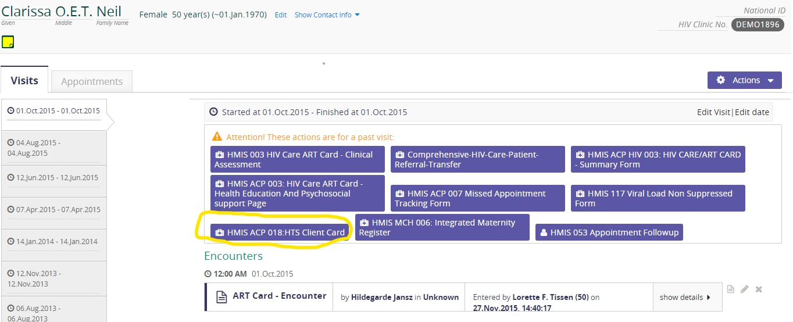
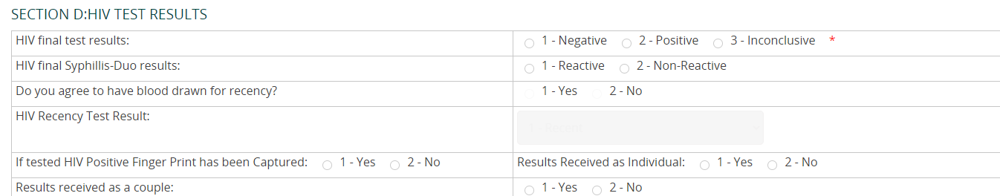

## How To Enter Recency Data Within The Hts Client Card

### Accessing the HTS client card for an existing or new patient in the EMR

1.	Search for the given patient or create a new patient

2.	Open a recent visit or start a past visit for the newly created patient

3.	View the patient’s dashboard and look for the HMIS ACP 018:HTS CLIENT CARD that shall be used to enter in the data.

### Notes

1.	Note that the serial number as decided upon by the facility MUST be entered into the EMR before entering the form as it shall be used as an identifier for that patient

2.	Note that the HTS Recency Test results should also be entered depending on the results from the lab i.e. Long-Term, Recent, Invalid, Negative

3.	Note that the consent question (Do you agree your blood to be drawn for Recency?) should be entered depending on the clients consent status from the counselor as this is important while carrying out recency at your facility.

All the other entries within the HTS form remain the same as  usual and should also be entered.