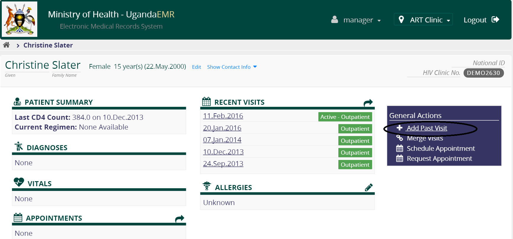

# HIV Counseling and Testing Client Card

## Enter new HCT card

1. Go to the patient dashboard 
2. Find a patient  3.Type in the name ofthe patient and select 
3. Create a past visit on the date that the patient was tested  5.Select past visit date 
4. Click on the link to the HIV counseling and testing card 

## Edit HCT Card

## Delete HCT Card

