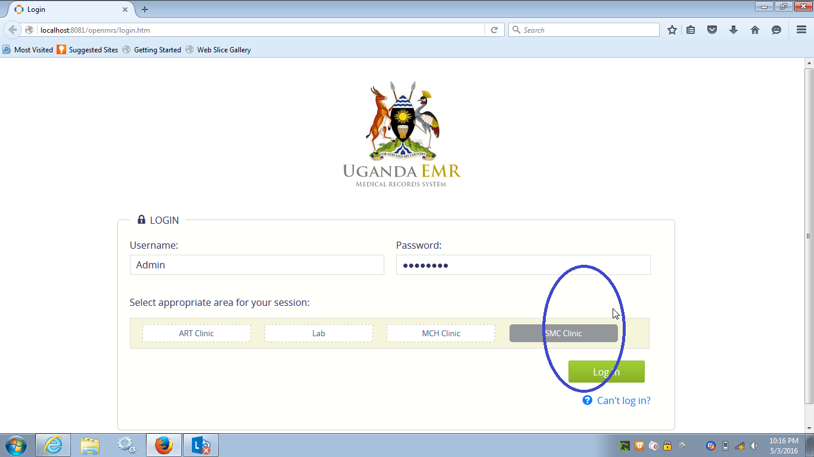
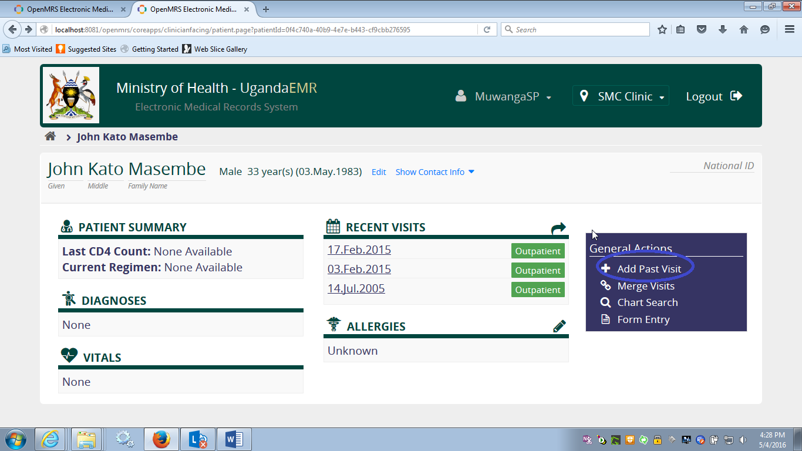
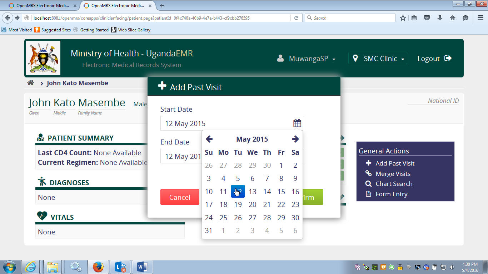
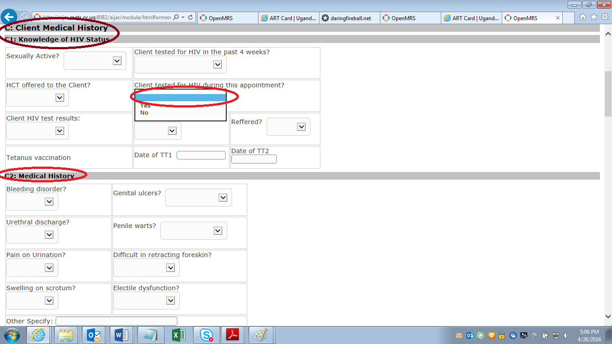
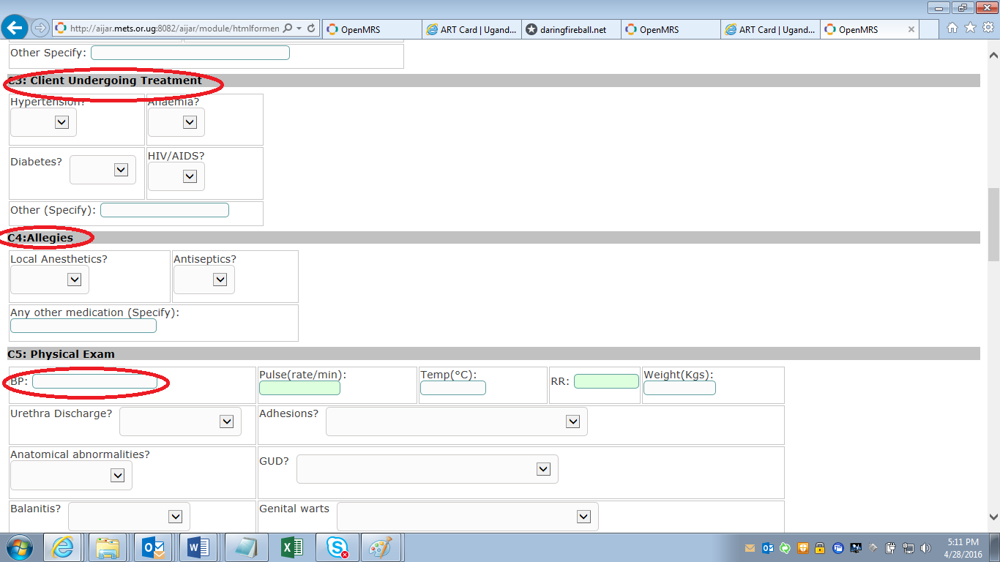
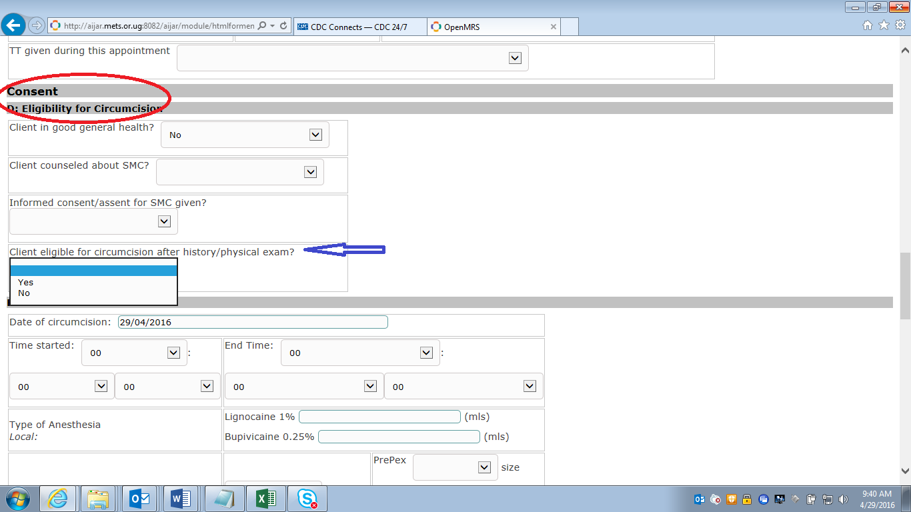
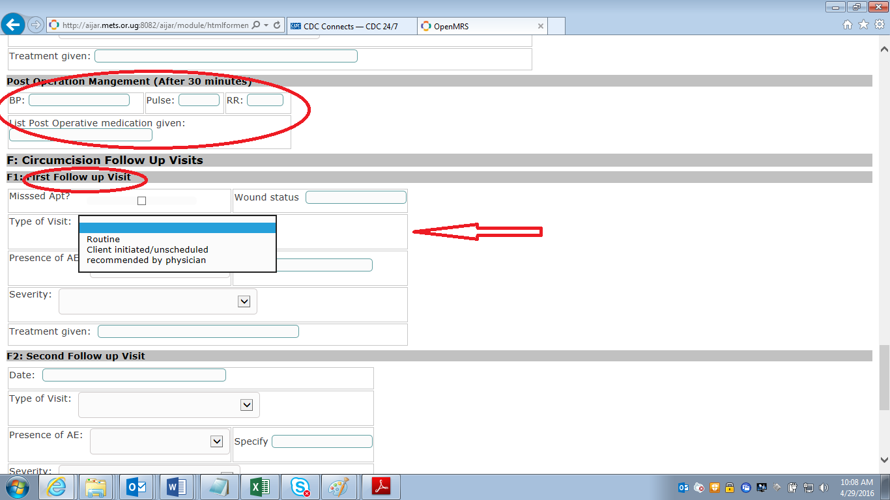
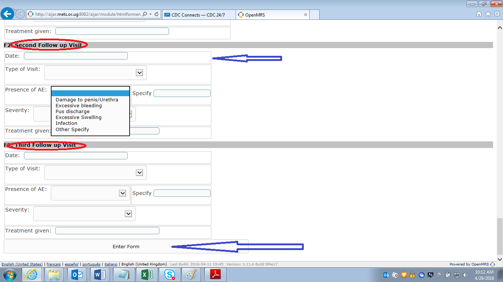
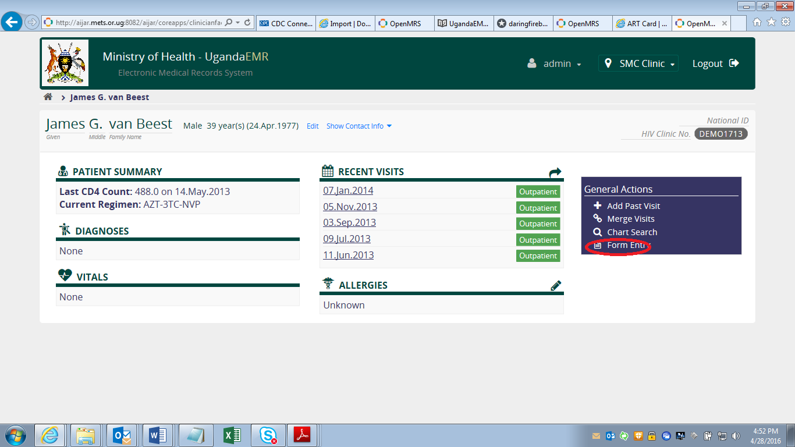
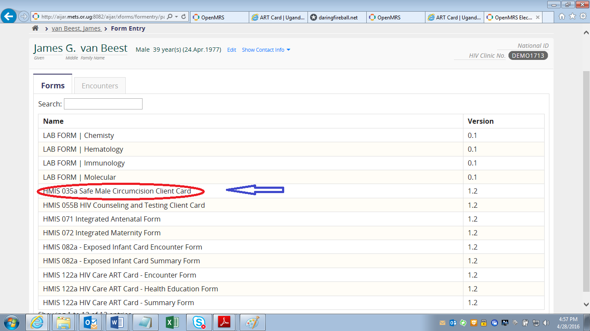

# Safe Male Circumcision

This section describes how to enter data from the SMC client card.

## SMC Client card entry

You will need the "HMIS FORM 035a - SAFE MALE CIRCUMCISION CLIENT FORM" as the data source, if entering data retrospectively.

login at the "SMC clinic" session, as shown below. 

A screen will open as shown below. Select the "Find Patient Record" option. 

On the screen that appears, type the name or ID of the patient, as registered in the system. 

Search for and find the client - 

If the client is not in the system already, registered him first \(refer to the entering client information section\).

Select "Add Past Visit" as shown below 

A screen will pop-up prompting you to select the "Start date" and "End Date" for the visit. Select the appropriate date and save by clicking the "confirm" button, as in the example below 

From the list that appears, select "HMIS 035a Safe Male Circumcision Client Card" as shown below

## Facility information:

For the "Date" field, select Year, month and day, in that order, using the Datepicker Note that all fields with a red star "\*" are "MUST ENTER" fields. 

## Client medical histrory

Enter all available client medical history information. When working with dropdowns, to clear a field, select the top most blank option.

Enter all information as filled in on the SMC card:- 1. Knowledge of HIV status 2. Medical history 

1. Client undergoing Treatment
2. Allergies
3. Physical examination

   

## Consent

Enter consent information as provided. Note that the circumcision section is valid only if "Client eligible for circumcision" is a "Yes" 

## Circumcision procedure

The "Time started" and "End time" are in the order: Hour, Minutes and Seconds 

## Circumcision follow-up visits

Note: This section is normally filled as an update. Reffer to instructions on how to update an SMC client form. Three follow-up visits are provided for. Make sure the type of visit and the date the follow-up visit happened is entered

To submit and save data entered on the form, click **"Enter Form"** at the end as . 

## Editing/updating an SMC card

The SMC card and indeed all other patient/client forms are editable/updatable.

From the home page, go to "Find patient record" as previously described. 

Under "General Action", click the "Form Entry" link 

From the list that appears, select "HMIS 035a Safe Male Circumcision Client Card" as shown below 

Edit the card as necessary and click the "Enter Form" button at the end, to submit.

