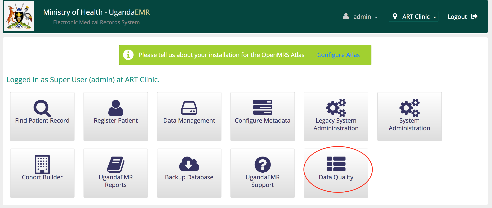
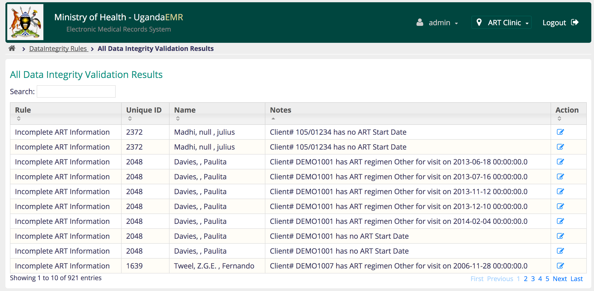
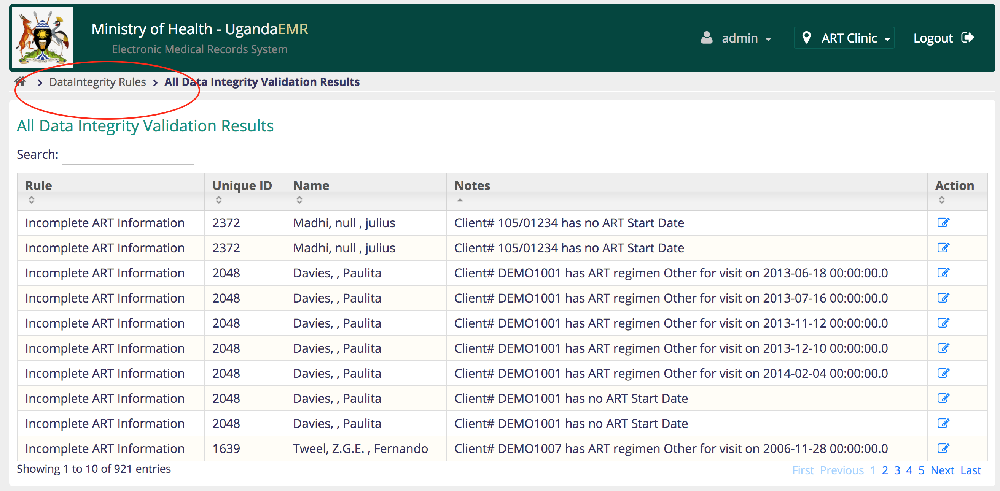
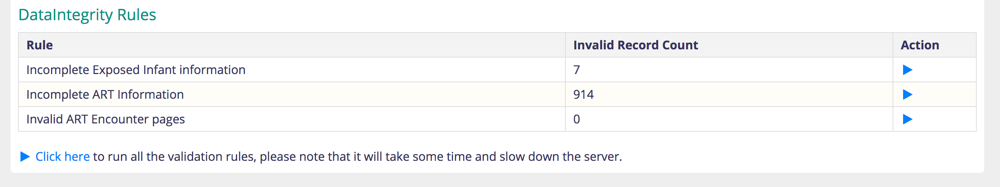
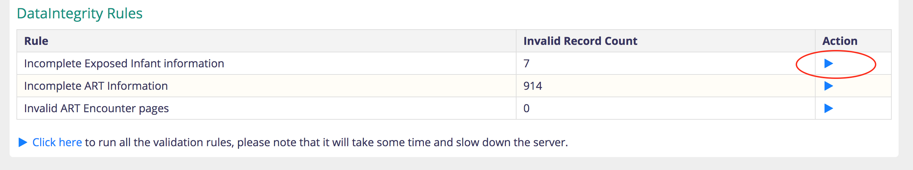
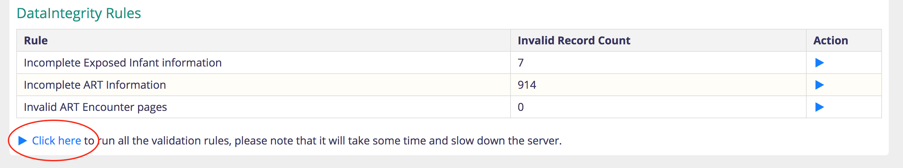

# Data Quality Checks

Currently data validation rules are enforced on the data entry forms to ensure that required information is entered and that conflicting data items are not entered e.g., pregnancy for males.

## Data Validation Rules

The following data quality checks are run after the data is saved and starting from [version 1.0.16](https://github.com/METS-Programme/ugandaemr-usermanual/tree/2ae2c5adb235152662b6716ed1f0630cba54baf3/ugandaemr-1016.md) under different rules:

1. Incomplete ART information
   * Patients on ART without ART start date 
   * Patients on ART without an ART start regimen 
   * Patients on ART with other regimen - this was common where the regimens were not added, so now the need is to move all patients with other to the respective regimen to improve computation of patients on first and second line
2. Invalid ART encounters
   * Patients on ART with summary page and no encounters 
   * Patients on ART with encounters but no summary page
   * Patients with more than one ART summary page 
   * Patients with more than one encounter of the same type on the same date 
3. Incomplete Exposed Infant Information 
   * Exposed Infants with Summary page and no encounters 
   * Exposed Infants with Encounters and no Summary page 
   * Exposed Infants older than 18 months with no final outcome 

## View Rule Violation Results

1. On the dashboard click the Data Quality button  

   

2. This will display all the data violations 

   

**NOTE:**  The search allows a user to search for names of clients, ART and Exposed Infant numbers as identifiers

## Fix the Violations

1. Click the link to fix the issue with the data. 
2. Once you have completed fixing the issue, then manually run the rules against the updated data

## Manually Run Data Validation Rules

At times it is necessary to manually run the data validation rules usually after fixing some of the violations or after a data entry session:

1. On the list of validation results, click the Dataintegrity Rules link next to the home icon 

    

2. This shows the list of available rules 

    

3. To run a single rule click the blue arrow at the end of the row for the rule 

    

4. To run all the validation rules again, click the link at the bottom of the list of rules 

   

**NOTE** Running all the validation rules will slow down the computer and may take some time depending on the number of rules, so run this at times of low usage.

