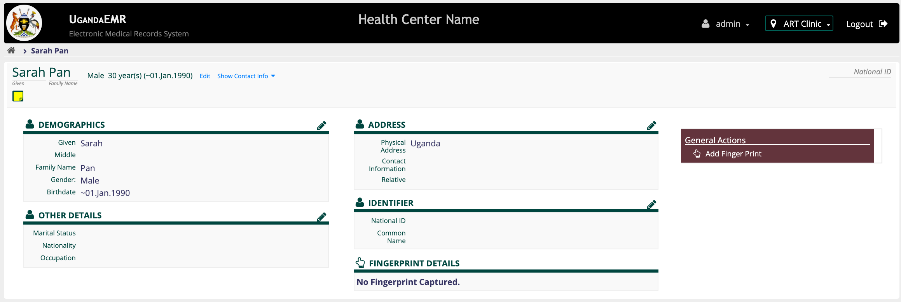
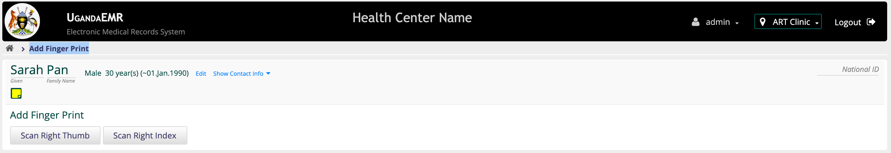

# Search by Patient Fingerprint

## Search By Fingerprint

Before searching by fingerprint, make sure that you have the right [configurations](setup_configurations.md).

1. On the Desktop launch the the "Start Fingerprint" icon. This will popup a black screen launching the fingerprint connector app.
2. Minimize the launched black screen. **Note:** Do not close it. 
3. Goto UgandaEMR and [Login](https://github.com/METS-Programme/ugandaemr-usermanual/tree/1fbbe0b2801ddccebeb5041ed0f406697a3b1f0a/login.md) with an account that has [role](https://github.com/METS-Programme/ugandaemr-usermanual/tree/1fbbe0b2801ddccebeb5041ed0f406697a3b1f0a/point-of-care-poc/installation-and-configuration/roles.md) _"Reception"_. This will Navigate you to the "Home" page.
4. On the Home page, click on the _"Find Patient Record"_ This will navigate you to the search page.

   

5. Click on the _"Fingerprint"_ icon. This will show instructions "Scan your finger".
6. Ask the patient to put their finger on the fingerprint device. There are two possible outcomes.

   a\) Patient found. This will make a patient appear in the patient list.

   b\) Patient not found. This will show a toast indicating that the patient was not found.

## Add Patient Fingerprint.

In order to add a patient fingerprint, make sure that the you have the right [Configurations](setup_configurations.md) 1. On the Desktop launch the the "Start Fingerprint" icon. This will popup a black screen launching the fingerprint connector app. 2. Minimize the launched black screen. **Note:** Do not close it. 3. Goto UgandaEMR and [Login](https://github.com/METS-Programme/ugandaemr-usermanual/tree/1fbbe0b2801ddccebeb5041ed0f406697a3b1f0a/login.md) with an account that has [role](https://github.com/METS-Programme/ugandaemr-usermanual/tree/1fbbe0b2801ddccebeb5041ed0f406697a3b1f0a/point-of-care-poc/installation-and-configuration/roles.md) _"Reception"_. This will Navigate you to the "Home" page.

### For existing patients

1. [Find](../patient-management/search_patient.md) a patient you would like to add fingerprint for.
2. On the patient search in the _"ACTION"_ column, Click on the Edit Demographic  icon. This will Navigate you to the Registration Summary.

   

3. On the right in the _"General Action"_ Section, Click on the _"Add FingerPrint"_ link. This will take you to the _"Add Finger Print"_ page. 

   

4. Click on the Buttons provided. For example the "Scan Right Thumb" one at a time. This will show instructions "Scan your finger". 
5. Ask the Patient to put their respective finger on the scanner four times. **Note:** Ensure that the finger placed on is captured. By the fourth time the fingerprint will be added
6. Repeat from step 7 for any other fingers you would like to capture.

### For new patients being registered

1. [Register Patient](../patient-management/patient_registration.md). This will navigate you to the registration Summary.
2. On the right in the _"General Action"_ Section, Click on the _"Add FingerPrint"_ link. This will take you to the _"Add Finger Print"_ page. 
3. Click on the Buttons provided. For example the "Scan Right Thumb" one at a time. This will show instructions "Scan your finger". 
4. Ask the Patient to put their respective finger on the scanner four times. **Note:** Ensure that the finger placed on is captured. By the fourth time the fingerprint will be added
5. Repeat from step 7 for any other  fingers you would like to capture.

