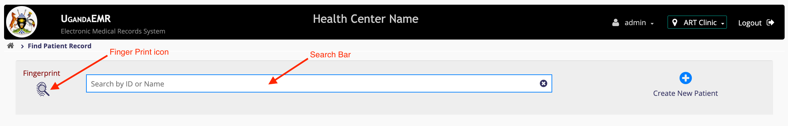

# Search By Fingerprint
Before searching by fingerprint, make sure that you have the right [configurations](setup_configurations.md). 

1. On the Desktop launch the the "Start Fingerprint" icon. This will popup a black screen launching the fingerprint connector app.
2. Minimize the launched black screen. **Note:** Do not close it. 
3. Goto UgandaEMR and [Login](../login.md) with an account that has [role](../point-of-care-poc/installation-and-configuration/roles.md) _"Reception"_. This will Navigate you to the "Home" page.
4. On the Home page, click on the _"Find Patient Record"_ This will navigate you to the search page.

5. Click on the _"Fingerprint"_ icon. This will show instructions "Scan your finger".

6. Ask the patient to put their finger on the fingerprint device. 
    There are two possible outcomes. 
  
    a ) Patient found. This will make a patient appear in the patient list. 
    b ) Patient not found. This will show a toast indicating that the patient was not found. 