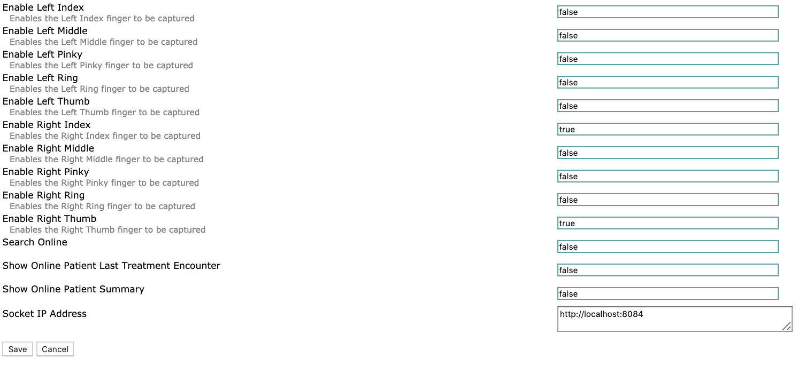
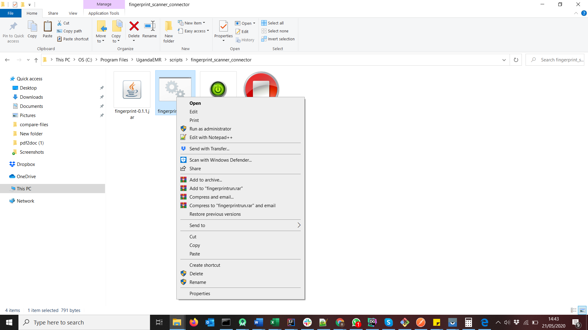
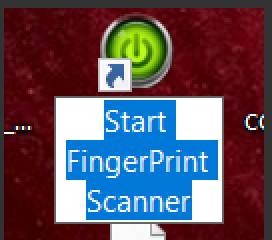
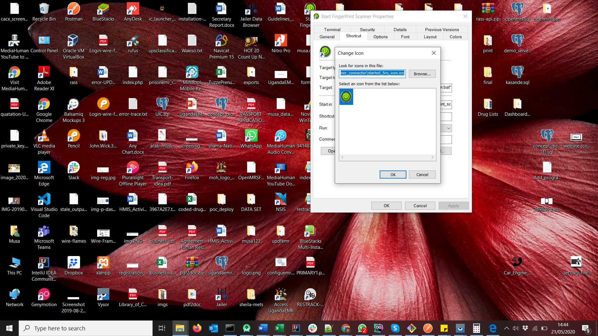
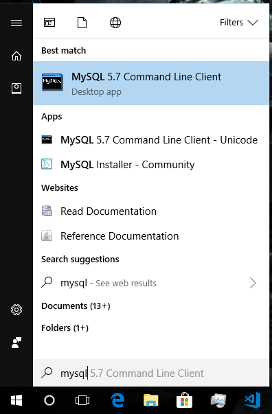
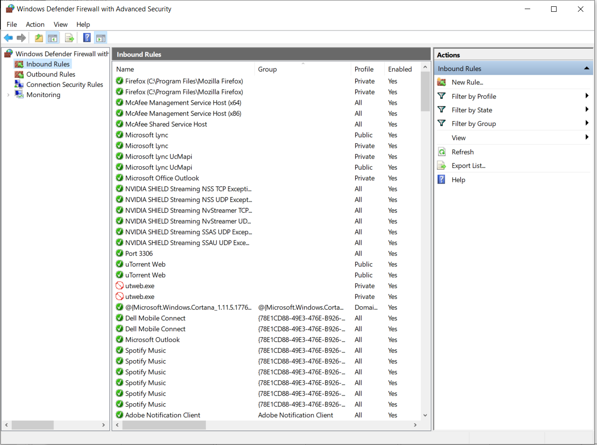
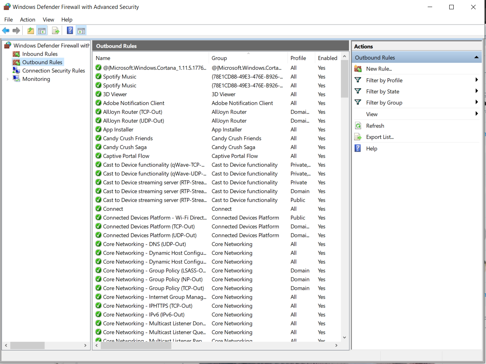

# Configuration

In order to use the fingerprint functionality you need to have a [Digital Personal](https://www.neurotechnology.com/fingerprint-scanner-digitalpersona-u-are-u-4500.html) 4500 device and its drivers installed.

## General Setup

### Configure Fingerprint app

In order to configure the fingerprint app there are two things that should be done. 1. Setting the username and password for the it to access the openmrs database. 2. UgandaEMR Settings

```text
   a) [Login](../login.md) In UgandaEMR. This will navigate you to the _"Home"_ page

   b) Click on the "System Administrator icon . This will navigate you to the _" System Administration"_ page. 

   c) Click on the Fingerprint Settings icon. . This will navigate you to the fingerprint settings
   

   d) In order to enable or disable a finger type _"true"_ to enable and _"false"_ to disable. 

   e) The Socket IP Address is very important. It should be set to _"http://localhost:8084"_ if its not set, or different, change it to _"http://localhost:8084"_.

   f) In order to save the changes, _"click the save"_ button. 
```

## Client Server Setup

### Client Machine

1. Ensure UgandaEMR has been installed successfully: The you can ably login using your session like ART, SMC, OPD and the many more.
2. Server and client computers must be on the same network: [Ping](https://www.howtogeek.com/355664/how-to-use-ping-to-test-your-network/) the server address from your computer. Ping replies should be successful.
3. [Download fingerprint connector](https://sourceforge.net/projects/ugandaemr/files/Others/fingerprint%20connector.zip/download) on your computer.
4. Unzip the download to a directory of your choice
5. In the fingerprint directory. Open the file _"fingerprintrun.bat"_ in any text editor of your choice. [Note pad ++ is preferred](https://notepad-plus-plus.org/).
6. Replace _"localhost"_ with the IP address of the server.
7. Right click on the _"fingerprintrun.bat"_ and Create shortcut to Desktop 
8. Go to Desktop and rename the Short to "Start Fingerprint". 
9. May Change the icon of the shortcut. There is one provided in the fingerprint directory. 

   **Server Machine**

10. Launch mysql client

    

11. Login in mysql
12. Run the following commands below

    ```text
     Create user ‘openmrs’@’%’ identified by ‘openmrs’;
     GRANT ALL PRIVILEGES on openmrs.* to ‘openmrs’@’%’
    ```

13. Go to Windows Firewall, add inbound rules. In there, add ports 3306

    

14. Do the same for Outbound rules

    

