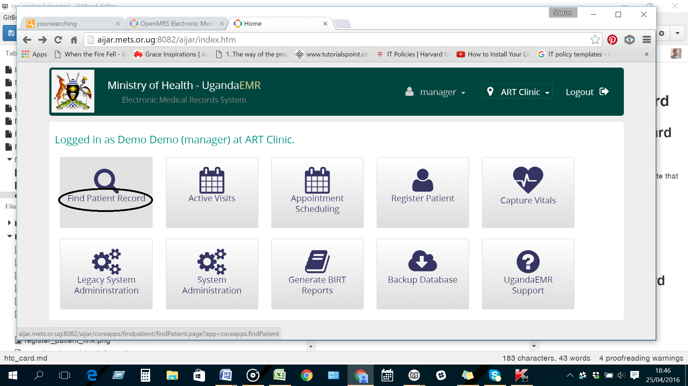

# HIV Counseling and Testing Card
## Enter new HCT card
1. Go to the patient dashboard 
2. Find a patient

3.Type in the name ofthe patient and select 

4. Create a  past visit on the date that the patient was tested

5.Select past visit date

6. Click on the link to the HIV counseling  and testing card

## Edit HCT Card
## Delete HCT Card

