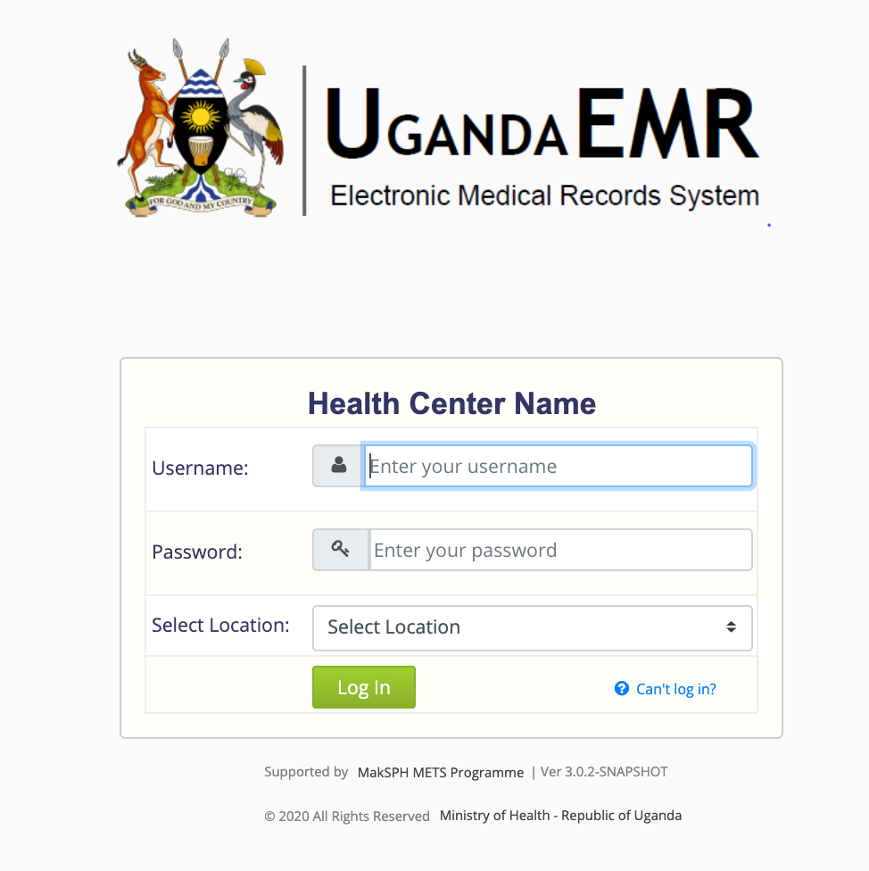

#### Logging In UgandaEMR 
1. Launch UgandaEMR in the browser. 
    UgandaEMR by default after installation runs on http://localhost:8081/openmrs if an installer is used. 

2. Enter username and password
3. Select a location
4. Click on login. This will navigate you to the home screen.
