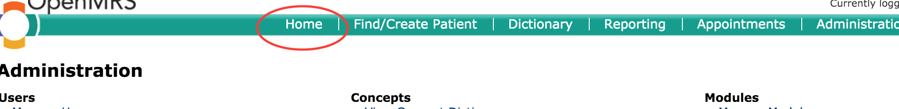
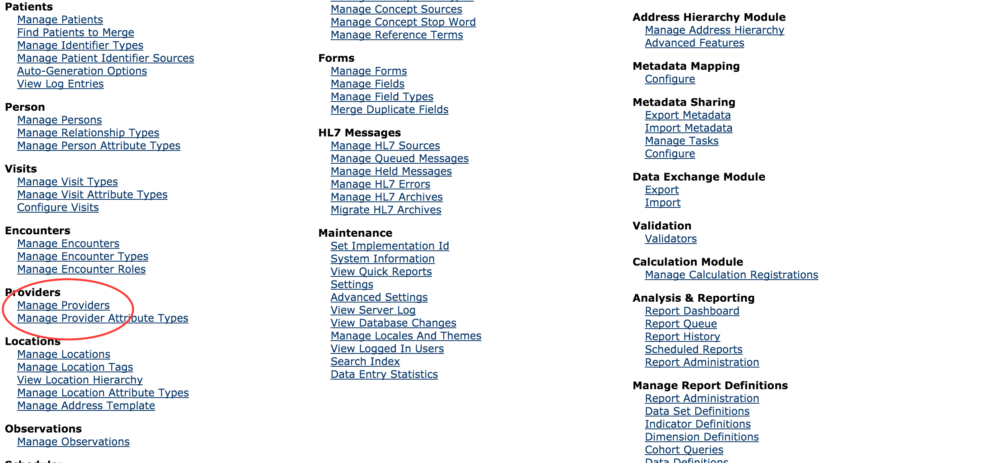

#2. Making an existing user a provider

There are situations where a user was created and not made a provider, which causes the error as below

The steps to make an existing user account a provider are as follows:
1. Click Home
    
    
2. Click the Legacy System Administration link on the home page

3. Click the ***Manage Providers*** link on the system administration page

3.Click ***Add Provider*** link 
4.Enter provider name, and hit the ***save*** button 
5.You should see newly added provider on the list as below;
