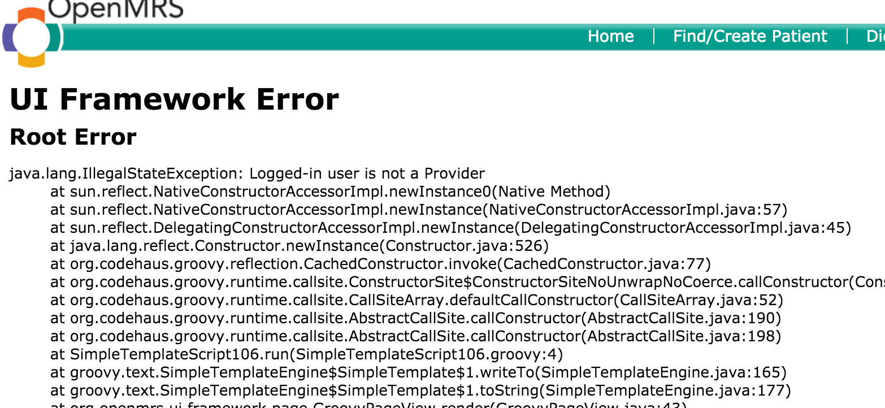

#2. Making an existing user a provider

There are situations where a user was created and not made a provider, which causes the error as below

The steps to make an existing user account a provider are as follows:
1. Click Home
    
    
2. Click the Legacy System Administration link on the home page

3. Click the ***Manage Providers*** link on the system administration page

3. Click the Edit button next to the user account you want to edit. Any user with 0 (zero) in the provider Accounts has not been created as a provider

4. On the Edit Account click the Add Provider Account button

5. When all the required information has been entered then the Save button will appear, but remember to use the account names as provider with no spaces

