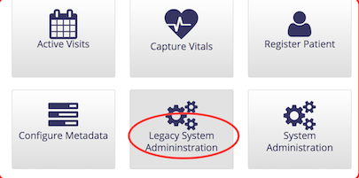
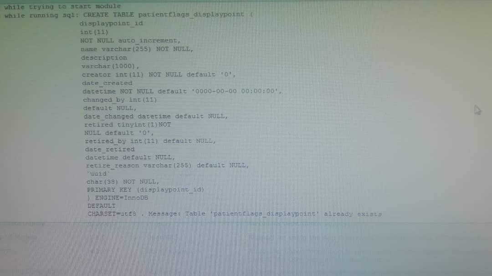

# Patient Flags

These flags are a clinical decision support to highlight important aspects of a patient's treatment

The flags use the traffic light analogy as follows:

* Green – information for an upcoming e.g., Upcoming appointment, Due for Viral Load
* Orange – warning, prepare to take action e.g., Missed appointment
* Red – take action now e.g., Lost, Lost to Followup, Overdue for Viral Load

The patient flags are: 

1. Due for 1st DNA PCR \(green\)   
2. Due for 1st Viral Load \(green\)  
3. Due for 2nd DNA PCR \(green\)   
4. Due for Rapid Test \(green\)  
5. Due for Routine Viral Load \(green\)   
6. Lost\(red\)  
7. Lost to Followup \(red\)  
8. Missed appointment \(orange\)   
9. Overdue for 1st DNA PCR \(red\)  
10. Overdue for First Viral Load \(red\)  
11. Overdue for Rapid Test \(red\)  
12. Overdue for Routine Viral Load \(red\)   
13. Overdue for 2nd DNA PCR \(red\)  
14. Transferred Out Patient \(orange\)  
15. Un-suppressed Viral Load \(red\)  
16. Upcoming appointment \(green\)

## Disabling Patient Flags

Depending on the facility needs, not all the patient flags will be relevant, so the steps below provide the capability of disabling unused flags which will also improve the performance of the patient dashboard

1. On the home page click the `Legacy System Administration` button

   

2. On the administration page, click the `Settings` link

   

3. Select Ugandaemr in the left-hand menu to display the UgandaEMR settings
4. In the "Patientflags Disabled Flags" text field enter the names of the patient flags you want to disable separated by a comma \(,\)
5. Restart your computer

## Troubleshooting Tips

### Module cannot start due to error creating patientflags\_displaypoint

See message below 

**Fix**

1. Open Heidi and delete the `patientflags_displaypoint` table 
2. Click Start All to start all the modules 

### Module cannot start create patientflags\_tag\_role

The error message displayed when starting the module is

```text
Error while running sql: CREATE TABLE patientflags_tag_role (
            tag_id int(11) NOT NULL,
            role
            varchar(50) NOT NULL,
            KEY tag_id (tag_id),
            KEY role (role),
            CONSTRAINT
            FOREIGN KEY (tag_id) REFERENCES patientflags_tag (tag_id),
            CONSTRAINT
            FOREIGN KEY (role) REFERENCES role (role)
            ) ENGINE=InnoDB DEFAULT
            CHARSET=utf8 . Message: Can't create table 'openmrs.patientflags_tag_role' (errno: 150)
```

The root cause of this that the character set for the patientflags\_tag\_role table, utf8, is different from the role table.

Run the script below to change all the tables in the database to UTF8

```text
/*!40101 SET @OLD_CHARACTER_SET_CLIENT = @@CHARACTER_SET_CLIENT */;
/*!40101 SET @OLD_CHARACTER_SET_RESULTS = @@CHARACTER_SET_RESULTS */;
/*!40101 SET @OLD_COLLATION_CONNECTION = @@COLLATION_CONNECTION */;
/*!40101 SET NAMES utf8 */;
/*!40103 SET @OLD_TIME_ZONE = @@TIME_ZONE */;
/*!40103 SET TIME_ZONE = '+00:00' */;
/*!40014 SET @OLD_UNIQUE_CHECKS = @@UNIQUE_CHECKS, UNIQUE_CHECKS = 0 */;
/*!40014 SET @OLD_FOREIGN_KEY_CHECKS = @@FOREIGN_KEY_CHECKS, FOREIGN_KEY_CHECKS = 0 */;
/*!40101 SET @OLD_SQL_MODE = @@SQL_MODE, SQL_MODE = 'NO_AUTO_VALUE_ON_ZERO' */;
/*!40111 SET @OLD_SQL_NOTES = @@SQL_NOTES, SQL_NOTES = 0 */;
ALTER TABLE `address_hierarchy_address_to_entry_map` CONVERT TO CHARACTER SET UTF8;                  
ALTER TABLE `address_hierarchy_entry` CONVERT TO CHARACTER SET UTF8;                                 
ALTER TABLE `address_hierarchy_level` CONVERT TO CHARACTER SET UTF8;                                 
ALTER TABLE `allergy` CONVERT TO CHARACTER SET UTF8;                                                 
ALTER TABLE `allergy_reaction` CONVERT TO CHARACTER SET UTF8;                                        
ALTER TABLE `appframework_component_state` CONVERT TO CHARACTER SET UTF8;                            
ALTER TABLE `appframework_user_app` CONVERT TO CHARACTER SET UTF8;                                   
ALTER TABLE `appointmentscheduling_appointment` CONVERT TO CHARACTER SET UTF8;                       
ALTER TABLE `appointmentscheduling_appointment_block` CONVERT TO CHARACTER SET UTF8;                 
ALTER TABLE `appointmentscheduling_appointment_request` CONVERT TO CHARACTER SET UTF8;               
ALTER TABLE `appointmentscheduling_appointment_status_history` CONVERT TO CHARACTER SET UTF8;        
ALTER TABLE `appointmentscheduling_appointment_type` CONVERT TO CHARACTER SET UTF8;                  
ALTER TABLE `appointmentscheduling_block_type_map` CONVERT TO CHARACTER SET UTF8;                    
ALTER TABLE `appointmentscheduling_time_slot` CONVERT TO CHARACTER SET UTF8;                         
ALTER TABLE `calculation_registration` CONVERT TO CHARACTER SET UTF8;                                
ALTER TABLE `care_setting` CONVERT TO CHARACTER SET UTF8;                                            
ALTER TABLE `chartsearch_bookmark` CONVERT TO CHARACTER SET UTF8;                                    
ALTER TABLE `chartsearch_categories` CONVERT TO CHARACTER SET UTF8;                                  
ALTER TABLE `chartsearch_category_displayname` CONVERT TO CHARACTER SET UTF8;                        
ALTER TABLE `chartsearch_history` CONVERT TO CHARACTER SET UTF8;                                     
ALTER TABLE `chartsearch_note` CONVERT TO CHARACTER SET UTF8;                                        
ALTER TABLE `chartsearch_preference` CONVERT TO CHARACTER SET UTF8;                                  
ALTER TABLE `chartsearch_synonym_groups` CONVERT TO CHARACTER SET UTF8;                              
ALTER TABLE `chartsearch_synonyms` CONVERT TO CHARACTER SET UTF8;                                    
ALTER TABLE `clob_datatype_storage` CONVERT TO CHARACTER SET UTF8;                                   
ALTER TABLE `cohort` CONVERT TO CHARACTER SET UTF8;                                                  
ALTER TABLE `cohort_member` CONVERT TO CHARACTER SET UTF8;                                           
ALTER TABLE `concept` CONVERT TO CHARACTER SET UTF8;                                                 
ALTER TABLE `concept_answer` CONVERT TO CHARACTER SET UTF8;                                          
ALTER TABLE `concept_attribute` CONVERT TO CHARACTER SET UTF8;                                       
ALTER TABLE `concept_attribute_type` CONVERT TO CHARACTER SET UTF8;                                  
ALTER TABLE `concept_class` CONVERT TO CHARACTER SET UTF8;                                           
ALTER TABLE `concept_complex` CONVERT TO CHARACTER SET UTF8;                                         
ALTER TABLE `concept_datatype` CONVERT TO CHARACTER SET UTF8;                                        
ALTER TABLE `concept_description` CONVERT TO CHARACTER SET UTF8;                                     
ALTER TABLE `concept_map_type` CONVERT TO CHARACTER SET UTF8;                                        
ALTER TABLE `concept_name` CONVERT TO CHARACTER SET UTF8;                                            
ALTER TABLE `concept_name_tag` CONVERT TO CHARACTER SET UTF8;                                        
ALTER TABLE `concept_name_tag_map` CONVERT TO CHARACTER SET UTF8;                                    
ALTER TABLE `concept_numeric` CONVERT TO CHARACTER SET UTF8;                                         
ALTER TABLE `concept_proposal` CONVERT TO CHARACTER SET UTF8;                                        
ALTER TABLE `concept_proposal_tag_map` CONVERT TO CHARACTER SET UTF8;                                
ALTER TABLE `concept_reference_map` CONVERT TO CHARACTER SET UTF8;                                   
ALTER TABLE `concept_reference_source` CONVERT TO CHARACTER SET UTF8;                                
ALTER TABLE `concept_reference_term` CONVERT TO CHARACTER SET UTF8;                                  
ALTER TABLE `concept_reference_term_map` CONVERT TO CHARACTER SET UTF8;                              
ALTER TABLE `concept_set` CONVERT TO CHARACTER SET UTF8;                                             
ALTER TABLE `concept_state_conversion` CONVERT TO CHARACTER SET UTF8;                                
ALTER TABLE `concept_stop_word` CONVERT TO CHARACTER SET UTF8;                                       
ALTER TABLE `conditions` CONVERT TO CHARACTER SET UTF8;                                              
ALTER TABLE `dataintegrity_result` CONVERT TO CHARACTER SET UTF8;                                    
ALTER TABLE `dataintegrity_rule` CONVERT TO CHARACTER SET UTF8;                                      
ALTER TABLE `drug` CONVERT TO CHARACTER SET UTF8;                                                    
ALTER TABLE `drug_ingredient` CONVERT TO CHARACTER SET UTF8;                                         
ALTER TABLE `drug_order` CONVERT TO CHARACTER SET UTF8;                                              
ALTER TABLE `drug_reference_map` CONVERT TO CHARACTER SET UTF8;                                      
ALTER TABLE `encounter` CONVERT TO CHARACTER SET UTF8;                                               
ALTER TABLE `encounter_provider` CONVERT TO CHARACTER SET UTF8;                                      
ALTER TABLE `encounter_role` CONVERT TO CHARACTER SET UTF8;                                          
ALTER TABLE `encounter_type` CONVERT TO CHARACTER SET UTF8;                                          
ALTER TABLE `field` CONVERT TO CHARACTER SET UTF8;                                                   
ALTER TABLE `field_answer` CONVERT TO CHARACTER SET UTF8;                                            
ALTER TABLE `field_type` CONVERT TO CHARACTER SET UTF8;                                              
ALTER TABLE `fingerprint` CONVERT TO CHARACTER SET UTF8;                                             
ALTER TABLE `form` CONVERT TO CHARACTER SET UTF8;                                                    
ALTER TABLE `form_field` CONVERT TO CHARACTER SET UTF8;                                              
ALTER TABLE `form_resource` CONVERT TO CHARACTER SET UTF8;                                           
ALTER TABLE `formfilter_filter_property` CONVERT TO CHARACTER SET UTF8;                              
ALTER TABLE `formfilter_form_filter` CONVERT TO CHARACTER SET UTF8;                                  
ALTER TABLE `global_property` CONVERT TO CHARACTER SET UTF8;                                         
ALTER TABLE `hl7_in_archive` CONVERT TO CHARACTER SET UTF8;                                          
ALTER TABLE `hl7_in_error` CONVERT TO CHARACTER SET UTF8;                                            
ALTER TABLE `hl7_in_queue` CONVERT TO CHARACTER SET UTF8;                                            
ALTER TABLE `hl7_source` CONVERT TO CHARACTER SET UTF8;                                              
ALTER TABLE `htmlformentry_html_form` CONVERT TO CHARACTER SET UTF8;                                 
ALTER TABLE `idgen_auto_generation_option` CONVERT TO CHARACTER SET UTF8;                            
ALTER TABLE `idgen_id_pool` CONVERT TO CHARACTER SET UTF8;                                           
ALTER TABLE `idgen_identifier_source` CONVERT TO CHARACTER SET UTF8;                                 
ALTER TABLE `idgen_log_entry` CONVERT TO CHARACTER SET UTF8;                                         
ALTER TABLE `idgen_pooled_identifier` CONVERT TO CHARACTER SET UTF8;                                 
ALTER TABLE `idgen_remote_source` CONVERT TO CHARACTER SET UTF8;                                     
ALTER TABLE `idgen_reserved_identifier` CONVERT TO CHARACTER SET UTF8;                               
ALTER TABLE `idgen_seq_id_gen` CONVERT TO CHARACTER SET UTF8;                                        
ALTER TABLE `liquibasechangelog` CONVERT TO CHARACTER SET UTF8;                                      
ALTER TABLE `liquibasechangeloglock` CONVERT TO CHARACTER SET UTF8;                                  
ALTER TABLE `location` CONVERT TO CHARACTER SET UTF8;                                                
ALTER TABLE `location_attribute` CONVERT TO CHARACTER SET UTF8;                                      
ALTER TABLE `location_attribute_type` CONVERT TO CHARACTER SET UTF8;                                 
ALTER TABLE `location_tag` CONVERT TO CHARACTER SET UTF8;                                            
ALTER TABLE `location_tag_map` CONVERT TO CHARACTER SET UTF8;                                        
ALTER TABLE `metadatamapping_metadata_set` CONVERT TO CHARACTER SET UTF8;                            
ALTER TABLE `metadatamapping_metadata_set_member` CONVERT TO CHARACTER SET UTF8;                     
ALTER TABLE `metadatamapping_metadata_source` CONVERT TO CHARACTER SET UTF8;                         
ALTER TABLE `metadatamapping_metadata_term_mapping` CONVERT TO CHARACTER SET UTF8;                   
ALTER TABLE `metadatasharing_exported_package` CONVERT TO CHARACTER SET UTF8;                        
ALTER TABLE `metadatasharing_imported_item` CONVERT TO CHARACTER SET UTF8;                           
ALTER TABLE `metadatasharing_imported_package` CONVERT TO CHARACTER SET UTF8;                        
ALTER TABLE `note` CONVERT TO CHARACTER SET UTF8;                                                    
ALTER TABLE `notification_alert` CONVERT TO CHARACTER SET UTF8;                                      
ALTER TABLE `notification_alert_recipient` CONVERT TO CHARACTER SET UTF8;                            
ALTER TABLE `notification_template` CONVERT TO CHARACTER SET UTF8;                                   
ALTER TABLE `obs` CONVERT TO CHARACTER SET UTF8;                                                     
ALTER TABLE `openconceptlab_item` CONVERT TO CHARACTER SET UTF8;                                     
ALTER TABLE `openconceptlab_update` CONVERT TO CHARACTER SET UTF8;                                   
ALTER TABLE `order_frequency` CONVERT TO CHARACTER SET UTF8;                                         
ALTER TABLE `order_group` CONVERT TO CHARACTER SET UTF8;                                             
ALTER TABLE `order_set` CONVERT TO CHARACTER SET UTF8;                                               
ALTER TABLE `order_set_member` CONVERT TO CHARACTER SET UTF8;                                        
ALTER TABLE `order_type` CONVERT TO CHARACTER SET UTF8;                                              
ALTER TABLE `order_type_class_map` CONVERT TO CHARACTER SET UTF8;                                    
ALTER TABLE `orders` CONVERT TO CHARACTER SET UTF8;                                                  
ALTER TABLE `patient` CONVERT TO CHARACTER SET UTF8;                                                 
ALTER TABLE `patient_identifier` CONVERT TO CHARACTER SET UTF8;                                      
ALTER TABLE `patient_identifier_type` CONVERT TO CHARACTER SET UTF8;                                 
ALTER TABLE `patient_program` CONVERT TO CHARACTER SET UTF8;                                         
ALTER TABLE `patient_state` CONVERT TO CHARACTER SET UTF8;                                           
ALTER TABLE `patientflags_displaypoint` CONVERT TO CHARACTER SET UTF8;                               
ALTER TABLE `patientflags_flag` CONVERT TO CHARACTER SET UTF8;                                       
ALTER TABLE `patientflags_flag_tag` CONVERT TO CHARACTER SET UTF8;                                   
ALTER TABLE `patientflags_priority` CONVERT TO CHARACTER SET UTF8;                                   
ALTER TABLE `patientflags_tag` CONVERT TO CHARACTER SET UTF8;                                        
ALTER TABLE `patientflags_tag_displayPoint` CONVERT TO CHARACTER SET UTF8;                                                           
ALTER TABLE `person` CONVERT TO CHARACTER SET UTF8;                                                  
ALTER TABLE `person_address` CONVERT TO CHARACTER SET UTF8;                                          
ALTER TABLE `person_attribute` CONVERT TO CHARACTER SET UTF8;                                        
ALTER TABLE `person_attribute_type` CONVERT TO CHARACTER SET UTF8;                                   
ALTER TABLE `person_merge_log` CONVERT TO CHARACTER SET UTF8;                                        
ALTER TABLE `person_name` CONVERT TO CHARACTER SET UTF8;                                             
ALTER TABLE `privilege` CONVERT TO CHARACTER SET UTF8;                                               
ALTER TABLE `program` CONVERT TO CHARACTER SET UTF8;                                                 
ALTER TABLE `program_workflow` CONVERT TO CHARACTER SET UTF8;                                        
ALTER TABLE `program_workflow_state` CONVERT TO CHARACTER SET UTF8;                                  
ALTER TABLE `provider` CONVERT TO CHARACTER SET UTF8;                                                
ALTER TABLE `provider_attribute` CONVERT TO CHARACTER SET UTF8;                                      
ALTER TABLE `provider_attribute_type` CONVERT TO CHARACTER SET UTF8;                                 
ALTER TABLE `providermanagement_provider_role` CONVERT TO CHARACTER SET UTF8;                        
ALTER TABLE `providermanagement_provider_role_provider_attribute_type` CONVERT TO CHARACTER SET UTF8;
ALTER TABLE `providermanagement_provider_role_relationship_type` CONVERT TO CHARACTER SET UTF8;      
ALTER TABLE `providermanagement_provider_role_supervisee_provider_role` CONVERT TO CHARACTER SET UTF8;
ALTER TABLE `providermanagement_provider_suggestion` CONVERT TO CHARACTER SET UTF8;                  
ALTER TABLE `providermanagement_supervision_suggestion` CONVERT TO CHARACTER SET UTF8;               
ALTER TABLE `relationship` CONVERT TO CHARACTER SET UTF8;                                            
ALTER TABLE `relationship_type` CONVERT TO CHARACTER SET UTF8;                                       
ALTER TABLE `report_object` CONVERT TO CHARACTER SET UTF8;                                           
ALTER TABLE `report_schema_xml` CONVERT TO CHARACTER SET UTF8;                                       
ALTER TABLE `reporting_report_design` CONVERT TO CHARACTER SET UTF8;                                 
ALTER TABLE `reporting_report_design_resource` CONVERT TO CHARACTER SET UTF8;                        
ALTER TABLE `reporting_report_processor` CONVERT TO CHARACTER SET UTF8;                              
ALTER TABLE `reporting_report_request` CONVERT TO CHARACTER SET UTF8;                                
ALTER TABLE `role` CONVERT TO CHARACTER SET UTF8;                                                    
ALTER TABLE `role_privilege` CONVERT TO CHARACTER SET UTF8;                                          
ALTER TABLE `role_role` CONVERT TO CHARACTER SET UTF8;                                               
ALTER TABLE `scheduler_task_config` CONVERT TO CHARACTER SET UTF8;                                   
ALTER TABLE `scheduler_task_config_property` CONVERT TO CHARACTER SET UTF8;                          
ALTER TABLE `serialized_object` CONVERT TO CHARACTER SET UTF8;                                       
ALTER TABLE `test_order` CONVERT TO CHARACTER SET UTF8;                                              
ALTER TABLE `uiframework_user_defined_page_view` CONVERT TO CHARACTER SET UTF8;                      
ALTER TABLE `user_property` CONVERT TO CHARACTER SET UTF8;                                           
ALTER TABLE `user_role` CONVERT TO CHARACTER SET UTF8;                                               
ALTER TABLE `users` CONVERT TO CHARACTER SET UTF8;                                                   
ALTER TABLE `visit` CONVERT TO CHARACTER SET UTF8;                                                   
ALTER TABLE `visit_attribute` CONVERT TO CHARACTER SET UTF8;                                         
ALTER TABLE `visit_attribute_type` CONVERT TO CHARACTER SET UTF8;                                    
ALTER TABLE `visit_type` CONVERT TO CHARACTER SET UTF8;                                              
ALTER TABLE `xforms_medical_history_field` CONVERT TO CHARACTER SET UTF8;                            
ALTER TABLE `xforms_person_repeat_attribute` CONVERT TO CHARACTER SET UTF8;                          
ALTER TABLE `xforms_xform` CONVERT TO CHARACTER SET UTF8;

/*!40101 SET SQL_MODE=@OLD_SQL_MODE */;
/*!40014 SET FOREIGN_KEY_CHECKS=@OLD_FOREIGN_KEY_CHECKS */;
/*!40014 SET UNIQUE_CHECKS=@OLD_UNIQUE_CHECKS */;
/*!40101 SET CHARACTER_SET_CLIENT=@OLD_CHARACTER_SET_CLIENT */;
/*!40101 SET CHARACTER_SET_RESULTS=@OLD_CHARACTER_SET_RESULTS */;
/*!40101 SET COLLATION_CONNECTION=@OLD_COLLATION_CONNECTION */;
/*!40111 SET SQL_NOTES=@OLD_SQL_NOTES */;
```

#### Aijar cannot start because the patientflags\_tag\_role table is missing

**Symptom**

There is an error starting the aijar module with the following text in the stack trace

```text
INFO - AijarActivator.stopped(393) |2020-06-05 11:01:42,299| aijar Module stopped
WARN - ModuleUtil.refreshApplicationContext(935) |2020-06-05 11:01:42,359| Unable to invoke started() method on the module's activator
java.lang.RuntimeException: failed to setup the module 
    at org.openmrs.module.aijar.AijarActivator.started(AijarActivator.java:181)
    at org.openmrs.module.ModuleUtil.refreshApplicationContext(ModuleUtil.java:927)
    at org.openmrs.module.web.WebModuleUtil.refreshWAC(WebModuleUtil.java:847)
    at org.openmrs.web.Listener.performWebStartOfModules(Listener.java:632)
    at org.openmrs.web.Listener.performWebStartOfModules(Listener.java:612)
    at org.openmrs.web.Listener.startOpenmrs(Listener.java:251)
    at org.openmrs.web.WebDaemon$1.run(WebDaemon.java:42)
Caused by: java.lang.RuntimeException: failed to install the common metadata 
    at org.openmrs.module.aijar.AijarActivator.installCommonMetadata(AijarActivator.java:366)
    at org.openmrs.module.aijar.AijarActivator.started(AijarActivator.java:149)
    ... 6 more
Caused by: org.openmrs.api.APIException: Unable to install bundle UgandaEMRPatientFlagMetadataBundle
    at org.openmrs.module.metadatadeploy.api.impl.MetadataDeployServiceImpl.installBundle(MetadataDeployServiceImpl.java:117)
    at org.openmrs.module.metadatadeploy.api.impl.MetadataDeployServiceImpl.installBundle(MetadataDeployServiceImpl.java:81)
    at sun.reflect.NativeMethodAccessorImpl.invoke0(Native Method)
    at sun.reflect.NativeMethodAccessorImpl.invoke(NativeMethodAccessorImpl.java:62)
    at sun.reflect.DelegatingMethodAccessorImpl.invoke(DelegatingMethodAccessorImpl.java:43)
    at java.lang.reflect.Method.invoke(Method.java:498)
    at org.springframework.aop.support.AopUtils.invokeJoinpointUsingReflection(AopUtils.java:317)
    at org.springframework.aop.framework.ReflectiveMethodInvocation.invokeJoinpoint(ReflectiveMethodInvocation.java:190)
    at org.springframework.aop.framework.ReflectiveMethodInvocation.proceed(ReflectiveMethodInvocation.java:157)
    at org.springframework.transaction.interceptor.TransactionInterceptor$1.proceedWithInvocation(TransactionInterceptor.java:99)
    at org.springframework.transaction.interceptor.TransactionAspectSupport.invokeWithinTransaction(TransactionAspectSupport.java:281)
    at org.springframework.transaction.interceptor.TransactionInterceptor.invoke(TransactionInterceptor.java:96)
    at org.springframework.aop.framework.ReflectiveMethodInvocation.proceed(ReflectiveMethodInvocation.java:179)
    at org.springframework.aop.framework.JdkDynamicAopProxy.invoke(JdkDynamicAopProxy.java:207)
    at com.sun.proxy.$Proxy170.installBundle(Unknown Source)
    at sun.reflect.NativeMethodAccessorImpl.invoke0(Native Method)
    at sun.reflect.NativeMethodAccessorImpl.invoke(NativeMethodAccessorImpl.java:62)
    at sun.reflect.DelegatingMethodAccessorImpl.invoke(DelegatingMethodAccessorImpl.java:43)
    at java.lang.reflect.Method.invoke(Method.java:498)
    at org.springframework.aop.support.AopUtils.invokeJoinpointUsingReflection(AopUtils.java:317)
    at org.springframework.aop.framework.ReflectiveMethodInvocation.invokeJoinpoint(ReflectiveMethodInvocation.java:190)
    at org.springframework.aop.framework.ReflectiveMethodInvocation.proceed(ReflectiveMethodInvocation.java:157)
    at org.springframework.transaction.interceptor.TransactionInterceptor$1.proceedWithInvocation(TransactionInterceptor.java:99)
    at org.springframework.transaction.interceptor.TransactionAspectSupport.invokeWithinTransaction(TransactionAspectSupport.java:281)
    at org.springframework.transaction.interceptor.TransactionInterceptor.invoke(TransactionInterceptor.java:96)
    at org.springframework.aop.framework.ReflectiveMethodInvocation.proceed(ReflectiveMethodInvocation.java:179)
    at org.springframework.aop.framework.JdkDynamicAopProxy.invoke(JdkDynamicAopProxy.java:207)
    at com.sun.proxy.$Proxy332.installBundle(Unknown Source)
    at org.openmrs.module.aijar.AijarActivator.installCommonMetadata(AijarActivator.java:360)
    ... 7 more
Caused by: org.hibernate.exception.SQLGrammarException: could not execute batch
    at org.hibernate.exception.internal.SQLStateConversionDelegate.convert(SQLStateConversionDelegate.java:123)
    at org.hibernate.exception.internal.StandardSQLExceptionConverter.convert(StandardSQLExceptionConverter.java:49)
    at org.hibernate.engine.jdbc.spi.SqlExceptionHelper.convert(SqlExceptionHelper.java:126)
    at org.hibernate.engine.jdbc.batch.internal.BatchingBatch.performExecution(BatchingBatch.java:136)
    at org.hibernate.engine.jdbc.batch.internal.BatchingBatch.doExecuteBatch(BatchingBatch.java:114)
    at org.hibernate.engine.jdbc.batch.internal.AbstractBatchImpl.execute(AbstractBatchImpl.java:163)
    at org.hibernate.engine.jdbc.internal.JdbcCoordinatorImpl.executeBatch(JdbcCoordinatorImpl.java:226)
    at org.hibernate.engine.spi.ActionQueue.executeActions(ActionQueue.java:484)
    at org.hibernate.engine.spi.ActionQueue.executeActions(ActionQueue.java:351)
    at org.hibernate.event.internal.AbstractFlushingEventListener.performExecutions(AbstractFlushingEventListener.java:350)
    at org.hibernate.event.internal.DefaultFlushEventListener.onFlush(DefaultFlushEventListener.java:56)
    at org.hibernate.internal.SessionImpl.flush(SessionImpl.java:1258)
    at org.openmrs.api.db.hibernate.HibernateContextDAO.flushSession(HibernateContextDAO.java:368)
    at sun.reflect.NativeMethodAccessorImpl.invoke0(Native Method)
    at sun.reflect.NativeMethodAccessorImpl.invoke(NativeMethodAccessorImpl.java:62)
    at sun.reflect.DelegatingMethodAccessorImpl.invoke(DelegatingMethodAccessorImpl.java:43)
    at java.lang.reflect.Method.invoke(Method.java:498)
    at org.springframework.aop.support.AopUtils.invokeJoinpointUsingReflection(AopUtils.java:317)
    at org.springframework.aop.framework.ReflectiveMethodInvocation.invokeJoinpoint(ReflectiveMethodInvocation.java:190)
    at org.springframework.aop.framework.ReflectiveMethodInvocation.proceed(ReflectiveMethodInvocation.java:157)
    at org.springframework.transaction.interceptor.TransactionInterceptor$1.proceedWithInvocation(TransactionInterceptor.java:99)
    at org.springframework.transaction.interceptor.TransactionAspectSupport.invokeWithinTransaction(TransactionAspectSupport.java:281)
    at org.springframework.transaction.interceptor.TransactionInterceptor.invoke(TransactionInterceptor.java:96)
    at org.springframework.aop.framework.ReflectiveMethodInvocation.proceed(ReflectiveMethodInvocation.java:179)
    at org.springframework.aop.framework.JdkDynamicAopProxy.invoke(JdkDynamicAopProxy.java:207)
    at com.sun.proxy.$Proxy387.flushSession(Unknown Source)
    at org.openmrs.api.context.Context.flushSession(Context.java:824)
    at org.openmrs.module.metadatadeploy.api.impl.MetadataDeployServiceImpl.installBundle(MetadataDeployServiceImpl.java:114)
    ... 35 more
Caused by: java.sql.BatchUpdateException: Table 'openmrs.patientflags_tag_role' doesn't exist
    at sun.reflect.NativeConstructorAccessorImpl.newInstance0(Native Method)
    at sun.reflect.NativeConstructorAccessorImpl.newInstance(NativeConstructorAccessorImpl.java:62)
    at sun.reflect.DelegatingConstructorAccessorImpl.newInstance(DelegatingConstructorAccessorImpl.java:45)
    at java.lang.reflect.Constructor.newInstance(Constructor.java:423)
    at com.mysql.jdbc.Util.handleNewInstance(Util.java:425)
    at com.mysql.jdbc.Util.getInstance(Util.java:408)
    at com.mysql.jdbc.SQLError.createBatchUpdateException(SQLError.java:1163)
    at com.mysql.jdbc.PreparedStatement.executeBatchSerially(PreparedStatement.java:1778)
    at com.mysql.jdbc.PreparedStatement.executeBatchInternal(PreparedStatement.java:1262)
    at com.mysql.jdbc.StatementImpl.executeBatch(StatementImpl.java:970)
    at com.mchange.v2.c3p0.impl.NewProxyPreparedStatement.executeBatch(NewProxyPreparedStatement.java:1135)
    at org.hibernate.engine.jdbc.batch.internal.BatchingBatch.performExecution(BatchingBatch.java:127)
    ... 59 more
Caused by: com.mysql.jdbc.exceptions.jdbc4.MySQLSyntaxErrorException: Table 'openmrs.patientflags_tag_role' doesn't exist
    at sun.reflect.NativeConstructorAccessorImpl.newInstance0(Native Method)
    at sun.reflect.NativeConstructorAccessorImpl.newInstance(NativeConstructorAccessorImpl.java:62)
    at sun.reflect.DelegatingConstructorAccessorImpl.newInstance(DelegatingConstructorAccessorImpl.java:45)
    at java.lang.reflect.Constructor.newInstance(Constructor.java:423)
    at com.mysql.jdbc.Util.handleNewInstance(Util.java:425)
    at com.mysql.jdbc.Util.getInstance(Util.java:408)
    at com.mysql.jdbc.SQLError.createSQLException(SQLError.java:944)
    at com.mysql.jdbc.MysqlIO.checkErrorPacket(MysqlIO.java:3973)
    at com.mysql.jdbc.MysqlIO.checkErrorPacket(MysqlIO.java:3909)
    at com.mysql.jdbc.MysqlIO.sendCommand(MysqlIO.java:2527)
    at com.mysql.jdbc.MysqlIO.sqlQueryDirect(MysqlIO.java:2680)
    at com.mysql.jdbc.ConnectionImpl.execSQL(ConnectionImpl.java:2484)
    at com.mysql.jdbc.PreparedStatement.executeInternal(PreparedStatement.java:1858)
    at com.mysql.jdbc.PreparedStatement.executeUpdateInternal(PreparedStatement.java:2079)
    at com.mysql.jdbc.PreparedStatement.executeBatchSerially(PreparedStatement.java:1756)
```

**Resolution**

Run the following SQL script on your database

\`\`

```sql
/*!40101 SET @OLD_CHARACTER_SET_CLIENT = @@CHARACTER_SET_CLIENT */;
/*!40101 SET @OLD_CHARACTER_SET_RESULTS = @@CHARACTER_SET_RESULTS */;
/*!40101 SET @OLD_COLLATION_CONNECTION = @@COLLATION_CONNECTION */;
/*!40101 SET NAMES utf8 */;
/*!40103 SET @OLD_TIME_ZONE = @@TIME_ZONE */;
/*!40103 SET TIME_ZONE = '+00:00' */;
/*!40014 SET @OLD_UNIQUE_CHECKS = @@UNIQUE_CHECKS, UNIQUE_CHECKS = 0 */;
/*!40014 SET @OLD_FOREIGN_KEY_CHECKS = @@FOREIGN_KEY_CHECKS, FOREIGN_KEY_CHECKS = 0 */;
/*!40101 SET @OLD_SQL_MODE = @@SQL_MODE, SQL_MODE = 'NO_AUTO_VALUE_ON_ZERO' */;
/*!40111 SET @OLD_SQL_NOTES = @@SQL_NOTES, SQL_NOTES = 0 */;

CREATE TABLE `patientflags_tag_role`
(
    `tag_id` int(11)     NOT NULL,
    `role`   varchar(50) NOT NULL,
    KEY `role` (`role`),
    KEY `tag_role_id` (`tag_id`),
    CONSTRAINT `patientflags_tag_role_ibfk_1` FOREIGN KEY (`tag_id`) REFERENCES `patientflags_tag` (`tag_id`) ON DELETE NO ACTION ON UPDATE NO ACTION,
    CONSTRAINT `patientflags_tag_role_ibfk_2` FOREIGN KEY (`role`) REFERENCES `role` (`role`)
) ENGINE = InnoDB
  DEFAULT CHARSET = utf8;

/*!40101 SET SQL_MODE=@OLD_SQL_MODE */;
/*!40014 SET FOREIGN_KEY_CHECKS=@OLD_FOREIGN_KEY_CHECKS */;
/*!40014 SET UNIQUE_CHECKS=@OLD_UNIQUE_CHECKS */;
/*!40101 SET CHARACTER_SET_CLIENT=@OLD_CHARACTER_SET_CLIENT */;
/*!40101 SET CHARACTER_SET_RESULTS=@OLD_CHARACTER_SET_RESULTS */;
/*!40101 SET COLLATION_CONNECTION=@OLD_COLLATION_CONNECTION */;
/*!40111 SET SQL_NOTES=@OLD_SQL_NOTES */;
```

