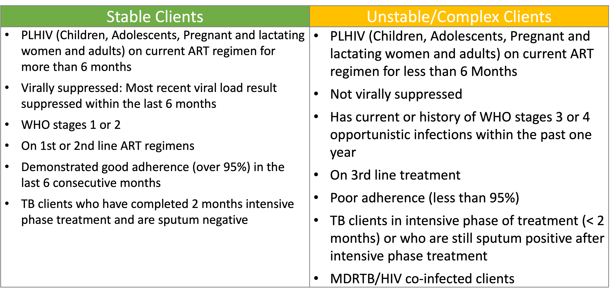
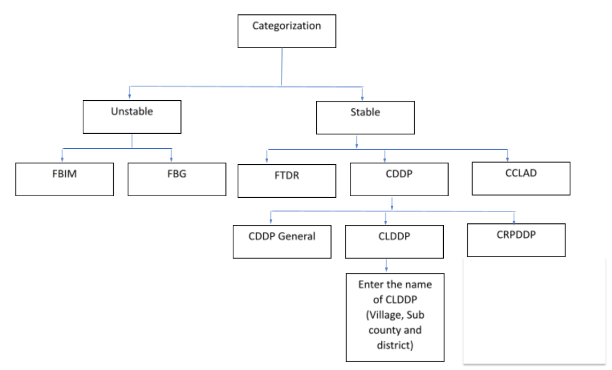
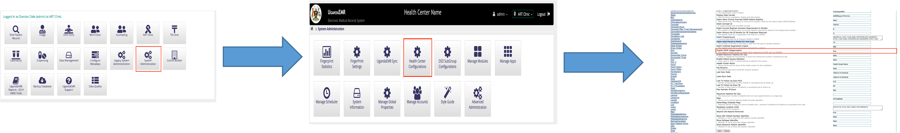
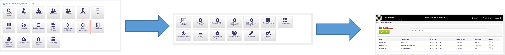

## CRPDDP / ART-ACCESS INTEGRATION

### Introduction
CRPDDP is a flavor of CDDP DSDM Model where patients are assigned pharmacies in communities where they can pickup drags. 
At Facility level, the Patient is assigned a pharmacy by a clinician. This patient has to first meet the DSDM Stability Criteria before they are enrolled in CDDP-CRPDDP.  

#### Stable Stability Criteria for patients in DSDM Implemeation

#### DSDM Hierarchy

### Configuration
There are three major setting that need to be changed in order to use Subcategories of CDDP which are 
 1. Enabling the Subcategory functionality in UgandaEMR
 2. Adding Subgroup/Pharmacy of CDDP sub models in UgandaEMR
 3. Configure the Exchange Profile
    
    a). Enable The Sync Profile
    
    b). Change username and password of profile.

#### Enable The Subcategories

1. On the UgandaEMR Home page Click on the “System Administrator” icon. This will navigate you to the System Administrator Page. 

2. On the System Administrator page, Click on the ”Health Center Configuration”. This will take you to the setting of UgandaEMR. 

3. On the UgandaEMR Health Center Settings Page, lookout of a setting “Enable CDDP Categorization”. Change Its value to true. Then Save the changes. 

#### Adding Subgroup/Pharmacy

1. On the UgandaEMR Home page Click on the “System Administrator” icon. This will navigate you to the System Administrator Page. 

2. On the System Administrator page, Click on the ”DSD Subgroup Configuration” Icon. This will navigate you to DSD Refill Groups page. 

3. On the DSD Refill Groups page, Click on the create button found on the page. This will pop up a dialogue box with a form. The form will contain the following field
    
        a) Name (Name or subgroup or pharmacy name)
        
        b) Group Type (CLDDP or CRPDDP). CLDDP is  Community Led Drug Distribution Point and CRPDDP is Community Retail Pharmacy Drug Distribution Point. CCLAD is Community Client Led ART Delivery.
        
        c) Description. The group or Pharmacy Description. 
        
        d) Identifier Code. The Pharmacy Identifier Number or group number

4. After Filling the form, Save the Form. This will display the saved Subcategory on the the DSD Refill Groups page

#### Configure the Exchange Profile
1. Click  [Here](https://drive.google.com/file/d/1su4Qz4dtYDQ5O2koWsINCnaIgK3QBVus/view?usp=sharing) to download the  script to execute. **Note:** You will need to request for permissions to access the script
2. Go to start menu and search for Execute Mysql Script and click on it. This will pop up a dialog window
3. Click install. This will prompt you to select a file. 
4. Select the Download file and click okay.

### Clinician Guide 
1. On the “Visits” Page Click on the “HMIS 003 HIV Care ART Card Clinical Assessment Form”. This will launch the Encounter Page of the HIV Client card.

2. Complete the Encounter page details. 

3. Input elements related to categorization for DSDM eg VL, Regimen, Adherence, WHO clinic stage. 
    **Note** This  helps in determining patient stability category
    
4. Select the CDDP Model. **Please note** this section is automated with validation rules related to DSDM 

5. Select the CDDP Category such as CRPDDP for pharmacy refill approach or CLDDP for community group approaches.
    
        For Pharmacy approach Pick a Pharmacy in the group.
        
        For CLDDP select a CLDDP Group
 
    **Noted** Unstable/complex  clients can only be enrolled in FBIM and CDDP will not be accepted.

6. Click the “Enter Form” button at the bottom of the page. This will show the updated “visits” page and the DSDM Model on the “patient dashboard” page

