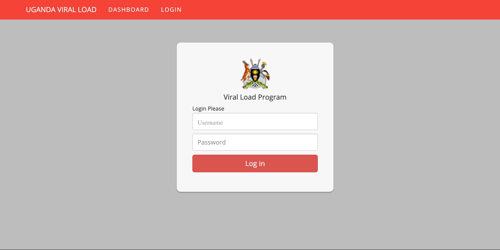

## Uploading Viral Load Results
### Downloading of Viral Load Results From VL Dashboard.
1. Access the Viral load Dashboard via [vldash.cphluganda.org](https://vldash.cphluganda.org)

2. On the Top Menu Click on the The Login Item. This will navigate you to the login screen

3. Enter username and password and click the login page. This will navigate you to the Facility Dashboard you have logged into

4. On the Top Menu, Click on the _"Reports"_ menu Item. This will navigate you to the reports. 

5. Use The date filter to determine the viral load results in period you would like to download. filterout the viral load results for that period
6. Click on the _"Valid Patients Results"_ Tab.
7. Click on the Download Icon found at the bottom of the page.

### Uploading Results in UgandaEMR.
1. Login UgandaEMR. This will navigate you to the Home page.

2. On The Home page Click on the _"System Administrator"_ Icon. This will navigate you to System Administration Page. 

3. On the System Administrator page  click on the _"UgandaEMR Sync"_ Icon. This will navigate you to the UgandaEMR Sync Page. 

4. On the UgandaEMR Sync Page Click on the _"Upload Viral Load Results"_ Icon. This will navigate you to the Upload Viral Load Results page. 

5. Click on the choose botton above

6. Select CSV File to Upload

7.  Click on the Upload Button. When the upload is complete, there are three possible outcomes
   
     a) **No patients Found.** This will show you the patients ART No. which have not been found.
     
     b) **No Encounters Found.** This shows patients whose viral load results have no related encounters which are on the same day as sample collection date.
     
     c) **Results uploaded.** This shows the patients results that have been successfully uploaded.
     

