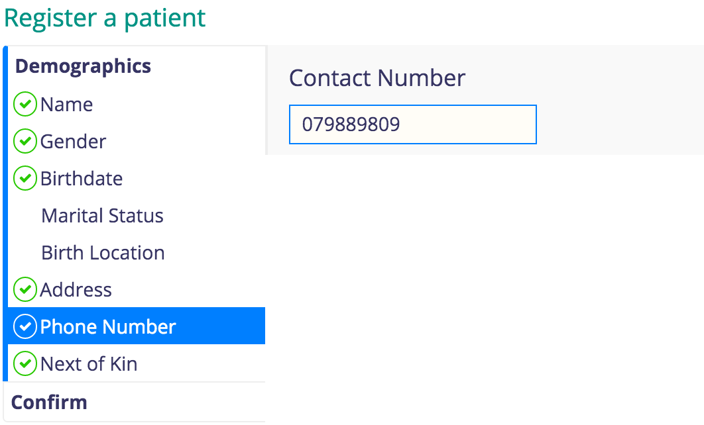
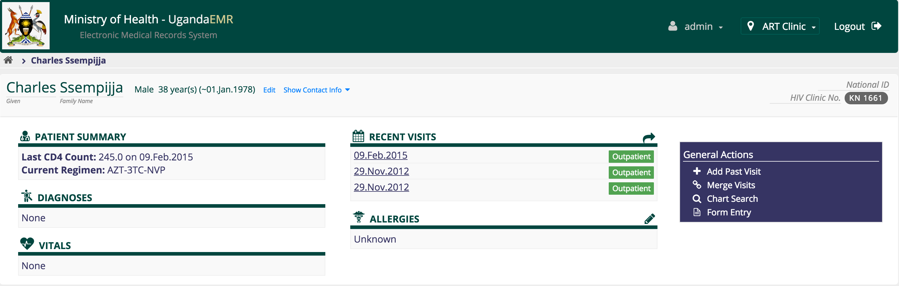

## Patient Registration and Management 
### Patient Registration 
1.Login and on the home page click the Register patient link circled below

2.Enter the details of the patient ensuring that the required fields which are marked with * are entered

3.On clicking the Register Patient icon, you enter patient details as below;

3.1.*Patient Name*
3.2.*Gender* 
3.3.*Birth date* 
 3.4.*Marital Status*
 3.5.*Birth Location* aka village in which patient was born
 3.6.*Address: Where the patient lives. Please follow the same procedure as above
 
3.7.*Phone Number: 
3.8.* Next of Kin: 

3.9.* Confirm: Shows all the bio-data collected about the patient.
3.10. Saving The data: Click confirm to save, if not click cancel to edit. You should see a patient dashboard once saving is successful as below 

### Merging Patients 
TBD 
### Marking Patients as Dead 
### 

### Common Errors 
#### User is not a provider

### Solution:
The above means your User Account does not have privileges to provide care to a patient. You therefore have to add Provider role to the user account as [indicated herein](making_an_existing_user_a_provider.md) .
