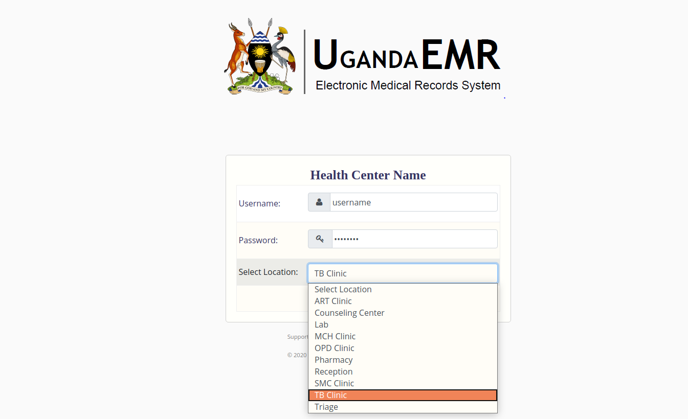
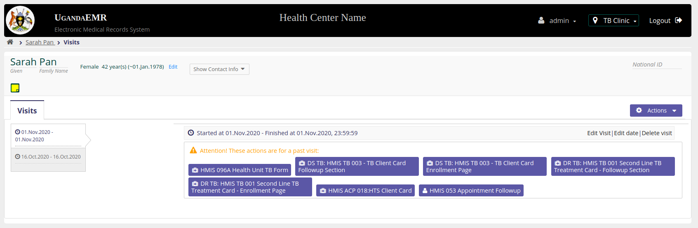
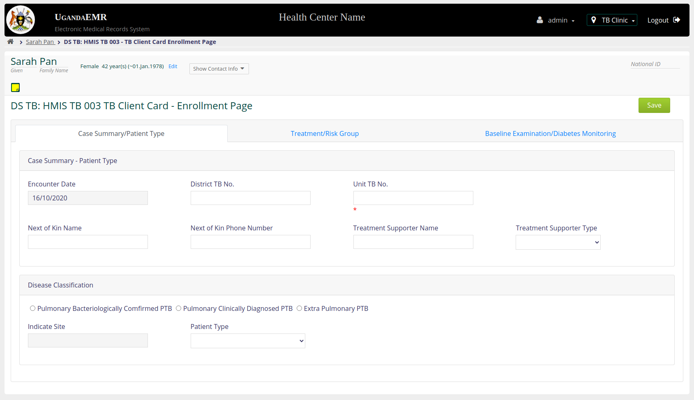
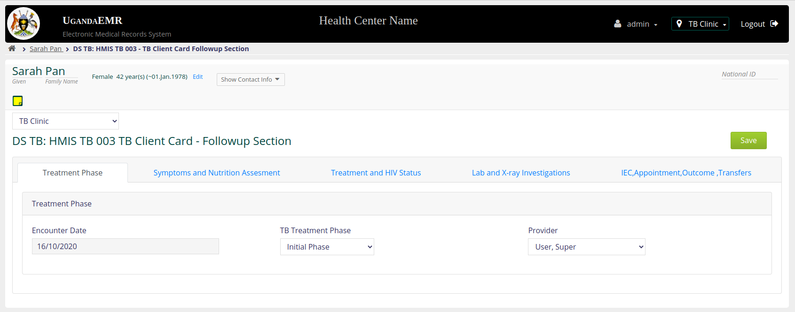
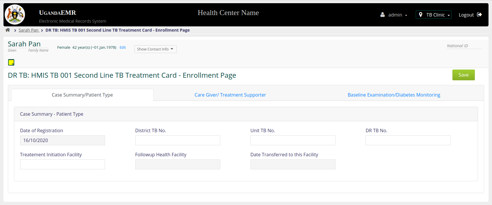
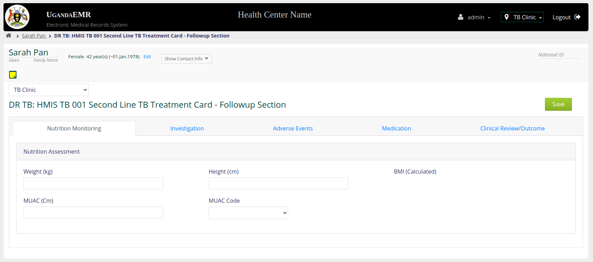
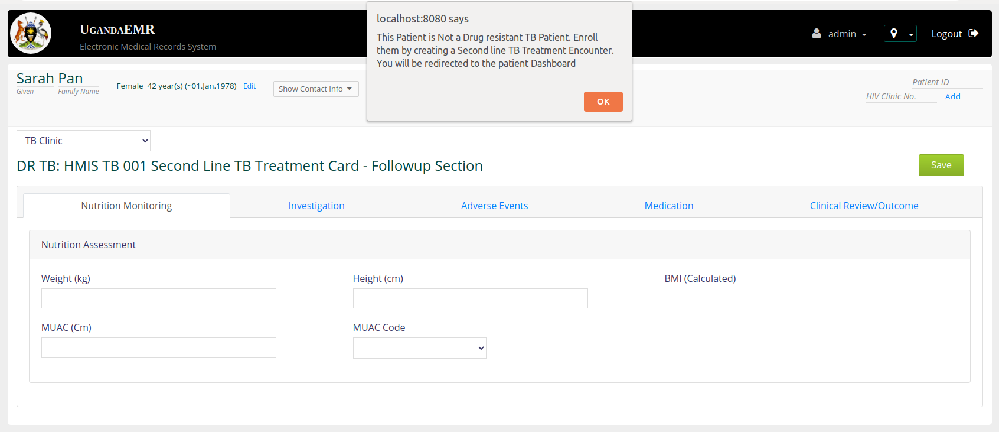

## TB PROGRAMS
The TB module deals with two programs, ie Drug Susceptible (DS) TB and Drug Resistant (DR) TB. 

### Accessing the TB forms.
Log into the system and choose TB program at the login page as illustrated in the image below.

Upon successful login, find patient`s visit and got to the TB programs shown in the image below and choose DS TB form if patient is a DS case and DRB forms is patient is a DR case.

 

#### DS TB Summary Card
This form emurates the HMIS TB 003 Client Card Summary section. IT has the following tabs;\
**(i) Case Summary/Patient Type** \
This tab captures case summary information and patient type. It also captures disease classification.\
**(ii) Treatment/Risk Group**\
This tab captures TB regimens, TB drug resistance, HIV information and Risk groups.\
**(iii) Baseline Examination/Diabetes Monitoring**\
This tab captures baseline examination, diabetes monitoring, referral and transfer information.\

#### DS TB Encounter Card
This form captures information on the HMIS TB 003 Client Card Followup section.\
**(i) Treatment Phase** \
This tab captures the treatment phase information.\
**(ii) Symptoms and Nutrition Assessment**\
This tab captures symptoms and nutrition assessment information.\
**(iii) Treatment and HIV Status**\
This Tab captures treatment information and HIV status\
**(iv) Lab and X-ray Investigations**\
This tab captures Lab tests, Radiology and Test results\
**(v) IEC, Appointment and Outcome and Transfers**\
This tab captures IEC information, next appointment date, treatment outcome and transfer out.

#### DR TB Summary Card
This form captures information on the HMIS TB 001 DR-TB Treatment Card encounter page.\
**(i) Case Summary/Patient Type**\
This section captures case summary/Patient type information.\
**(ii) Care Giver/Treatment Supporter**\
This tab captures risk group, GIS coordinates, next of kin and treatment supporter information.\
**(iii) Baseline Examination/ Diabetes Monitoring**\
This tab captures baseline information, registration group, medication diagnosis, Nutrition assessment, Previous 2nd line drugs and HIV information.\

#### DR TB Encounter Form
This form captures information on the HMIS TB 001 DR-TB Treatment Card followup section\ 
**(i) Nutrition Monitoring**\
This tab has got fields that capture nutrition assessment information about a patient.\
**(ii) Investigation**\
This tab captures investigations done in the lab, x-ray, Drug susceptible testing, general results, DST results and X-ray results.\ 
**(iii) Adverse Events**\
This tab captures adverse events, event date and event grade.\
**(iv) Medication**\ 
This tab captures medication information.\
**(v) Clinical Review/Outcome**\
This tab captures next appointment information, Drug adherence, clinical review notes, treatment outcome and transfer out.

**NB:** You cannot make a TB encounter if the patient does not have an enrollment page. The system will generate an error pop up message and redirect you back to the dashboard. This is illustrated in the screen shots below.

Image above shows an error message generated when a user attempts to create an encounter for a patient who does not have a DS TB enrollment page. 

Image above shows an error message generated when a user attempts to create an encounter for a patient who does not have a DR TB enrollment page.
