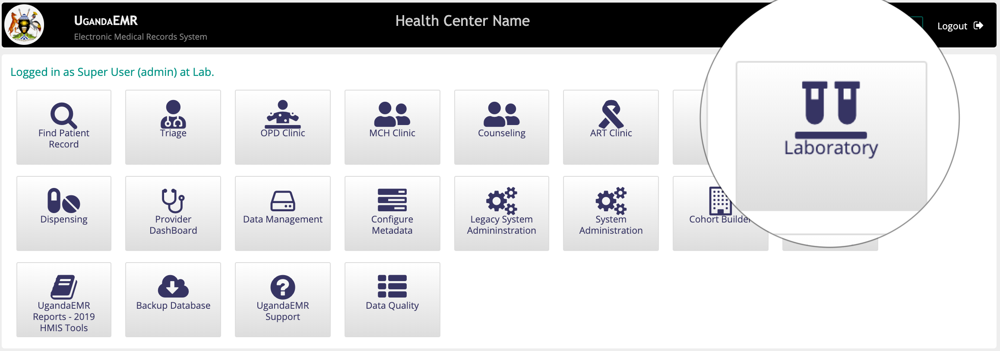
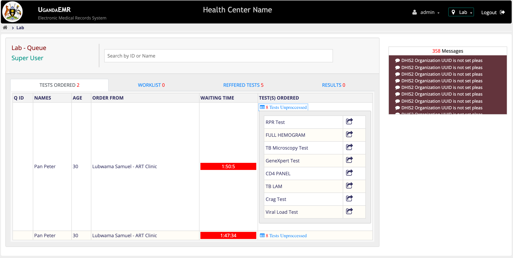
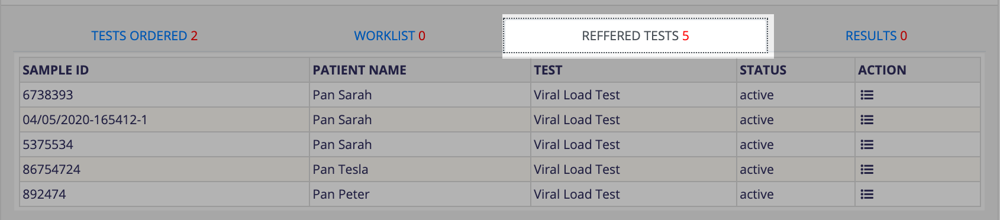

# Laboratory

When Clinicians order for tests, laboratory has to process them and provide results. Accessing patients list in Laboratory requires that one has [Organizational: Laboratory](https://github.com/METS-Programme/ugandaemr-usermanual/tree/1fbbe0b2801ddccebeb5041ed0f406697a3b1f0a/point-of-care-poc/installation-and-configuration/roles.md).

## Accessing Laboratory Provider Dashboard

1. [Login](https://github.com/METS-Programme/ugandaemr-usermanual/tree/1fbbe0b2801ddccebeb5041ed0f406697a3b1f0a/login.md) with account that has [role](https://github.com/METS-Programme/ugandaemr-usermanual/tree/1fbbe0b2801ddccebeb5041ed0f406697a3b1f0a/point-of-care-poc/installation-and-configuration/roles.md) _"Organizational: Laboratory"_. This action will navigate you to the home screen. 
2. On the Home page click on the _"Laboratory"_ icon. This will Navigate you to the _"Laboratory Provider Dashboard"_ 

   This page has four tabs

   a\) Tests Ordered. This contains patoients who have been sent to lab by clinicians but their samples have not yet been drawn

   b\) Worklist. This is a list of tests whose samples have been collected and will be processed at the health center

   c\) Refered Tests. This is a list of tests whose samples have been collected and have been refered out of the health center

   d\) Results. These are tests which have recieved results.

## Processing Samples

In order for an ordered test to be processed, there is need to collect a sample for the test and identify the test uniquely. The following are the steps that can be carried out in processing a sample

1. Under the “Test Ordered” tab in the “TEST\(S\) ORDERED” column, Click on the “Tests Unproccessed” link. This will dropdown the ordered tests of patients.
2. In the ordered test list provided, Click on the “process sample”  icon . This will popup a dialogue box to enable you to process the sample.
3. Enter the sample/specimen Id in the textbox provided or generate a sample id by clicking on the .

   **Please Note:** For Viral load test the serial number on the Viral load form or the DBS card is the sample Id to enter in the specimen id placeholder

4. Select the specimen type in the dropdown provided.
5. For test that are to be referred, Check the “REFER TEST” checkbox. This will show a dropdown with different options of referral of test in a select named “Select Reference Lab” .
6. For Viral Load test Select the option “CPHL” in order for the test to be sent to CPHL.
7. Click on the “Send” button. This action will has two possible results

   a\) If the test is a referred one it will be moved to the "Referred Test" tab. At this moment the test has been processed and ready to be sent to CPHL when synchronization occurs in the background.

   b\) If the test is not referred, it will be found in the "Worklist" tab.

## Adding Results to Samples

When a sample has been tested and results are available they can be availed back to the clinician by two approaches 1. Entering results. This is how a user can enter results.

```text
a) In the "Worklist" or "Referred test" tab under the action column, Click on the Capture results icon . This will pop up a capture results window with results options in respect to the test 
 

b) Enter the results appropriately and after click on "save results" button.
This will move the test from _"Referred"_ or "_Worklist"_ to Results Tab.
```

1. For tests that are referred and have an automated approach in receiving results such as the _"Viral Load test"_  The results will automatically be saved to the test and the test will go off the list.

