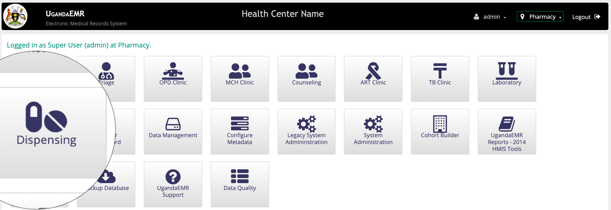
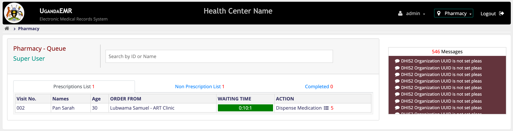
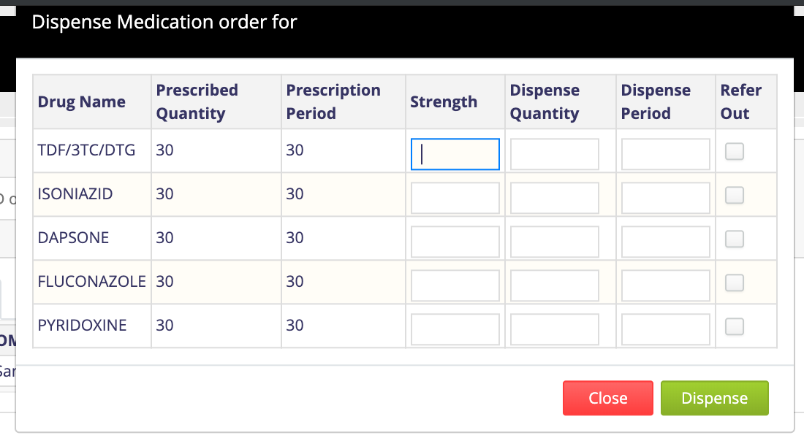

### Pharmacy
When Clinicians Prescribe medications for patients, Pharmacy has to dispense the available drugs or refer those that are not available to external pharmacies or drug shops.
Accessing patients list in Pharmacy requires that one has [Organizational: Pharmacy](../installation-and-configuration/roles.md).

#### Accessing Pharmacy Provider Dashboard
1. [Login](To be determied) with account that has [role](../installation-and-configuration/roles.md) _"Organizational: Pharmacy"_. This action will navigate you to the home screen. 
 

2. On the Home page click on the _"Dispensing"_ icon. This will Navigate you to the _"Pharmacy Provider Dashboard"_
 

    This page has four tabs 

        a) Prescription List. This contains a list of patients who have a prescription from the clinician.
        b) Non Prescription List. This contains a list of patients who dont have a prescription from a clinician.
        c) Completed. This is a list of patients who have been completed. 

#### Dispensing Prescribed Drugs
1. In  the “Prescription List” tab under the _"ACTION"_ column, Click on the _“Dispense Medication”_ link  This will  popup a dialogue box of the drugs to dispense.

2. Enter the quantity to dispense and the period for dispensing per drug.
**Note:** for drugs which you dont have in stock you can refer out by checking the box in the refer out column.
3. Click on the _"Dispense"_ button. This will move the patient from the _"Prescription List"_ to the _"Completed List"_.
If there are any drugs that have been referred out, a print out o will popup

#### Dispensing Non Prescription List