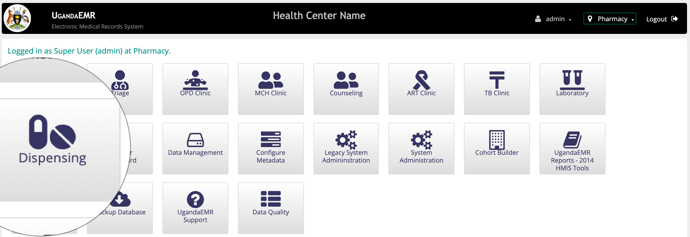
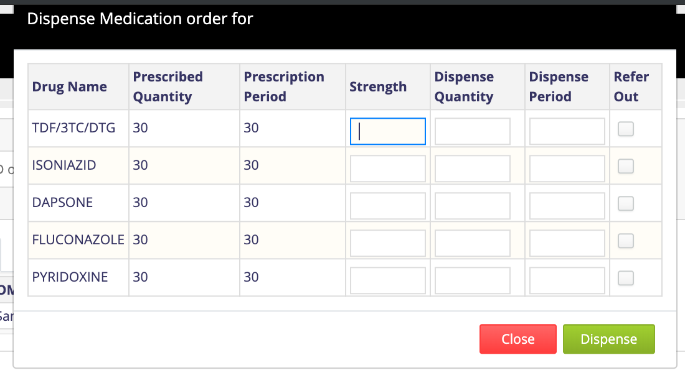
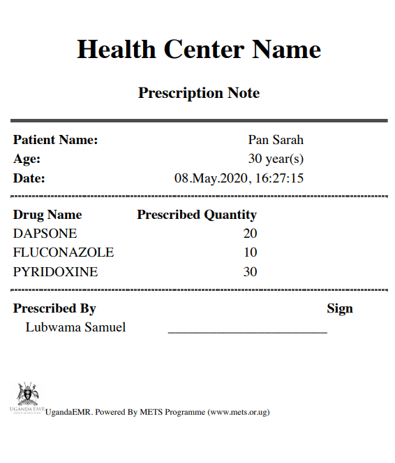
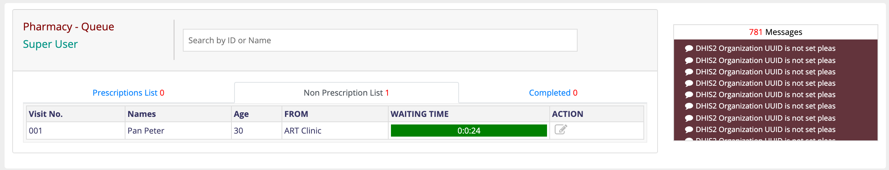
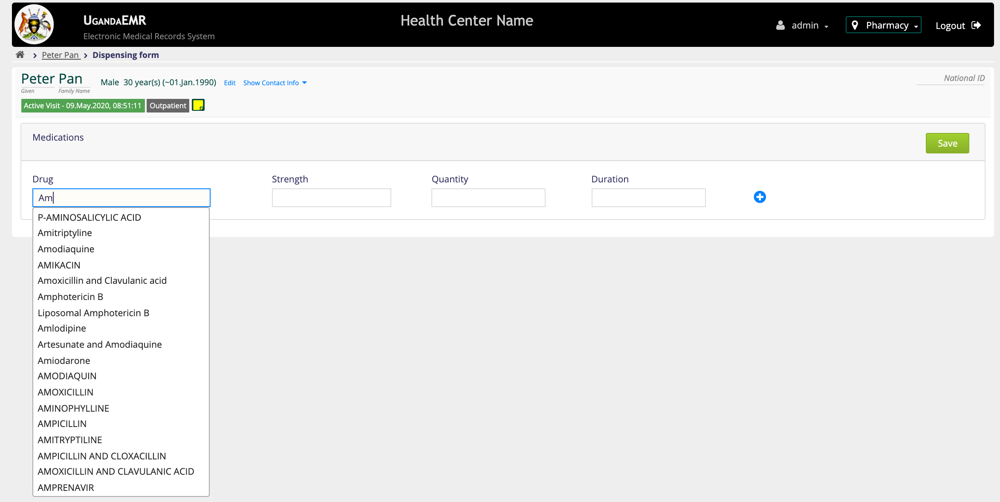
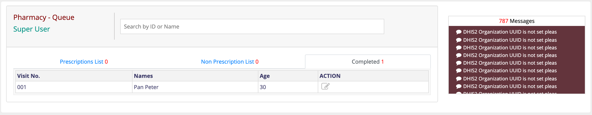

# Pharmacy

When Clinicians Prescribe medications for patients, Pharmacy has to dispense the available drugs or refer those that are not available to external pharmacies or drug shops. Accessing patients list in Pharmacy requires that one has [Organizational: Pharmacy](https://github.com/METS-Programme/ugandaemr-usermanual/tree/1fbbe0b2801ddccebeb5041ed0f406697a3b1f0a/point-of-care-poc/installation-and-configuration/roles.md).

## Accessing Pharmacy Provider Dashboard

1. [Login](https://github.com/METS-Programme/ugandaemr-usermanual/tree/1fbbe0b2801ddccebeb5041ed0f406697a3b1f0a/login.md) with account that has [role](https://github.com/METS-Programme/ugandaemr-usermanual/tree/1fbbe0b2801ddccebeb5041ed0f406697a3b1f0a/point-of-care-poc/installation-and-configuration/roles.md) _"Organizational: Pharmacy"_. This action will navigate you to the home screen. 
2. On the Home page click on the _"Dispensing"_ icon. This will Navigate you to the _"Pharmacy Provider Dashboard"_ 

   This page has four tabs

   ```text
    a) Prescription List. This contains a list of patients who have a prescription from the clinician.
    b) Non Prescription List. This contains a list of patients who dont have a prescription from a clinician.
    c) Completed. This is a list of patients who have been completed. 
   ```

## Dispensing Prescribed Drugs

1. In  the _“Prescription List”_ tab under the _"ACTION"_ column, Click on the _“Dispense Medication”_ link  This will  popup a dialogue box of the drugs to dispense.

   

2. Enter the quantity to dispense and the period for dispensing per drug.

   **Note:** for drugs which you dont have in stock you can refer out by checking the box in the refer out column.

3. Click on the _"Dispense"_ button. This will move the patient from the _"Prescription List"_ to the _"Completed List"_.

   If there are any drugs that have been referred out, a print out o will popup

   

4. Repeat from step 1 for any patient in the _"Prescription list"_ tab

## Dispensing Non Prescription List

There a patients who go directly to pharmacy to pick a refill with no need of a prescriptions from a clinician. 1. In the _"Non Prescription List"_ Tab, under the _"ACTION"_ tab, click on the "Dispense Medication" icon . This will navigate you to the dispensing form.  2. On the Dispensing form, capture all medication that the has been dispensed to the patient. **Note:** The  adds another row of medication to be dispensed. The Drug field is an auto complete list of drugs. Make sure that field is not highlighted red rather green.  3. Click on the save button to save the medication dispensed. This will save the drugs dispensed, moved to the _"Completed"_ tab and navigate you back to _"Pharmacy Provider Dashboard"_. 4. Repeat from step 1 for any patient in the _"Non Prescription list"_ tab

## Editing Dispensed Drugs

When Drugs are already dispensed and you would like to make changes to record, 1. In the _"Completed"_ tab under the _"ACTION"_ column, Click on the [Edit Medication](https://github.com/METS-Programme/ugandaemr-usermanual/tree/1fbbe0b2801ddccebeb5041ed0f406697a3b1f0a/images/poc/poc_edit_icon.png) icon. This will navigate you to the dispensing form. 2. Make the Changes you wish to make. 3. Click on the save button to save the changes. This will save the changes and navigate you back to _"Pharmacy Provider Dashboard"_.  


