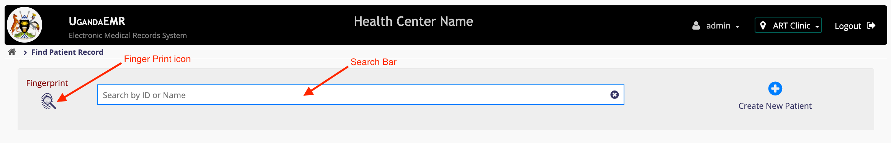
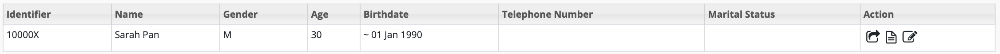
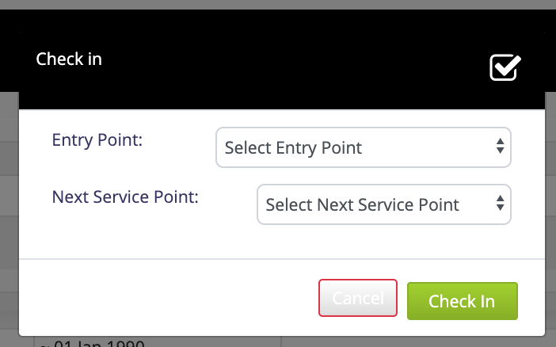
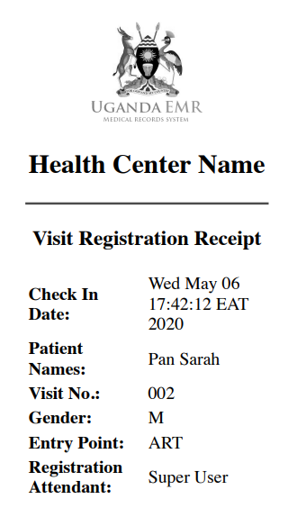

# Reception

The Receptionist requires a role called "Reception" which allows one to perform the following roles

## [Search for patient](../../patient-management/search_patient.md)

## [Register a patient](../../patient-management/patient_registration.md)

## [Edit patient demographics](../../patient-management/patient_registration.md)

## Check in patient

In Order to check in a patient, a patient the user with _"reception"_ role must follow these steps 1. [Login](https://github.com/METS-Programme/ugandaemr-usermanual/tree/1fbbe0b2801ddccebeb5041ed0f406697a3b1f0a/login.md) with account that has [role](https://github.com/METS-Programme/ugandaemr-usermanual/tree/1fbbe0b2801ddccebeb5041ed0f406697a3b1f0a/point-of-care-poc/installation-and-configuration/roles.md) reception. This action will navigate you to the home screen.  2. On the Home Screen Click on the _"Find patient record"_ icon this will navigate you to the _"patient search"_ page.  3. In the search box provided, type patient names or identifier. This will show a drop down list of patient \(s\) who match the typed details. **Note:** In case you need guidelines on searching by fingerprint refer to [This Link](../../fingerprint/search_add_patient_fingerprint.md#search-by-fingerprint)  4. In the the Action column in the search list on a patient item, click on the . This should show a check in dialogue popup  By Default the Checkin popup has two fields

```text
    a ) Entry Point. This is the Clinical point in which the patient has shown up at the health center for example HIV Clinic, OPD Clinic, MCh Clinic........
    b )  Next Service Point. This is whene you would like to send a petient to.
```

1. Select the Entry point and the Next Service point. This will show a checkin tocken print out which may be printed out and given to the patient.

   

   At this moment the patient is checked in and in the queue you selected as the _"next service point"_

2. Repeat the process for all patients that must be checked in on that particular day.

