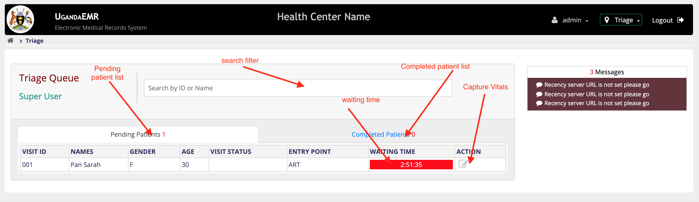

# Triage

The Triage Role allows a person to capture triage information for a patient and send them to the next service area. In order for a user to perform the triage functionality they must have the _"Triage"_ role. These are the steps on how a triage person can capture triage information on a patient and sent them to the next location.

1. [Login](https://github.com/METS-Programme/ugandaemr-usermanual/tree/1fbbe0b2801ddccebeb5041ed0f406697a3b1f0a/login.md) with account that has [role](https://github.com/METS-Programme/ugandaemr-usermanual/tree/1fbbe0b2801ddccebeb5041ed0f406697a3b1f0a/point-of-care-poc/installation-and-configuration/roles.md) _"Triage"_. This action will navigate you to the home screen. 
2. On the Home page click on the _"Triage"_ icon. This will Navigate you to the _"Triage Provider Dashboard"_  This page has two tabs

   a\) Pending patient. These are patiets who have been who have not yet been triaged.

   b\) Completed Patients. These are patients who have already been triaged.

3. In the pending tab in the table under the actions column, Clink on the _"Triage vitals"_ icon. This will navigate you to the Triage information form. 
4. Complete the information on the form.
5. Select the next location you would like to send a patient. **Note:** Lab Selecting Lab location will not send the patient to lab. This should be avoided.
6. Click on the _"Save"_ button. This will send the patient to the next location and navigate you back to the _"Triage Provider Dashboard"_
7. Repeat from Step three for any patient in the pending list.

