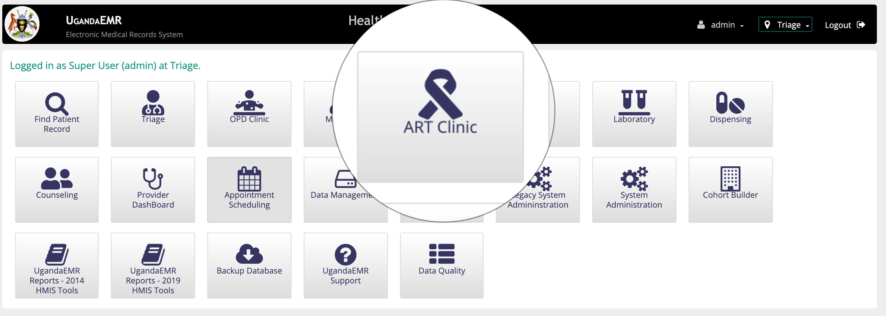
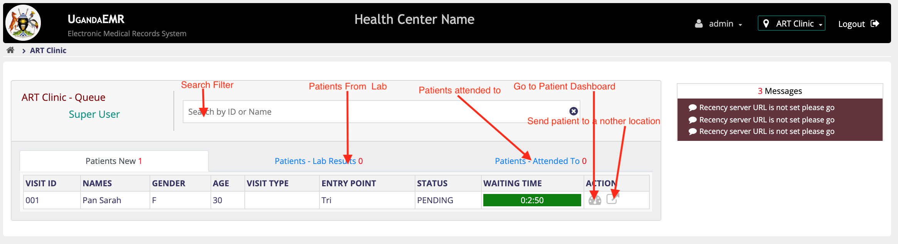
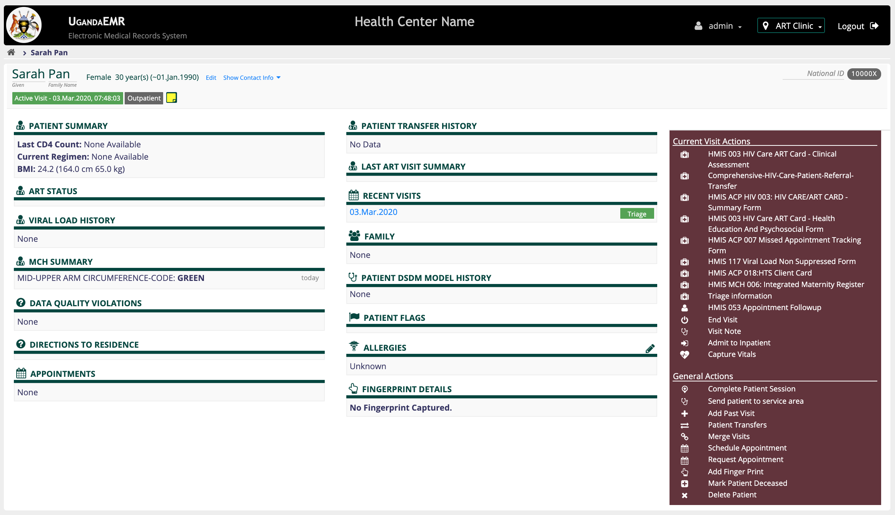
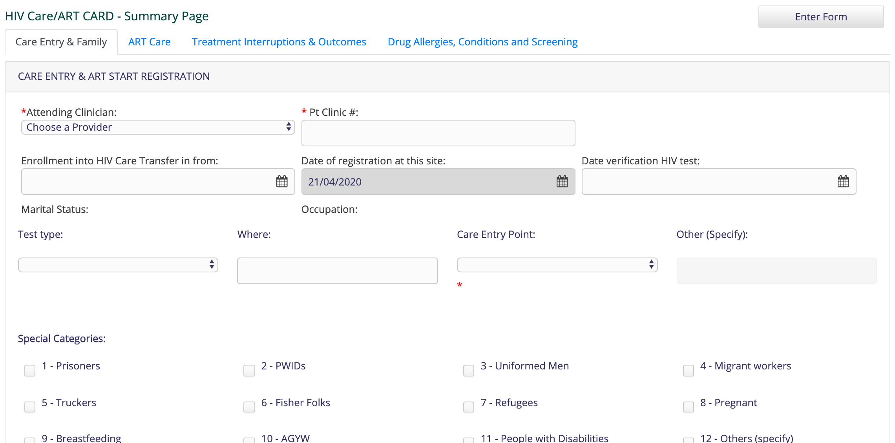
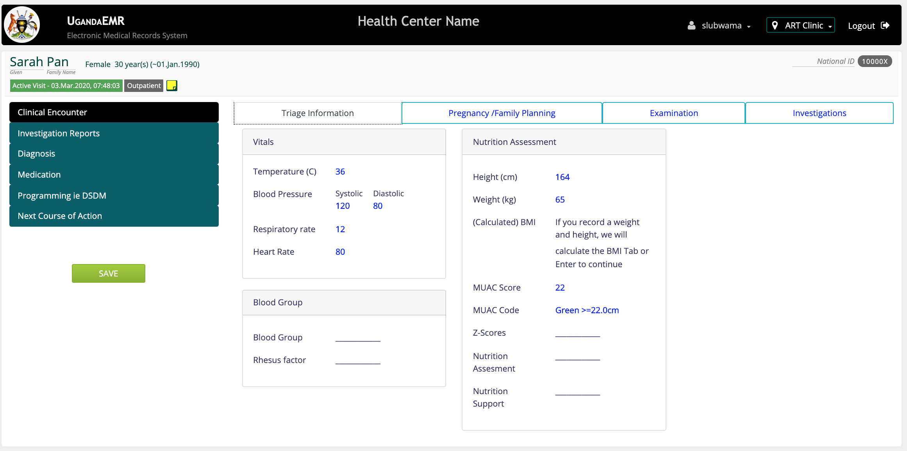

## HIV Clinic
Accessing patients list in HIV clinic requires that one has [HIV clinic Role](../../installation-and-configuration/roles.md). 

#### Accessing the Clinician Dashboard

1. An access icon of hiv clinic will be among the icons when a user with the right role is logged in 

2. Click on the ART Clinic Icon. This will navigate you to the HIV Clinician Dashboard showing patients in queue

On the HIV Clinic Dashoard there will be three tabs that is "Patient new" for patients who have been sent to the pool of HIV clinicians, "Patient - Lab Results" for patients returning from Lab with results and "Patients Attended To" Patients who have been attended to by clinician.

#### Accessing the Patient Dashboard Dashboard
Click on the patient "_Go to Patient Dashboard". This will navigate you to the patient dashboard
 

#### Accessing the patients HIV Summary Card 
1. On the right on the _**"current visit action"**_ Click on the _**"HMIS ACP HIV 003: HIV CARE/ART CARD - Summary Form"**_  This should navigate you to the Summary form.

2. The Summary page has different tabs which include 
    i. Care Entry & Family Tab
   
    ii. ART Care.
   
    iii. Treatment inturruption & out comes
   
    iv.  Drug Allergies, Conditions and Screening
   

#### Accessing the patients Clinical Assessment form 
On the right on the _**"current visit action"**_ Click on the _**"HMIS 003 HIV Care ART Card - Clinical Assessment"**_ 

The Clinical Assessment form has vertical tabs which contain  Horizontal Sub-tabs These include:
   
**a) Clinical Screening tab.** This tab has the following sub-tabs

i. Triage Information. This contains information that has been captured from triage

ii. Pregnancy/Family Panning tab.This fields that are used to capture information on family planning of a patient. 

iii. Examinations Tab has fields to capture information on Presenting Signs and Symptoms , Advanced Disease and WHO Clinical Stage, Side Effects Of ART, TB AND TPT and Syphilis status

iv. Investigations. This tab contains fields that are used to order for tests in the lab. It is in this section where tests such as viral load can be ordered in order for them to be proccesed by the lab technician.

**b) Investigation Report.** This tab contains information on investigation results that have been done in the lab. It contains two sub tabs that is 
    
i. Report. This displays any result that has been sent back to the clinican by the lab

ii. Capture Results. This has the results fields for essential tests in the HIV clinic. A Clinician can capture the results on the patient records from here
    
  **c) Diagnosis.** The Diagnosis tab contains a field that allows one to capture diagnosis of a patient. The field is an auto complete field where you have to type atleast two to three character to show the alternatives one can select on. 
  The select field can be select as a primary and secondary diagnosis. 
  
  **Please Note:** At least one primary diagnosis required when the diagnosis field is used. 
  
  **d) Medication.** This Tab contains all medication options that can be ordered for a patient.
 
  **Note:** Any Medication select in this section will result into a pharmacy request to the dispensing personnel.
       
  e) Programming Tab. This Tab contains the DSDM programming and duration on ART. 
  
  f) Next Course of action This Tab contains fields that are used to schedule the next appointment, or transfer out a patient.