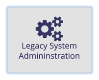
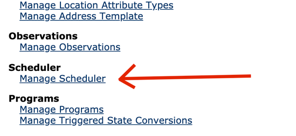
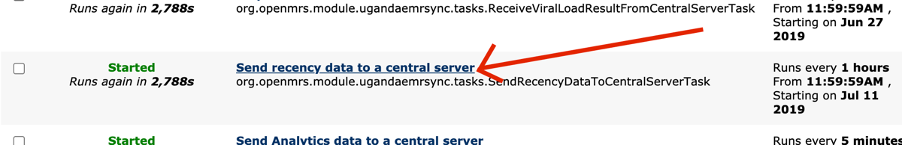
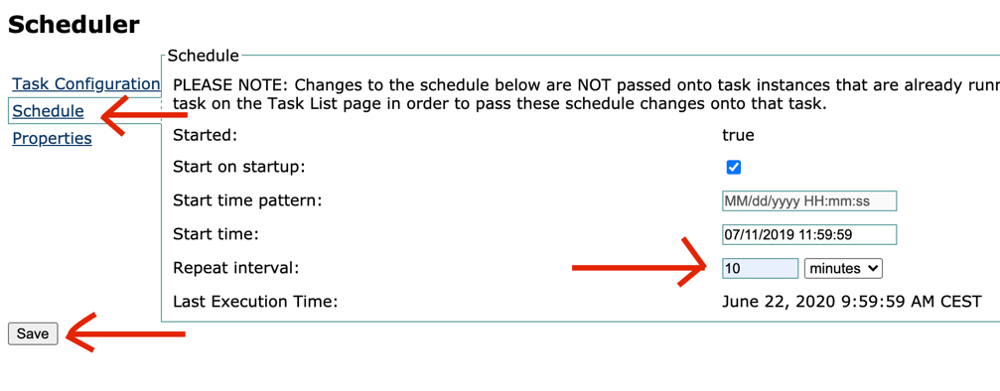
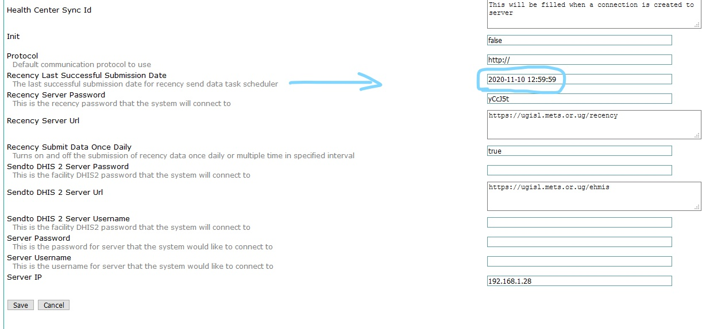

## How to Change the Frequency for Sending Recency Data to Central Server

This guide will show how to adjust the frequency of sending data. This can be useful in low connectivity facilities where internet is only available for short period. Reducing the frequency of sending data will ensure internet availability is utilized.

1. Click legacy administration link

2. In the Maintenance section click Manage Scheduler

3.	Click the Send recency data to central server link on the list of tasks. Here you will also be able to see when the next attempt to send data will be.

4.	Reduce the repeat interval to ten minutes.

**NOTE**: Even with a small repeat interval of 10 minutes, by default, recency data is submitted to the server only once daily. Therefore, the first successful submission for the day will be the last for that same day.

## Checking last sync date

To check when the EMR last synced HTS data to the central server,

1. Go to Legacy Admninistration page
2. Under Maintenance, click setting and head to UgandaemrSync page
3. Look out for Recency Last successful submission date and you will see the last date and time the EMR actually synced data through to the centarl server.

