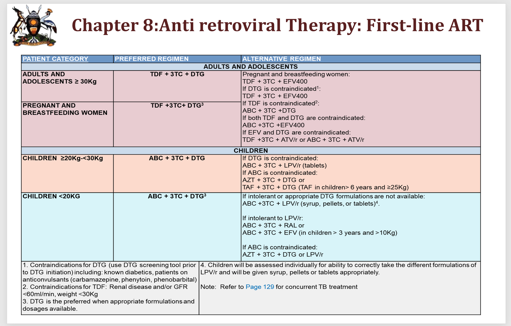
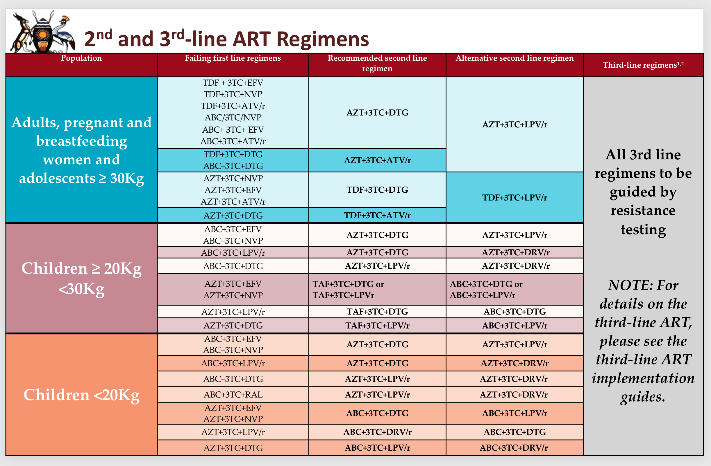
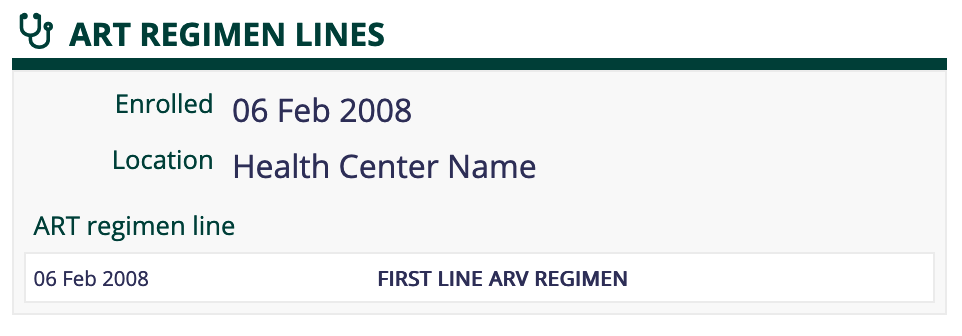

## ART Regimen Lines 

The AIDS Control Program (ACP) of the Ministry of Health (MOH) Uganda has made a significant impact in the fight against HIV by continuously updating the 2020 Consolidated Guidelines for Prevention and Treatment of HIV/AIDS in Uganda, especially in the area of ART Regimens dispensed, and use of regimen lines to track the transition of patients across the lines.

The new treatment guidelines provide preferred regimens for different patient categories (based on age group, weight, pregnancy, contraindications) and the recommended second line regimens for patients failing. However there is no clear rule distinction between first line and second line regimens since the same drugs can be prescribed for both lines, even for patients with the same categorisation

## How it works 

1. All patients enrolled into care are automatically added to the First Line Regimen 
2. Any new patients enrolled into care are automatically enrolled in the first line regimen 
3. The regimen lines statuses are displayed on the regimen lines widget as shown below 
4. A clinician can complete the Regimen Switch and Substitution form below to make any changes to the patient's current regimen line 

### Reporting 

The following reports are available from the reporting module 

1. Patients on First Line Regimens
2. Patients on Second Line Regimens
3. Patients on Third Line Regimens 
