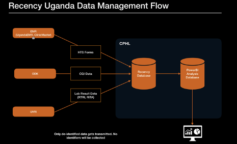

# HIV Recency Testing

## Overview

Recent HIV infection tests can provide real-time data about recent infections to identify  
hot spots of current HIV transmission.

In Uganda, this program is being rolled out with an initial 6 month pilot of 80 facilities from October 2019

## Installation and Configuration

### Setting up UgandaEMR data sync

The recency program only requires an upgrade to UgandaEMR 3.0.0 which is available from the EMR portal at

Once UgandaEMR has been upgraded, follow the steps below to complete the configuration changes.

1. Login as a user with administrator privileges

   

2. Click legacy administration link as circled in the image below

   

3. In the Maintenance section click Settings 

   

4. Click Ugandaemr 

   Enter the DHIS2 uuid for the facility. This will be provided separately and will be used as the username when submitting data to the central server

    

5. Click Ugandaemr sync 

   Configure the settings for the recency server as stated below which are provided for your facility 

   * Recency Server URL - [https://ugisl.mets.or.ug:5000/recency](https://ugisl.mets.or.ug:5000/recency)
   * Recency Server Password \(provided separately\)
   * Hts Recency - set to true to enable the entry of Recency specific data on the HTS client card 

6. Restart UgandaEMR instance to enable the system to register the newly added variable in \(4\) and \(5\) above.

## Data Capture Tools

HIV Recency Testing is an extension of the national HIV Testing Algorithm, and is done for patients above 15 years whose HIV results are positive.

The clients are requested to give consent for Recency testing and/or storage of their blood samples for future research.

This data is entered following the steps in [HIV Testing Services Client Card](../data_entry/htc_card.md) which also includes the Recency Addendum

## Reporting

The reporting tools include the national HMIS tools are:  
1. HMIS ACP 018 HIV Testing Services Register  
2. HMIS 105 Health Unit Outpatient Monthly Report - Section 4  
3. MER Indicators - HTS\_RECENT, HCT\_TST\_Facility  
4. Data Exports

* HTS Client Card Export - CSV file containing all the fields entered on the HTS Card 
* Recency Data Export - CSV file with recency data fields 

## Data Sharing with Central Server

This is an automated process that occurs every hour until a successful submission is done in a day. Due to the small numbers involved, all the HTS records are sent each time, a process which will be improved as the program proceeds. The EMR gives the option to change the scheduled sync frequency.

### Sync data flow

A few key points to note:

* **Facility surveillance** data is collected in an EMR. Through an internet connection, the data will be sent to the Central Database at CPHL on regular intervals \(every day\).

* **UVRI data** is collected by the UVRI data management system. UVRI to send the data as excel files once a week to the Central database at CPHL. A web or file transfer interface will be used to upload the excel file with the previous week’s data.

* **CQI data** for all sites will be collected using ODK. This data will then be uploaded into the Power BI Analysis Database.

* **The central database** will hold all the data and combine/integrate the two datasets \(EMR and UVRI data\) into a single Recency dataset.

* **The Power BI Analysis Database** will disclose this data through dashboards to authorized users

### Acquiring credentials

During or prior to recency activation at each site, METS/UCSF provide each facility with authentication details that can be added within the facility’s EMR. The credentials are created within MIRTH. MIRTH is the system that receives data from all facilities and verifies the credentials. It is installed at CPHL central server.

The username is preferred as the national DHIS2 ID. The password is a random set of characters and numbers.

### Sync authentication

The supported authentication methods are stated in the API description below.

### API description

The description of the API that receives the data can be found at this link.
https://github.com/METS-Programme/hie-documentation/blob/master/reference/recency-surveillance.v1.json

## Troubleshooting Tips

### Unable to login to the central server

### Unable to send data to the central server

1. Restart the UgandaEMR instance at the facility. This is key after 
2. Observe the UgandaEMR alerts. Check if there are errors related to the following.
   * The UgandaEMR instance at the facility needs to have an internet connection for at least one hour within a day. 
   * 401 authentication error: This implies that either the recency server URL, username and or password are incorrect. Double check these values and also verify the credentials in Mirth.
3. Reduce the scheduled sync frequency to 10 minutes, restart UgandaEMR and observe the behaviour.

