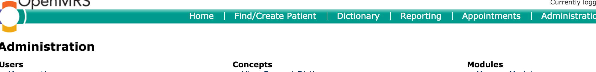
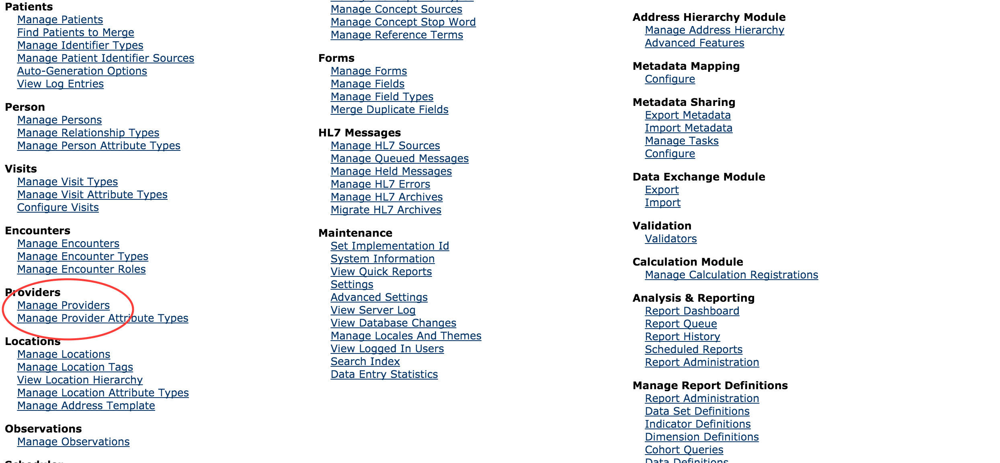
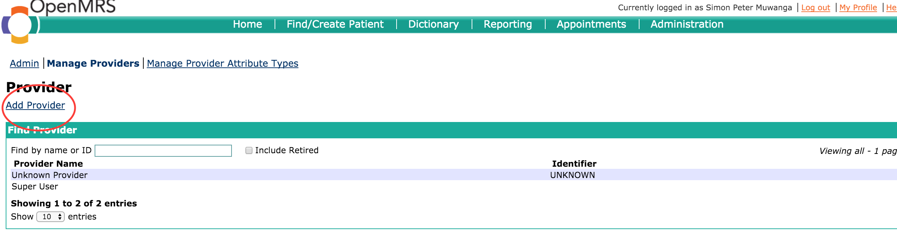
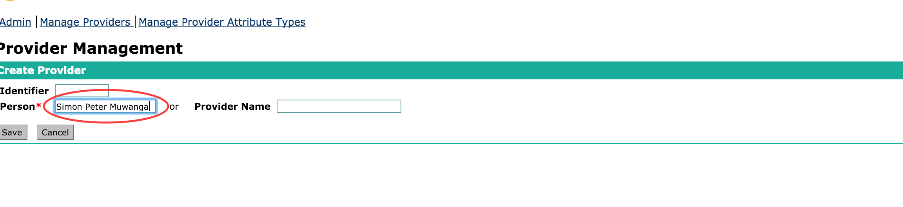
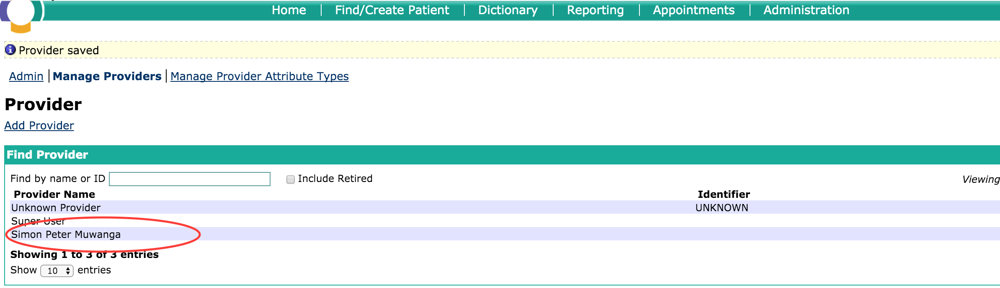

# Making an existing user a provider

There are situations where a user was created and not made a provider, which causes the error as below

The steps to make an existing user account a provider are as follows: 1. Click Home 

1. Click the Legacy System Administration link on the home page

   

2. Click the _**Manage Providers**_ link on the system administration page

   

4.Click _**Add Provider**_ link 

5.Enter provider name, and hit the _**save**_ button 

6.You should see the newly added provider on the list as below; 

