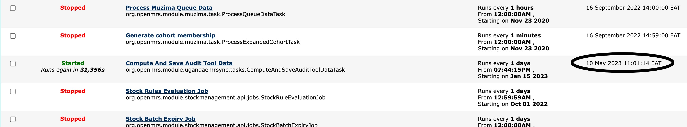
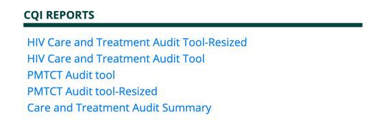
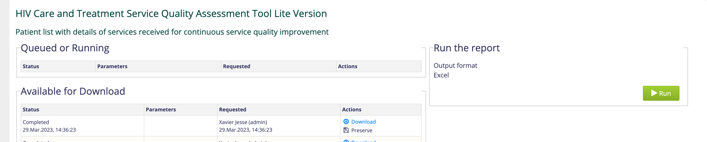

# Audit tools Reports

**OVERVIEW**

* CQI Audit tools have been designed as inbuilt reports in the EMR.This means they are listed as a reports under UgandaEMR Reports module
* Currently, Audit tools provided are PMTCT Audit tool (For mothers and Exposed Infants)and HIV Care and Treatment Audit tool (For HIV Clients ) 

**Audit tool Formats**

* Excel – The tools are downloadable as excel files with each row representing a patient record.

**HOW IT WORKS**
* Given the nature of the tool and their daily usage, the reports are extracted from separate tables which are created by a script
* This script is set to run automatically on a daily at a particular time, so we need to ensure this script was already run before we run a report
* To check whether the script is run we check on the Scheduled Tasks under 
Legacy System Administration-&gt;Scheduler-&gt;Manage Scheduler and check for the Compute and Save Audit tool Task
* This should have  the 'Started' Status (in green) , Run atleast every day (This should not be so frequent as it may slow down the computer)  and with last Execution Time (circled)
* Last Execution time determines when last the Audit tool records were updated.

**RUNNING AUDIT TOOL REPORT**

* On Home page, open UgandaEMR Reports 
* Audit tool Reports are under CQI Reports

* Click on the report of interest and run 
* Unlike other reports, the audit tool reports do not require start and end date parameters since they always pick the latest information

* You can then download the report when it is readily available
