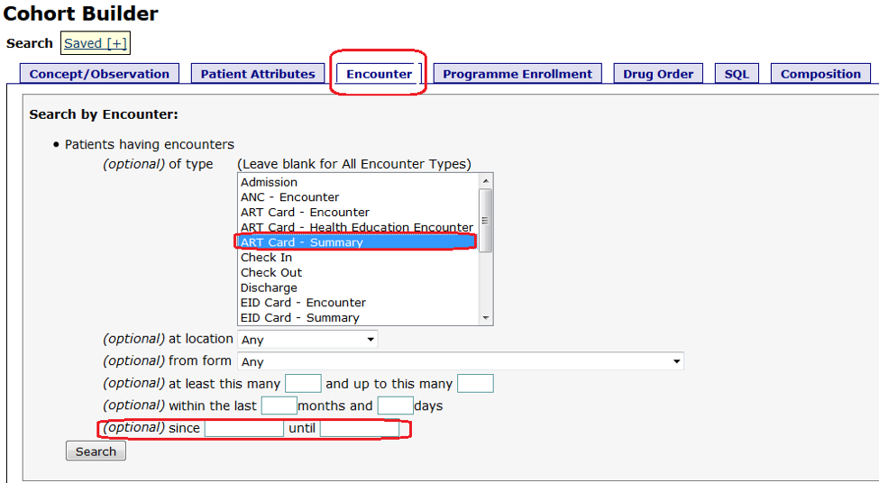
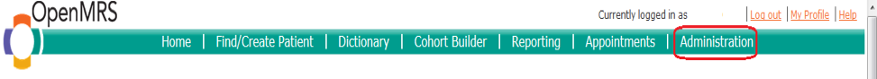
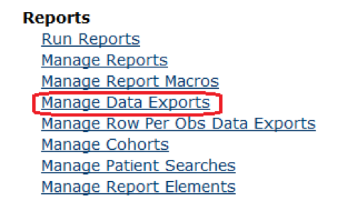
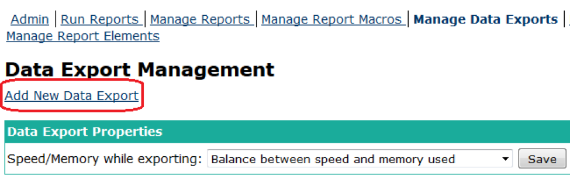
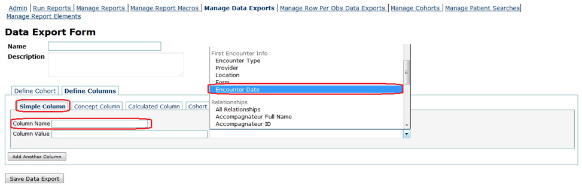

# Reporting

The reporting functionality helps users to extract information in pre-built and custom reports to meet reporting needs for managing facility operations, meeting MoH and support other programatic work.

The reports are generated in the following ways:

1. [Inbuilt reports](ugandaemr_reports.md) for facility level, MoH HMIS and PEPFAR MER Indicator reports 
2. [Cohort Builder](reporting_cohort_builder.md) for custom data extraction in Excel for more detailed analysis

## Using The Cohort Builder

1.Log into UgandaEMR and select Legacy Systems Administration


2.Click on the "Cohort builder" tab in the green navigation ribbon


3.Click on the "Encounter" tab and select "ART\_card summary" and specify the dates.



4.Click on search and view your results.

[_UgandaEMR Reports_](ugandaemr_reports.md) _being developed to replace BIRT and provide a starting point for commonly used cohort builder report exports_

## Using The Data Export Function

1.Click on the "Administration" tab on the green navigation bar.



2.Click on "Manage Data Exports" under the Reports section



3.Click on the"Add New Data Export" link under Manage Data Exports



4.Click on "Define Columns" and ensure that you have "simple column" selected



5.Pick the "Encounter Date" value in the "first encounter info section of the drop down list as shown above and rename the Column Name to reflect the "Enrollment Date"

6.Save the Data Export and run it.

## Running Data Export

```text
TBD
```

