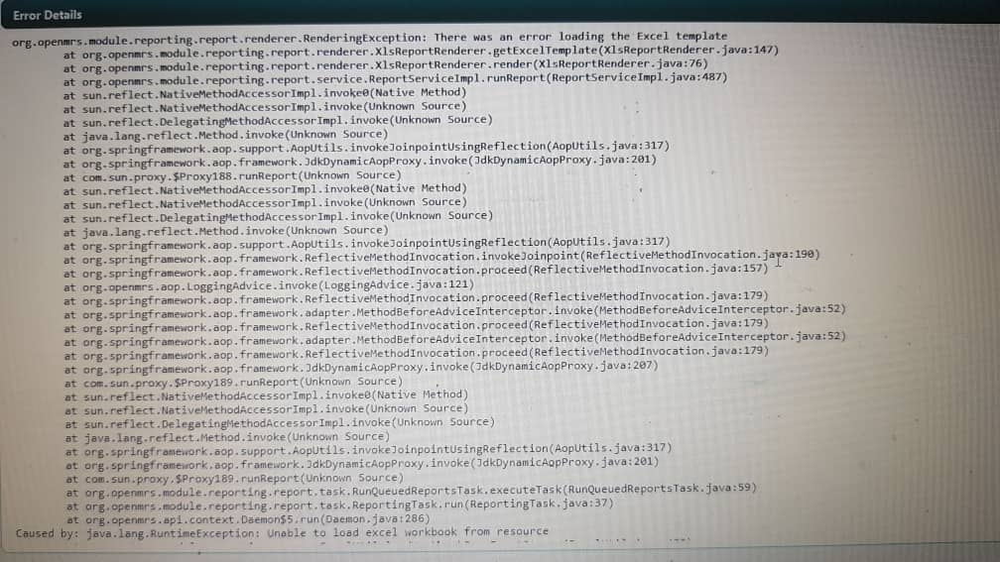
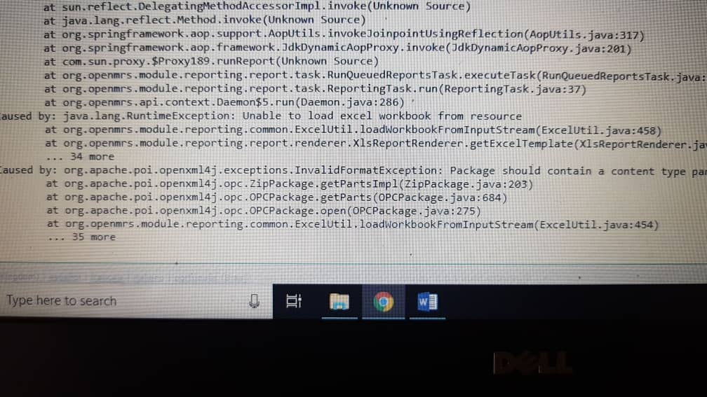

# Troubleshooting Report Tips

## Unable to run reports due to an error loading Excel template or the report definition uuid cannot be found

  


Reset all the reports by running the following script

```text
/*!40101 SET @OLD_CHARACTER_SET_CLIENT = @@CHARACTER_SET_CLIENT */;
/*!40101 SET @OLD_CHARACTER_SET_RESULTS = @@CHARACTER_SET_RESULTS */;
/*!40101 SET @OLD_COLLATION_CONNECTION = @@COLLATION_CONNECTION */;
/*!40101 SET NAMES utf8 */;
/*!40103 SET @OLD_TIME_ZONE = @@TIME_ZONE */;
/*!40103 SET TIME_ZONE = '+00:00' */;
/*!40014 SET @OLD_UNIQUE_CHECKS = @@UNIQUE_CHECKS, UNIQUE_CHECKS = 0 */;
/*!40014 SET @OLD_FOREIGN_KEY_CHECKS = @@FOREIGN_KEY_CHECKS, FOREIGN_KEY_CHECKS = 0 */;
/*!40101 SET @OLD_SQL_MODE = @@SQL_MODE, SQL_MODE = 'NO_AUTO_VALUE_ON_ZERO' */;
/*!40111 SET @OLD_SQL_NOTES = @@SQL_NOTES, SQL_NOTES = 0 */;

DELETE FROM reporting_report_design_resource;
DELETE FROM reporting_report_design;
DELETE FROM global_property WHERE property LIKE 'reporting.reportManager%';
DELETE FROM serialized_object WHERE type LIKE 'org.openmrs.module.reporting.report%';

/*!40101 SET SQL_MODE=@OLD_SQL_MODE */;
/*!40014 SET FOREIGN_KEY_CHECKS=@OLD_FOREIGN_KEY_CHECKS */;
/*!40014 SET UNIQUE_CHECKS=@OLD_UNIQUE_CHECKS */;
/*!40101 SET CHARACTER_SET_CLIENT=@OLD_CHARACTER_SET_CLIENT */;
/*!40101 SET CHARACTER_SET_RESULTS=@OLD_CHARACTER_SET_RESULTS */;
/*!40101 SET COLLATION_CONNECTION=@OLD_COLLATION_CONNECTION */;
/*!40111 SET SQL_NOTES=@OLD_SQL_NOTES */;
```

## Sending to DHIS2 Failures

**Internet Connection Failure**  When this Error displays Kindly check your internet connection if its available

**Internal Server Error**

When an error like this happens, Kindly contact. the team in charge of developing UgandaEMR.

