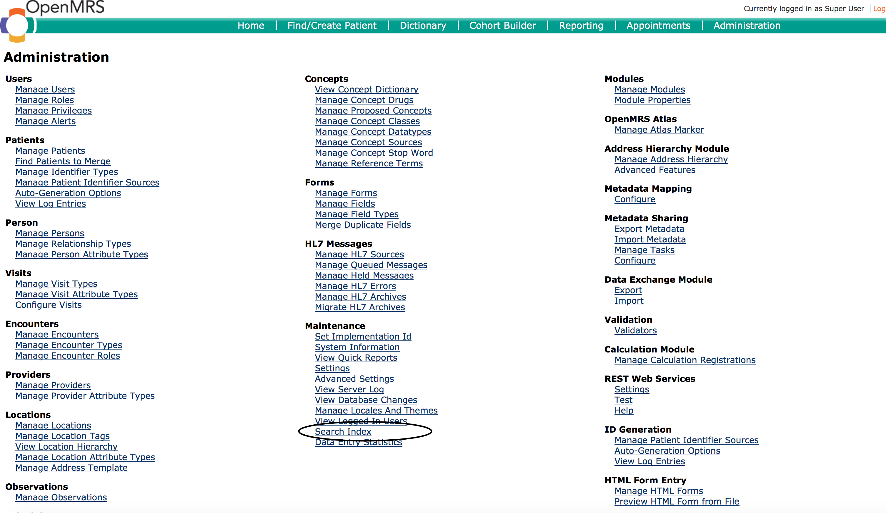
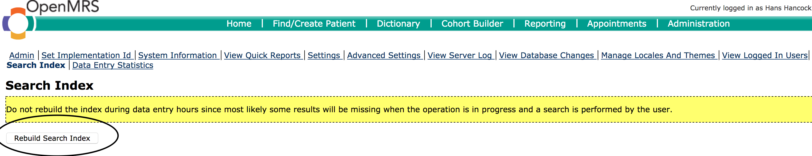

# Cohort Builder

## Cohort Builder

### What is a cohort?

* In statistics and demography, a cohort is a group of subjects who have shared a particular experience during a particular time span \(e.g. people born in Uganda between 1980 and 1999, truck drivers between age 30 and 40 who smoke, Patients Started on ART in a given Month\).
* Cohorts may be tracked over extended periods of time in a cohort study.
* Cohort \(builder\), is an OpenMRS capability that provides a group of proximate data, and/or operations and produce an aggregation of individuals who experience the same event within the same time interval

**Why use cohort builder?**

* The cohort builder is a strong tool in OpenMRS which is used answer and create Ad-hoc reports i.e. number of patients seen last week in your clinic and are between the age of 0- 24  

**How to access the cohort builder:**

1. Click on the Cohort Builder link on the top level form. This will show you the Cohort Builder page as shown below.

   

**How to query OpenMRS database based on either the concept ID or concept name:**

This section enables the user to search for concepts or observations existing in the system.

Step 1: **Click on the Cohort Builder** link on the top level form. This will show you the **Cohort Builder** page as shown below.

Step 2: Click on the **Concept/Observation** tab to show the page to be used in searching.


Step 3: Type in the concept name or ID of the variable you are looking for. E.g.Cd4  


Step 4: In case you typed in the concept name, click on the one that matches what you desire otherwise click on the only matching entry displayed.

The above action will show you a page with further settings/options for the chosen concept as shown and explained below:


**1** Allows you to query for the variable using the following options:

* **Any:** will return all matching entries,
* **None:** will return those patients without this valuable entered on them.
* **Earliest** will return the first variable to be entered. 
* **Most Recent:** will return the most recent variable entered.
* **Lowest:** will return the lowest value for this variable.
* **Highest:** will return the highest value for this variable.
* **Average** turns the average value from with the eligible results.

**2.** is optional and adds conditional options to filter the results this includes &lt;, &gt;, &lt;=,&gt;= i.e. less than, greater than, less or equal to or greater or equal to the value specified in the right hand box.

**3.** Is optional and adds another filter based on months or days

**4**. is optional and adds another filter for based on date ranges

**5.** Is the link to commences the query process

**6.** Is the link to cancel the query process.

  
**How to query OpenMRS database based on patient demographic attributes:**

This is mainly used for querying the OpenMRS database for patient based on their demographic attributes.

Step 1: Click on the **Cohort Builder** link on the top level form. This will show you the **Cohort Builder page** as shown below.

Step 2: Click on the **Patient Attributes tab** to show the page to be used in searching.  


This will display the Search by Demographics page as shown below  
  
The following are the options available  
1. **Gender** allows you to select and search by gender i. e Male or Female  
2. **Age** allows you to filer between ages i.e. 0-14  
3. **Birthdate** allows you to filer between birth dates  
4. **Alive only** allows you to search for alive patients  
5.  **Dead only** allows you to search for dead patients  
6.  **Search** is the tab or button for the search

Step 3: Click on the Search button to show the number of patient that match the criteria you specified.

**How to query OpenMRS database based on encounter information:**

This is mainly used for querying the OpenMRS database for encounter or visit related scenarios.

Step 1: Click on the **Cohort Builder** link on the top level form. This will show you the **Cohort Builder page** as shown below.  
Step 2: Click on the **Encounter tab** to show the page to be used in searching.  
  
This will display the Search by Encounter page as shown below  
  
**1.** Encounter type: Allows you to select and search by encounter i.e. summary page

 **2.** Location: Optional but allows you to select and search by a given location if you have multiple locations in the system

 **3.** From Form: Optional but allows you to select and search basing on a given form

**4.** At least this many **\_** and up to this many_\_\_\_: allows you to search by a given number of encounters for a given patient \[for example finding the number of patients with at least 4 encounters but not more than 20 \]

 **5.** within the last **\_** months and \_\_\_\_days: optional but allows you to search by number of month and number of days:

**6.** since _\*\*\*until \*_\_\_\*\*\_: optional but allows you to search by date ranges

**7.** Search is the tab or button for the search

**Step 3:** Click on the Search button to show the number of encounters that match the criteria you specified.

**How to query OpenMRS database using Program Enrollment Information:**

This is mainly used for searching/quering data by Program Enrollment and Status

Step 1: Click on the **Cohort Builder** link on the top level form. This will show you the Cohort Builder page as shown below.

Step 2: Click on the Programme Enrollment tab to show the page to be used in searching.

  
Step 3: Click on the drop down next to **Program** label and select the desired program.

Step 4: Optionally, choose the date range for when the query should be applied.

Step 5: Click on the **Search** button to show the number of patient that match the specified programme enrollment criteria.

**How to query OpenMRS database using Drug order Information**

OPENMRS DOES NOT CURRENTLY SUPPORT DRUG ORDERS.

**How to query OpenMRS database using SQL Tab** 

\_this section will be updated latte\_r

**How to correlate individually created queries in OpenMRS to produce combined results:**

This section will show you how to combine several searches together based on either similarities or differences between them. For example if the first search was for c**hildren aged 1 – 5 years** and the second one was about **patients on ART**. You can instruct OpenMRS to combine the two queries so as get the number of **children aged 1-5 years that were on ART!**

To achieve the above result follow the following steps:

**Step 1:** Click on the **Cohort Builder** link on the top level form. This will show you the Cohort Builder page as shown below.

**Step 2:** Create the individual queries as shown in the preceding sections.

**Step 3:** Click on the **Composition**_**\*\***_ tab to show the page to be used in forming compositions.

![!\[\]\(ch10.png\)](../.gitbook/assets/ch10%20%281%29.png)

**Step 4:** Type the query sequence number of the first query followed by the correlation/join operatorand the query sequence number of the second query.  
NOTE: The following correlation/join operators are recognized

**AND:**- Will only show in the final result all those entries found to be existing in all the participating queries.

**OR:**- Will only show in the final result all entries found to be existing in either participating queries i.e. the combination of both.

**NOT:**- Will only show in the final result all entries found to be existing in in the left query hand side but not in the right hand side query

**Step 5:** Click on the **Add** button to show the number of records that matched the composition criteria set above as shown below

**How to save queries for future reference:**

OpenMRS has a feature with which you can save the any query constructed using the steps above for future use. This has the advantage that you do not need to go back and compose the query again and is mostly useful for repetitive routine/periodic querying tasks. The saved query compostions are referred to as Saved Searches.

To create saved searches, follow the following steps:

**Step 1:** Click on the Cohort Builder link on the top level form. This will show you the Cohort Builder page as shown below.

**Step 2:** Create the individual queries as shown in the preceding sections. You will get a listing as show below


**Step 3:** Click on the Save icon \(with the blue diskette symbol\) besides the query you want to save. This will give you a popup \(as shown below\)  


**Step 4:** Enter the name you want to associate with the composed query. Optionally, put the description as well. The description is meant to provide additional information about the saved search to anyone\(including yourself\) about the purpose of the query.

**Step 5:** Click on the Save button to save the query composition.

NOTE:

* To Delete a saved search use the    icon on the desired query.
* Once a search is saved, it changes its colors to differentiate it from the once that have not been saved.

**How to view saved searches:**

To view previously saved search, click on the Saved\[+\] link in the top left corner of the Cohort Builder page. This will produce a list of saved searches with the most recent at the bottom

  
_NOTE:\*_

**Saved Cohorts**

* Saved  cohort are not saved searches  they  can be link to other data manipulation  modules 
* They are found at the bottom of the saved search list 
* By clicking the any link that is existing on the list  it opens the export with 

  new or current numbers

The Main difference between a saved search and a saved cohort is a saved search will update the data it returns when rerun at a later date while the cohort will not update

## Common Queries

### DSDM Programs

### Patients who visited on a specific date

TBD

### New Patients registered on a specific date

TBD

### New Babies registered on a specific date

TBD

## Common Troubleshooting Tips

### Concepts cannot be found by name in en locale

This is caused by the search index for concepts being outdated.

The search index needs to rebuilt following the steps below:

1. Login as a user with administrative rights 
2. Go to the legacy administration screen as below, and click the Search index link

   

3. On the Search index page, click the Rebuild Search Index button - this may take some time depending on the speed of your system 

   

### Cohort Builder does not  Allow defining of Columns

**Screen Shots Of The Problem**


#### Root Cause

The root cause of this problem is due to the addition of other programs into the UgandaEMR system by an individual\( which is prohibited \) that is done by creation of concepts and thereby resulting into concept mismatch with concepts that come with UgandaEMR.


#### Resolution

1. Download the concept dictionary from [https://sourceforge.net/projects/ugandaemr/files/1.0.13/concept\_dictonary\_ref\_1.0.13.sql/download](https://sourceforge.net/projects/ugandaemr/files/1.0.13/concept_dictonary_ref_1.0.13.sql/download)
2. Run the concept dictionary using Heidi or the MySQL command line to remove any created concepts 
3. Run the script below to remove the custom programs

```text
/*!40101 SET @OLD_CHARACTER_SET_CLIENT = @@CHARACTER_SET_CLIENT */;
/*!40101 SET @OLD_CHARACTER_SET_RESULTS = @@CHARACTER_SET_RESULTS */;
/*!40101 SET @OLD_COLLATION_CONNECTION = @@COLLATION_CONNECTION */;
/*!40101 SET NAMES utf8 */;
/*!40103 SET @OLD_TIME_ZONE = @@TIME_ZONE */;
/*!40103 SET TIME_ZONE = '+00:00' */;
/*!40014 SET @OLD_UNIQUE_CHECKS = @@UNIQUE_CHECKS, UNIQUE_CHECKS = 0 */;
/*!40014 SET @OLD_FOREIGN_KEY_CHECKS = @@FOREIGN_KEY_CHECKS, FOREIGN_KEY_CHECKS = 0 */;
/*!40101 SET @OLD_SQL_MODE = @@SQL_MODE, SQL_MODE = 'NO_AUTO_VALUE_ON_ZERO' */;
/*!40111 SET @OLD_SQL_NOTES = @@SQL_NOTES, SQL_NOTES = 0 */;

DELETE from patient_program ;
DELETE from program;

/*!40101 SET SQL_MODE=@OLD_SQL_MODE */;
/*!40014 SET FOREIGN_KEY_CHECKS=@OLD_FOREIGN_KEY_CHECKS */;
/*!40014 SET UNIQUE_CHECKS=@OLD_UNIQUE_CHECKS */;
/*!40101 SET CHARACTER_SET_CLIENT=@OLD_CHARACTER_SET_CLIENT */;
/*!40101 SET CHARACTER_SET_RESULTS=@OLD_CHARACTER_SET_RESULTS */;
/*!40101 SET COLLATION_CONNECTION=@OLD_COLLATION_CONNECTION */;
/*!40111 SET SQL_NOTES=@OLD_SQL_NOTES */;
```

1. Restart your computer which will add only the supported programs

